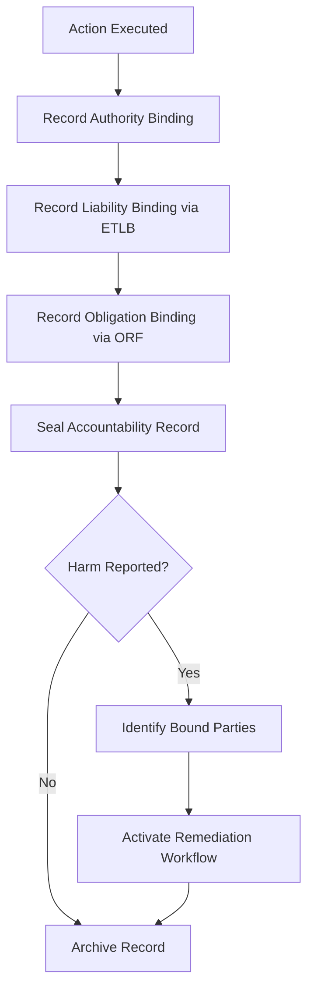

# Layer 19: Accountability Asymmetry

## Definition

Accountability Asymmetry is the civilizational layer that addresses the structural imbalance between those who make decisions and those who bear the consequences. In every institution, the person who approves an action and the person who suffers from a bad action are rarely the same. A CEO who approves a cost-cutting measure does not lose their job when a factory worker is injured. A regulator who delays a drug approval does not suffer when a patient dies waiting. Accountability asymmetry is not a bug in institutional design -- it is an inherent feature that must be recognized and managed.

In AI systems, accountability asymmetry reaches its most extreme form. The model provider who trained the system, the platform that deployed it, the enterprise that purchased it, the manager who approved its use, and the end user who was affected by its output form a chain where accountability diffuses at every link. When an AI system denies a valid insurance claim, who is accountable -- the model, the marketplace, the insurer, the procurement officer, or the claims adjuster who relied on it? The FrankMax Marketplace uses the ORF and ETLB protocols to collapse this ambiguity, binding accountability to specific actors at specific moments.

## Why It Matters

When accountability asymmetry is unmanaged, the result is "accountability vacuum" -- everyone points to everyone else, and the affected party has no recourse. In AI systems, this vacuum is amplified by technical complexity: the model provider claims the enterprise misconfigured it, the enterprise claims the marketplace mis-described it, the marketplace claims the provider's documentation was inadequate. Meanwhile, the patient whose claim was wrongly denied has no idea who to hold responsible. Unmanaged accountability asymmetry is the primary reason that public trust in AI is declining despite improving capabilities. Without explicit accountability binding, AI governance is a shared fiction that dissolves at the moment it is needed most.

## Implementation in the Marketplace

The platform implements Layer 19 through the **Accountability Binding Protocol (ABP)**, which integrates with both the ORF (Obligation and Responsibility Finality) and ETLB (Execution-Time Liability Binding) protocols. At every point in the execution chain, the ABP records three bindings: (1) who authorized this action (execution authority from Layer 2), (2) who bears liability if this action fails (ETLB binding), and (3) who has obligation to remediate if harm occurs (ORF binding). These bindings are immutable once recorded and form the basis for dispute resolution, regulatory response, and remediation workflow activation.

## Core Systems Mapping

| Core System | Role in Layer 19 |
|---|---|
| Accountability Binding Protocol | Records authority, liability, and obligation bindings |
| ORF Protocol Engine | Finalizes obligation and responsibility assignments |
| ETLB Protocol Engine | Binds liability at execution time |
| Dispute Resolution System | Routes accountability claims to bound parties |
| Remediation Workflow Engine | Activates obligation-holder workflows when harm occurs |

## BPMN Workflow

## Audience Relevance

- **General Counsel**: Must understand where institutional liability concentrates
- **Board Risk Committees**: Director liability for AI decisions is a personal exposure
- **Patient Advocacy Organizations**: Need clear accountability paths for AI-driven harm
- **Consumer Protection Agencies**: Require identifiable responsible parties for enforcement
- **Insurance Underwriters**: Accountability clarity is a prerequisite for AI liability coverage

## Revenue Streams

Layer 19 generates revenue through the **Accountability Mapping Service** ($3,000/month) providing real-time visibility into liability distribution across AI operations, the **Dispute Resolution Platform** ($1,500/incident) automated workflow for accountability claims between marketplace participants, and the **Liability Certificate** ($2,000/quarter) regulator-ready documentation of accountability bindings for audit defense. Accountability Asymmetry is the capstone governance layer -- it makes the ORF and ETLB protocols commercially relevant by converting abstract liability frameworks into auditable, enforceable, and billable accountability infrastructure.
