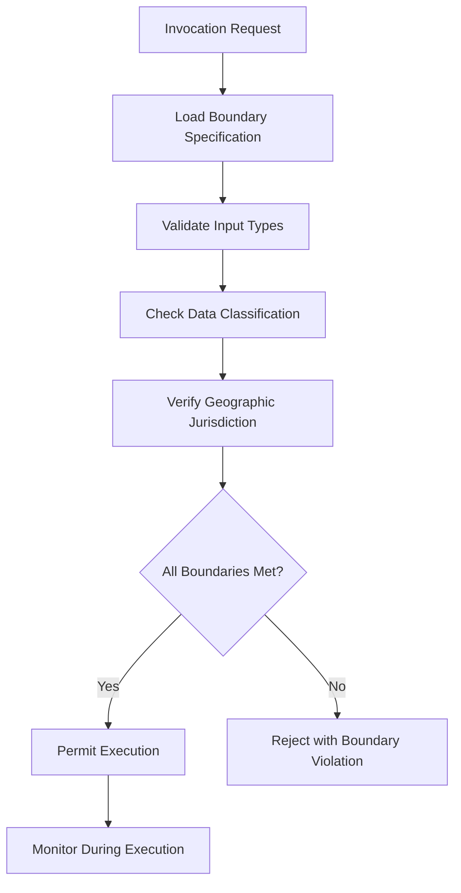

# Layer 11: Boundary Definition

## Definition

Boundary Definition is the civilizational layer that establishes where one domain of authority ends and another begins. Nations have borders. Corporations have charters. Departments have mandates. Contracts have scope clauses. Without boundaries, jurisdictions overlap, responsibilities blur, and every action becomes a potential conflict over who owns what. Boundaries are not barriers to cooperation -- they are the prerequisites for it. You cannot collaborate with a neighbor until you agree where your yard ends and theirs begins.

In AI systems, boundaries define the operational envelope of every model, agent, and governance layer. A clinical AI model has a boundary: it may analyze radiology images but not prescribe medication. A billing agent has a boundary: it may generate invoices but not approve refunds. The FrankMax Marketplace enforces boundaries at every level -- model scope, data access, compute allocation, geographic jurisdiction, and regulatory applicability -- ensuring that no component operates outside its defined domain.

## Why It Matters

When boundaries are undefined, organizations experience "scope creep at machine speed." An AI agent authorized to summarize medical records begins making diagnostic suggestions. A cost optimization model authorized to recommend vendor switches begins auto-executing procurement changes. In ungoverned environments, boundary violations compound because each violation expands the perceived norm for the next agent. Within 90 days, the operational reality bears no resemblance to the authorized design. Boundary violations in healthcare AI have triggered FDA enforcement actions, and in financial services, unauthorized scope expansion has resulted in trading losses exceeding $100M.

## Implementation in the Marketplace

The platform implements Layer 11 through the **Boundary Enforcement Mesh (BEM)**, a policy layer that wraps every marketplace component with explicit scope constraints. Each offering in the marketplace carries a Boundary Specification Document (BSD) that defines: (1) permitted input types, (2) permitted output types, (3) data classification ceilings, (4) geographic restrictions, (5) regulatory applicability, and (6) maximum resource consumption. The BEM validates every invocation against the BSD before execution begins and terminates any invocation that would cross a defined boundary.

## Core Systems Mapping

| Core System | Role in Layer 11 |
|---|---|
| Boundary Enforcement Mesh | Runtime boundary validation for every invocation |
| Boundary Specification Registry | Stores and versions BSDs for all 713 offerings |
| Data Classification Engine | Enforces data-type boundaries |
| Geographic Restriction Service | Validates jurisdictional boundaries |
| Resource Quota Manager | Enforces compute and storage boundaries |

## BPMN Workflow

## Audience Relevance

- **Data Protection Officers**: Data boundaries are the foundation of privacy compliance
- **Healthcare Compliance Teams**: Clinical AI boundaries prevent unauthorized diagnostic scope
- **Financial Risk Managers**: Trading AI must operate within strict position and authority limits
- **Government Security Officers**: Classified data boundaries require absolute enforcement
- **Multi-Tenant Platform Operators**: Tenant isolation depends on boundary enforcement

## Revenue Streams

Layer 11 generates revenue through the **Boundary Configuration Service** ($1,500/month) providing managed boundary definition and enforcement, the **Boundary Audit Report** ($750/quarter) documenting all boundary violations and near-misses for compliance review, and the **Custom BSD Authoring** ($2,000/offering) where the marketplace team defines bespoke boundaries for complex enterprise use cases. Boundary definition is a prerequisite sale for every regulated customer -- no compliance officer will approve AI procurement without documented operational boundaries.
