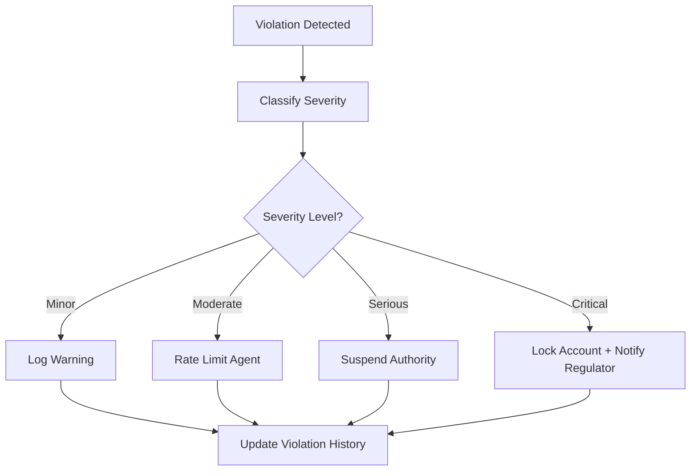

# Layer 5: Coercion / Consequence

## Definition

The Coercion and Consequence layer is the civilizational infrastructure that makes rules enforceable. Laws without penalties are suggestions. Contracts without remedies are aspirations. Every functioning institution maintains a consequence mechanism -- fines, revocation of access, termination of service, reputational damage, or legal action -- that transforms voluntary compliance into expected behavior. This layer does not require frequent use; its power lies in credible threat, not constant application.

In AI-governed marketplaces, consequence infrastructure must operate at machine speed. When an AI agent violates its governance envelope -- exceeding its authorized scope, producing outputs that breach compliance rules, or consuming resources beyond its allocation -- the consequence must be immediate and automatic. Human review committees that convene next Tuesday are irrelevant when an ungoverned model can generate 10,000 non-compliant outputs per hour. The FrankMax platform treats consequence as a real-time enforcement layer, not a post-hoc disciplinary process.

## Why It Matters

Without consequence infrastructure, governance becomes decorative. Organizations invest heavily in policies, training, and compliance frameworks, then discover that violations carry no meaningful penalty. In AI systems, this manifests as "governance theater" -- models are nominally governed but practically unconstrained because violations are logged but never acted upon. Research consistently shows that ungoverned AI systems in enterprise environments generate 15-25% more policy violations per quarter when consequence mechanisms are absent, because operators learn that boundaries are unenforced.

## Implementation in the Marketplace

The platform implements Layer 5 through the **Automated Consequence Engine (ACE)**, which enforces graduated responses to governance violations. ACE operates on a four-tier escalation model: (1) Warning and logging for first-time minor violations, (2) Rate limiting and scope reduction for repeated violations, (3) Suspension of execution authority for serious breaches, and (4) Account-level lockout and regulatory notification for critical violations. ACE integrates with the ETLB protocol so that liability for violations is bound to the responsible party at the moment of occurrence.

## Core Systems Mapping

| Core System | Role in Layer 5 |
|---|---|
| Automated Consequence Engine | Detects violations and applies graduated responses |
| Rate Limiter and Throttle Service | Enforces resource-based consequences |
| Authority Revocation Service | Suspends execution tokens in real time |
| Violation Classification Engine | Categorizes breaches by severity and type |
| Regulatory Notification Gateway | Automates mandatory breach reporting |

## BPMN Workflow

## Audience Relevance

- **Chief Risk Officers**: Need automated enforcement to back governance policies
- **Compliance Auditors**: Require evidence that violations trigger real consequences
- **Healthcare Privacy Officers**: HIPAA violations demand immediate containment
- **Financial Regulators**: Expect real-time enforcement, not quarterly reviews
- **Procurement Officers**: SLA enforcement requires automated penalty application

## Revenue Streams

Layer 5 generates revenue through the **Enforcement-as-a-Service** tier ($2,200/month) providing managed consequence infrastructure, the **Violation Analytics Dashboard** ($500/month) giving risk teams real-time visibility into enforcement patterns, and the **Regulatory Auto-Report Module** ($1,000/incident) automating mandatory breach notifications. Consequence infrastructure is a direct "fries" revenue driver -- organizations that buy the "burger" (cheap AI access) need enforcement to satisfy their regulators, creating natural upsell momentum.
