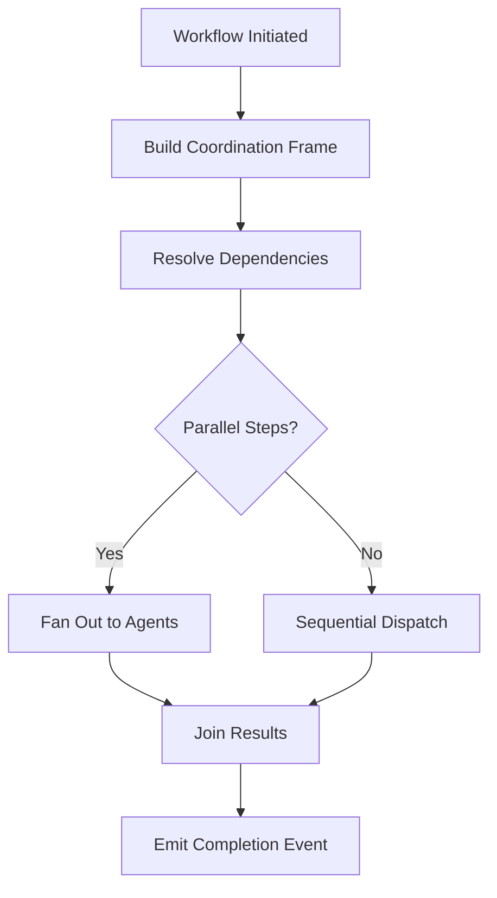

# Layer 3: Coordination

## Definition

Coordination is the civilizational layer that enables multiple actors to align their actions toward shared outcomes without requiring centralized command over every decision. Markets coordinate through prices. Armies coordinate through doctrine. Bureaucracies coordinate through procedure. The distinguishing feature of coordination infrastructure is that it reduces the cost of joint action -- it makes it cheaper for ten people (or ten AI agents) to accomplish something together than for each to act independently.

In the FrankMax Marketplace, coordination governs how multiple AI models, governance layers, billing systems, and human operators interact within a single workflow. A healthcare claims processing pipeline might invoke three different models (triage, extraction, adjudication), each governed by different compliance regimes, billing at different rates, and reporting to different stakeholders. Coordination infrastructure ensures these components execute in the right order, share context appropriately, and degrade gracefully when one component fails.

## Why It Matters

Without coordination infrastructure, multi-agent workflows collapse into one of two failure states. The first is "serial bottleneck" -- every component waits for every other component, and end-to-end latency grows linearly with pipeline depth. A 5-step workflow that should complete in 2 seconds takes 45 seconds because each step re-authenticates, re-fetches context, and re-validates permissions from scratch. The second failure state is "coordination deadlock" -- two agents each wait for the other to complete, and neither progresses. In production AI systems, coordination failures account for roughly 40% of all pipeline timeouts.

## Implementation in the Marketplace

The platform implements Layer 3 through the **Workflow Orchestration Bus (WOB)**, an event-driven coordination layer that manages multi-step AI pipelines. The WOB maintains a shared execution context (the "coordination frame") that flows through every step of a workflow, carrying authentication state, accumulated outputs, billing meters, and compliance annotations. The WOB supports both synchronous choreography (step A triggers step B) and asynchronous orchestration (a central controller dispatches steps in parallel and joins results).

## Core Systems Mapping

| Core System | Role in Layer 3 |
|---|---|
| Workflow Orchestration Bus | Central coordination engine for multi-step pipelines |
| Event Mesh | Pub/sub infrastructure for asynchronous agent communication |
| Context Propagation Service | Maintains shared execution frames across steps |
| Dependency Resolution Engine | Determines execution order and parallelization opportunities |
| Circuit Breaker Registry | Manages graceful degradation when components fail |

## BPMN Workflow

## Audience Relevance

- **Enterprise Architects**: Need to design multi-model pipelines that scale
- **Healthcare Systems Integrators**: Claims workflows span multiple AI models and legacy systems
- **Supply Chain Directors**: Coordination across procurement, logistics, and compliance AI
- **Insurance Underwriters**: Multi-step risk assessment pipelines require tight coordination
- **Government Program Managers**: Cross-agency AI initiatives demand interoperability

## Revenue Streams

Layer 3 generates revenue through the **Orchestration Runtime** ($0.005/workflow step) charged per coordination event, the **Pipeline Builder** ($2,000/month) a visual workflow designer for enterprise customers, and the **Coordination Analytics** ($600/month) providing bottleneck detection and optimization recommendations. Coordination is the layer where the "kitchen" moat begins -- every workflow executed generates telemetry that improves the platform's ability to optimize future workflows, creating a compounding data advantage.
