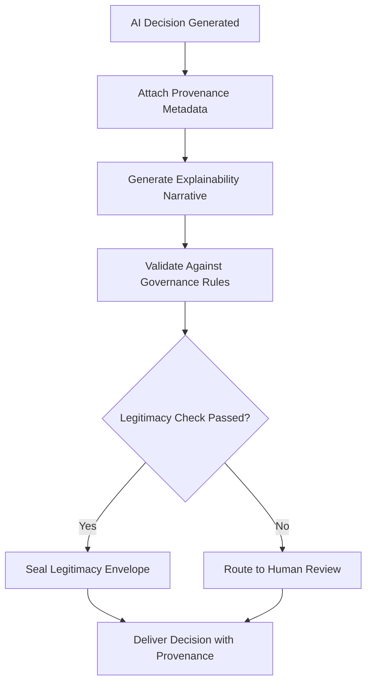

# Layer 4: Decision Legitimacy

## Definition

Decision Legitimacy is the civilizational layer that determines whether an action is accepted as valid by the stakeholders it affects. Legality is necessary but insufficient -- a decision can be lawful yet illegitimate if it violates institutional norms, bypasses expected approval processes, or lacks transparency. Courts derive legitimacy from due process. Legislatures derive it from elections. Corporate boards derive it from fiduciary duty and shareholder consent.

In AI systems, legitimacy is the most underappreciated failure mode. A model can produce a technically correct output that is procedurally illegitimate -- for example, an AI that denies a loan application using a factor the applicant was never told would be considered. The FrankMax Marketplace embeds decision legitimacy into every offering by requiring that AI outputs carry provenance metadata explaining not just what was decided, but why, by what authority, and through what process.

## Why It Matters

When decision legitimacy is absent, institutions face "consent erosion" -- stakeholders stop trusting outputs even when those outputs are correct. A hospital that deploys AI triage without physician buy-in will see clinicians override 80% of recommendations regardless of accuracy. A bank that uses AI credit scoring without explainability will face regulatory challenge under the Equal Credit Opportunity Act. Illegitimate decisions are contested decisions, and contested decisions are expensive decisions. The average cost to defend an AI decision challenged in regulatory proceedings exceeds $50,000.

## Implementation in the Marketplace

The platform implements Layer 4 through the **Decision Provenance Framework (DPF)**, which attaches a legitimacy envelope to every AI output. The envelope contains: the authority delegation that permitted the decision, the model version and configuration that produced it, the data inputs that informed it, the governance rules that constrained it, and the explainability narrative that justifies it. The DPF integrates with the ORF protocol to ensure that once a decision is recorded as legitimate, its provenance cannot be retroactively altered.

## Core Systems Mapping

| Core System | Role in Layer 4 |
|---|---|
| Decision Provenance Framework | Generates and stores legitimacy envelopes |
| Explainability Engine | Produces human-readable justifications for AI outputs |
| Stakeholder Consent Registry | Tracks which parties have accepted governance terms |
| Appeals and Override System | Manages challenges to AI decisions |
| Regulatory Mapping Service | Links decisions to applicable legal frameworks |

## BPMN Workflow

## Audience Relevance

- **Chief Ethics Officers**: Need demonstrable legitimacy for AI-driven decisions
- **Regulatory Affairs Directors**: Must prove decisions follow approved processes
- **Patient Advocacy Groups**: Demand transparency in clinical AI recommendations
- **Consumer Financial Protection**: Fair lending requires explainable credit decisions
- **Public Sector Ombudsmen**: Government AI decisions must withstand public scrutiny

## Revenue Streams

Layer 4 monetizes through the **Explainability-as-a-Service** tier ($1,500/month) providing real-time decision narratives for regulated outputs, the **Legitimacy Audit Package** ($3,000/quarter) for board-level reporting on AI decision integrity, and the **Appeals Management Module** ($800/month) that automates the challenge-and-review workflow. Decision legitimacy is the governance layer that most directly converts regulatory pressure into recurring revenue -- every new AI regulation increases demand for legitimacy infrastructure.
