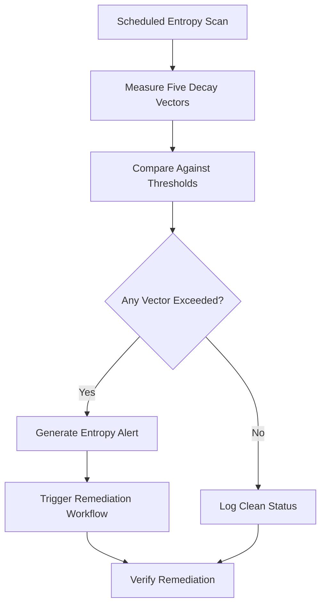

# Layer 13: Entropy / Decay

## Definition

Entropy and Decay is the civilizational layer that acknowledges and manages the inevitable degradation of all systems over time. Every institution, every process, every technology decays. Laws become obsolete. Infrastructure corrodes. Knowledge erodes as personnel turn over. Organizations that fail to account for entropy do not fail suddenly -- they fail gradually, imperceptibly, until a stress event reveals that the system they trusted has been hollow for years. Entropy management is not prevention of decay; it is the disciplined practice of detecting, measuring, and counteracting degradation before it reaches critical thresholds.

In AI systems, entropy manifests as model drift (performance degradation as real-world data distribution shifts from training data), configuration drift (runtime settings diverging from documented baselines), governance drift (compliance rules falling behind evolving regulations), and knowledge drift (documentation becoming stale). The FrankMax Marketplace treats entropy as a first-class operational concern, continuously monitoring all 713 offerings for degradation signals and triggering remediation before customers experience impact.

## Why It Matters

When entropy is unmanaged, organizations experience "silent failure" -- systems continue to operate but produce progressively worse outcomes. A medical AI trained on 2022 treatment guidelines continues to recommend outdated protocols in 2026. A compliance engine built for pre-EU-AI-Act regulations passes audits that should fail. A billing system accumulates rounding errors that compound into material revenue leakage. The insidious nature of entropy is that it is invisible to spot checks -- a system that performed well last quarter may have degraded 3% this quarter, and 3% per quarter compounds to 12% annual degradation, which in a billion-dollar healthcare system represents $120M in misallocated resources.

## Implementation in the Marketplace

The platform implements Layer 13 through the **Entropy Detection and Remediation System (EDRS)**, which continuously monitors five decay vectors across every marketplace offering. Model drift is measured via statistical divergence tests on output distributions. Configuration drift is detected through baseline comparison scans. Governance drift is tracked by mapping compliance rules against regulatory update feeds. Knowledge drift is identified by comparing documentation timestamps against product change logs. The EDRS generates a weekly Entropy Report for every active offering, flagging any vector that exceeds its degradation threshold and triggering automated remediation workflows.

## Core Systems Mapping

| Core System | Role in Layer 13 |
|---|---|
| Entropy Detection and Remediation System | Monitors five decay vectors across all offerings |
| Model Drift Detector | Statistical divergence testing on output distributions |
| Configuration Baseline Scanner | Detects configuration drift from approved baselines |
| Regulatory Update Feed | Tracks regulation changes that create governance drift |
| Documentation Freshness Monitor | Flags stale documentation against product changes |

## BPMN Workflow

## Audience Relevance

- **MLOps Teams**: Model drift detection is their primary operational concern
- **Compliance Officers**: Regulatory drift creates audit exposure
- **Healthcare Quality Managers**: Clinical AI must track evolving treatment standards
- **IT Operations**: Configuration drift causes outages and security vulnerabilities
- **Knowledge Management Officers**: Documentation decay undermines institutional memory

## Revenue Streams

Layer 13 generates revenue through the **Entropy Monitoring Service** ($1,800/month) providing continuous decay detection across all active offerings, the **Drift Remediation Package** ($500/remediation) automated correction of detected drift with verification, and the **Entropy Intelligence Report** ($400/month) providing trend analysis on degradation patterns across the customer's AI portfolio. Entropy management is a pure "kitchen" play -- the telemetry data generated by monitoring 713 offerings across hundreds of customers creates an industry-level entropy knowledge base that no single organization could build independently.
