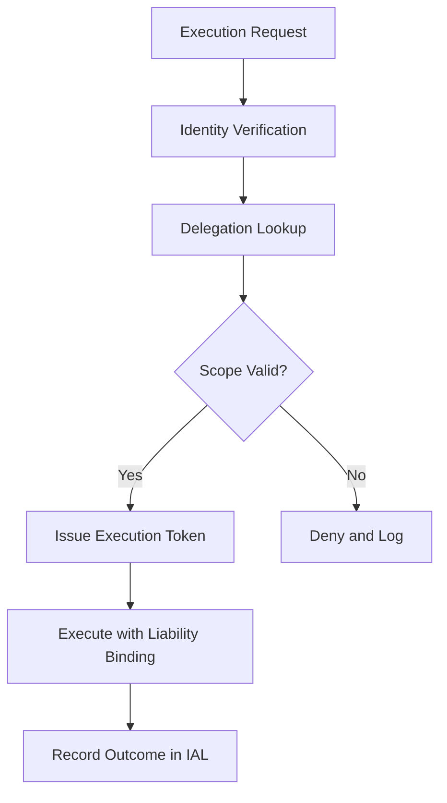

# Layer 2: Execution Authority

## Definition

Execution Authority is the civilizational layer that determines who -- or what -- is permitted to act. In any functioning institution, the ability to make things happen is not distributed uniformly. It is delegated, scoped, revocable, and auditable. A government issues warrants. A corporation grants signing authority. A military issues orders through a chain of command. Without this layer, either nothing happens (paralysis) or everything happens simultaneously with no coordination (chaos).

In AI-powered systems, Execution Authority becomes uniquely critical because autonomous agents can act at machine speed without waiting for human approval. The question shifts from "can this person act?" to "can this model act, on behalf of this entity, within this scope, at this moment?" The FrankMax Marketplace treats every AI invocation as an act of delegated authority that must be explicitly granted, bounded, and logged.

## Why It Matters

When Execution Authority is absent, organizations face two catastrophic failure modes. The first is "authority vacuum" -- no one is empowered to make decisions, and AI systems idle while waiting for approvals that never come. The second is "authority sprawl" -- every user and every agent assumes they can do anything, leading to unauthorized model invocations, unbudgeted compute spend, and compliance violations. In regulated industries, a single unauthorized AI action (a model accessing patient records without proper delegation, for instance) can trigger penalties exceeding $1M per incident under HIPAA.

## Implementation in the Marketplace

The platform implements Layer 2 through the **Delegated Authority Engine (DAE)**, which enforces the ETLB (Execution-Time Liability Binding) protocol. Every API call passes through the DAE, which validates three conditions before permitting execution: (1) the requesting identity holds a valid authority delegation, (2) the requested action falls within the delegation scope, and (3) the delegation has not been revoked or expired. The DAE issues short-lived execution tokens (default 300 seconds) that bind the invoking identity to the resulting liability.

## Core Systems Mapping

| Core System | Role in Layer 2 |
|---|---|
| Identity and Access Management (IAM) | Issues and manages authority delegations |
| ETLB Protocol Engine | Binds execution authority to liability at invocation time |
| Policy Decision Point (PDP) | Evaluates scope constraints in real time |
| Token Issuance Service | Generates time-bound execution tokens |
| Revocation Registry | Maintains real-time list of revoked authorities |

## BPMN Workflow

## Audience Relevance

- **CISOs and Security Teams**: Must control which agents can act on enterprise systems
- **Financial Controllers**: Signing authority for AI-generated transactions must be explicit
- **Hospital CIOs**: Clinical AI must operate under physician delegation, not autonomously
- **Government Agency Directors**: Federal systems require authority-to-operate documentation
- **Board-Level Risk Committees**: Need assurance that AI authority mirrors corporate governance

## Revenue Streams

Layer 2 monetizes through the **Authority-as-a-Service** module ($1,800/month) providing managed delegation infrastructure, the **ETLB Compliance Certificate** ($750/audit cycle) proving execution authority integrity to regulators, and the **Delegation Analytics Dashboard** ($400/month) giving executives visibility into who authorized what across all AI operations. The authority layer is a prerequisite for every other revenue-generating layer, making it the linchpin of the governance "fries" stack.
