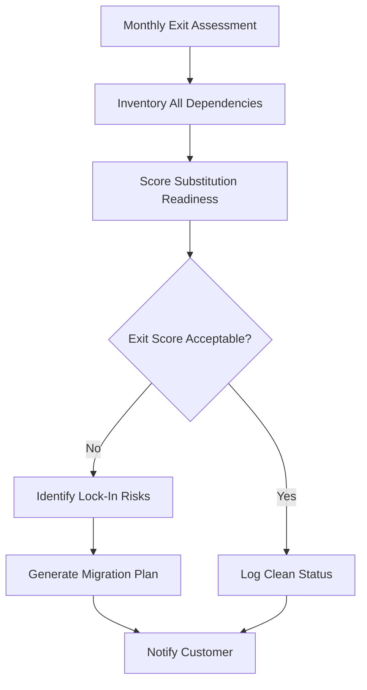

# Layer 18: Exit & Substitution

## Definition

Exit and Substitution is the civilizational layer that ensures no single dependency becomes an existential trap. In political systems, this is the right to emigrate. In markets, it is the ability to switch vendors. In employment, it is the right to resign. Exit infrastructure does not require frequent use -- its power lies in the credible option. A vendor who knows you can leave treats you differently than a vendor who knows you cannot. Substitution is the operational corollary of exit: the ability to replace one component with another without rebuilding the system.

In AI marketplaces, exit and substitution address the defining risk of the AI era: vendor lock-in. An enterprise that builds its operations on a single model provider's proprietary API, fine-tuned embeddings, and custom integrations has no exit. When that provider raises prices by 40% (as has occurred repeatedly in the AI industry), the enterprise has two choices: pay or rebuild from scratch. The FrankMax Marketplace is architecturally designed to be the exit infrastructure -- by abstracting model access behind standardized governance interfaces, every model is substitutable, and the customer is never locked to a single provider.

## Why It Matters

When exit and substitution are absent, power asymmetry compounds over time. The vendor accumulates leverage with every integration, every custom workflow, and every data dependency. Within 18 months, switching costs typically exceed 3x the annual contract value, making exit economically irrational regardless of vendor performance. In AI specifically, lock-in is accelerated by fine-tuning -- once an organization fine-tunes a model on proprietary data, the resulting weights are tied to that provider's architecture and cannot be ported. The FrankMax Marketplace breaks this cycle by ensuring that governance, compliance, and audit infrastructure is model-agnostic.

## Implementation in the Marketplace

The platform implements Layer 18 through the **Substitution Readiness Framework (SRF)**, which maintains exit viability for every customer at all times. The SRF operates through three mechanisms. First, **model abstraction**: all marketplace offerings are accessed through standardized APIs, so swapping GPT-4 for Claude or Gemini requires a configuration change, not a code rewrite. Second, **governance portability**: all compliance rules, boundary specifications, and audit records are stored in vendor-neutral formats that can be exported and reconstituted on any platform. Third, **exit scoring**: every customer receives a monthly Exit Readiness Score measuring how quickly they could migrate away from any single dependency.

## Core Systems Mapping

| Core System | Role in Layer 18 |
|---|---|
| Substitution Readiness Framework | Maintains exit viability across all dependencies |
| Model Abstraction Layer | Standardized APIs enabling provider substitution |
| Governance Export Service | Exports compliance configurations in portable formats |
| Exit Readiness Scorer | Monthly assessment of migration feasibility |
| Vendor Dependency Monitor | Tracks concentration risk across model providers |

## BPMN Workflow

## Audience Relevance

- **CIOs and CTOs**: Vendor lock-in is their primary strategic technology risk
- **Procurement Officers**: Exit clauses and substitution rights are contract essentials
- **Enterprise Architects**: Must design systems that support component substitution
- **Risk Committees**: Concentration risk in AI vendors is a board-level concern
- **Government IT Directors**: Federal procurement requires vendor-neutral architectures

## Revenue Streams

Layer 18 generates revenue through the **Exit Readiness Assessment** ($2,000/quarter) providing detailed migration feasibility analysis, the **Governance Portability Package** ($1,500/month) maintaining export-ready compliance configurations, and the **Migration Execution Service** ($10,000/migration) hands-on support for customers switching model providers or leaving the marketplace entirely. Exit infrastructure is paradoxically the marketplace's strongest retention tool -- customers who know they can leave feel safe staying, and the exit readiness data creates a trust signal that reinforces the platform's value proposition.
