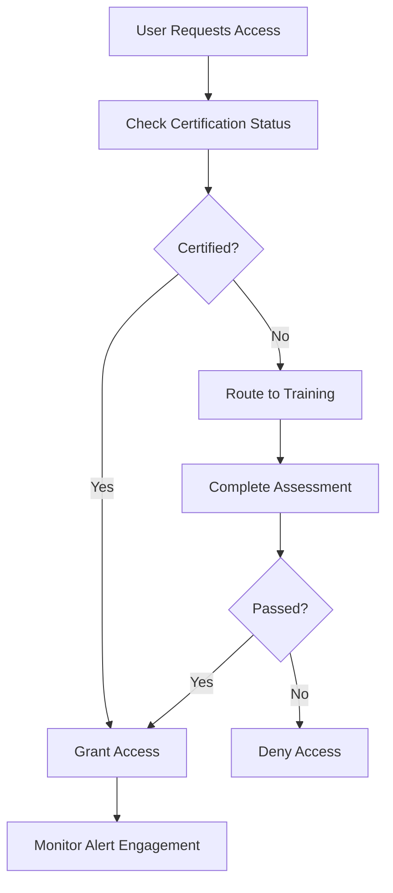

# Layer 16: Human Discipline

## Definition

Human Discipline is the civilizational layer that governs the behavioral expectations, training requirements, and competency standards for the humans who interact with institutional systems. Technology alone does not create governance -- humans must be trained to use it, disciplined to follow it, and competent to intervene when it fails. Armies train soldiers. Hospitals credential physicians. Airlines certify pilots. The common thread is that access to powerful systems is gated behind demonstrated human capability, and that capability is periodically revalidated.

In AI-powered environments, human discipline becomes paradoxically more important as automation increases. When AI handles routine decisions, the remaining human decisions are the hard ones -- the edge cases, the ambiguous scenarios, the situations where the AI abstained (Layer 14) or flagged an irreversible action (Layer 12). These decisions require higher skill, not lower, because the easy decisions have already been automated away. The FrankMax Marketplace enforces human discipline requirements on every offering that involves human-in-the-loop interactions.

## Why It Matters

When human discipline is absent, governance infrastructure becomes a liability rather than an asset. The most sophisticated compliance engine is useless if the human reviewing its alerts clicks "approve" without reading them. Alert fatigue -- the phenomenon where humans stop paying attention to automated warnings -- is a documented cause of catastrophic failures in healthcare (ignored medication alerts), aviation (ignored cockpit warnings), and finance (ignored risk flags). Organizations that deploy AI governance without investing in human discipline create a dangerous illusion: the system appears governed, but the human component has degraded to a rubber stamp.

## Implementation in the Marketplace

The platform implements Layer 16 through the **Human Competency Management System (HCMS)**, which enforces three requirements. First, **role-based certification**: every user who accesses governance-gated offerings must complete role-specific training on the governance controls they will encounter. Second, **competency verification**: periodic assessments verify that users can correctly interpret AI outputs, respond to abstention signals, and handle irreversible action confirmations. Third, **alert engagement monitoring**: the system tracks whether users actually read and consider governance alerts versus reflexively dismissing them, and flags users whose engagement patterns suggest alert fatigue.

## Core Systems Mapping

| Core System | Role in Layer 16 |
|---|---|
| Human Competency Management System | Manages certification and training requirements |
| Role-Based Training Engine | Delivers role-specific governance training |
| Competency Assessment Platform | Periodic knowledge verification |
| Alert Engagement Monitor | Detects alert fatigue and rubber-stamping |
| Credential Revocation Service | Removes access for users who fail revalidation |

## BPMN Workflow

## Audience Relevance

- **Chief Learning Officers**: Responsible for institutional competency in AI governance
- **Healthcare Credentialing Committees**: Clinical AI use requires documented human competency
- **Financial Services Training Directors**: Regulatory exams increasingly cover AI oversight
- **Government Agency Training Managers**: Federal AI mandates require workforce readiness
- **Risk Committee Members**: Human discipline is a measurable risk mitigation factor

## Revenue Streams

Layer 16 generates revenue through the **Certification-as-a-Service** ($800/user/year) providing managed training and assessment for enterprise users, the **Alert Engagement Analytics** ($600/month) reporting on human interaction quality across governance touchpoints, and the **Custom Training Module Development** ($5,000/module) creating organization-specific governance training content. Human discipline is a recurring revenue stream with high retention -- once an organization certifies its workforce, annual recertification becomes a budget line item rather than a discretionary expense.
