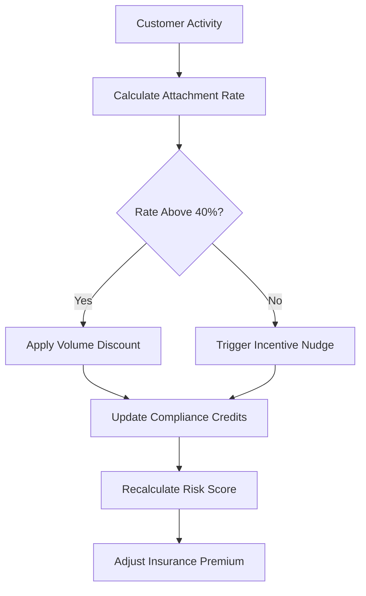

# Layer 7: Incentive Gradient

## Definition

The Incentive Gradient layer is the civilizational infrastructure that aligns individual actor behavior with systemic goals. Where Coercion (Layer 5) punishes deviation, incentives reward alignment. Effective institutions do not rely solely on punishment -- they construct environments where the easiest, most natural action is also the desired action. Tax deductions incentivize charitable giving. Stock options incentivize employee retention. Frequent-flyer programs incentivize airline loyalty. The gradient metaphor is precise: incentives create slopes that guide behavior without requiring constant supervision.

In AI marketplaces, the incentive gradient governs both human behavior (customers choosing governed models over ungoverned alternatives) and agent behavior (AI systems preferring compliant execution paths over shortcut paths). The FrankMax Marketplace designs its incentive architecture so that using governance layers is cheaper, faster, and lower-risk than bypassing them -- making compliance the path of least resistance rather than the path of greatest friction.

## Why It Matters

When incentive gradients are misaligned, governance becomes an adversarial game. Users find workarounds. Agents exploit loopholes. Compliance teams spend more time policing than enabling. The classic failure mode is "compliance tax" -- governance adds cost and latency to every operation, incentivizing users to route around it. Organizations with misaligned incentives see shadow AI adoption rates exceeding 60%, where employees use personal accounts for ungoverned model access because the governed path is too slow or too expensive. Shadow AI is ungovernable AI, and ungovernable AI is institutional risk.

## Implementation in the Marketplace

The platform implements Layer 7 through the **Incentive Architecture Engine (IAE)**, which applies three gradient mechanisms. First, **volume discounts** that increase as governance attachment rates rise -- customers who use compliance layers on 80% or more of invocations receive 15% lower per-call pricing. Second, **compliance credits** that accumulate when users follow recommended governance practices, redeemable against future marketplace purchases. Third, **risk scoring** that gives customers with high governance adoption lower insurance premiums through partner carriers. The IAE continuously monitors attachment rates and adjusts incentives to maintain the critical 40% floor.

## Core Systems Mapping

| Core System | Role in Layer 7 |
|---|---|
| Incentive Architecture Engine | Calculates and applies incentive gradients |
| Attachment Rate Monitor | Tracks governance layer adoption per customer |
| Volume Discount Calculator | Adjusts pricing based on compliance behavior |
| Compliance Credit Ledger | Manages earned credits and redemption |
| Risk Score Aggregator | Feeds governance metrics to insurance partners |

## BPMN Workflow

## Audience Relevance

- **CFOs and Finance Directors**: Incentive alignment directly impacts AI spend efficiency
- **Procurement Teams**: Volume discount structures influence vendor selection
- **Risk Managers**: Lower premiums for governed AI create measurable ROI
- **Department Heads**: Need to demonstrate cost savings from compliance adoption
- **IT Directors**: Must justify governance overhead to budget holders

## Revenue Streams

Layer 7 is an indirect revenue driver that increases attachment rates for direct-revenue layers. The **Incentive Dashboard** ($400/month) gives customers visibility into their earned discounts and credits. The **Risk Score Report** ($200/quarter) provides actuarial-grade governance metrics for insurance negotiations. Most importantly, the incentive gradient maintains the 40% attachment rate floor that makes the entire "fries" business viable -- without it, customers buy the "burger" and skip everything else, which is a death spiral for the business model.
