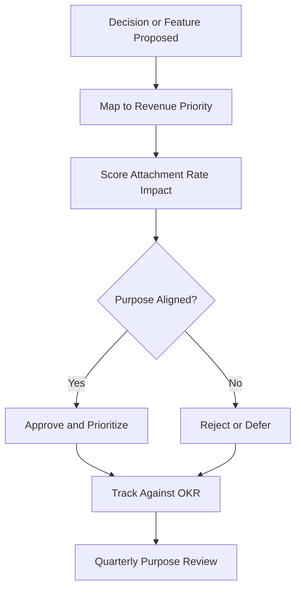

# Layer 10: Internal Purpose

## Definition

Internal Purpose is the civilizational layer that provides directional coherence to an institution beyond its external narrative. While Narrative Legitimacy (Layer 9) faces outward -- explaining the institution to the world -- Internal Purpose faces inward, answering the question: what are we actually trying to accomplish, and how do we know if we are succeeding? Armies have doctrines. Companies have mission statements that matter (as opposed to the ones on lobby walls). Research labs have intellectual agendas. Internal purpose prevents institutional drift -- the slow, invisible process by which an organization forgets what it was built to do.

In the FrankMax Marketplace, internal purpose is encoded directly into the platform architecture. The purpose is not "sell AI models" -- that is the mechanism. The purpose is "make institutional AI governance so cheap, fast, and effective that ungoverned AI becomes economically irrational." Every product decision, pricing structure, and technical investment is evaluated against this purpose. When a feature proposal does not serve this purpose, it is rejected regardless of its revenue potential. Internal purpose is the filter that prevents the marketplace from degenerating into a generic SaaS reseller.

## Why It Matters

When internal purpose erodes, organizations optimize for metrics that no longer serve their mission. A healthcare AI company that loses internal purpose starts optimizing for revenue per patient interaction rather than patient outcomes. A governance platform that loses internal purpose starts adding features to win RFPs rather than to improve governance. The symptom of lost purpose is "feature creep with declining coherence" -- the product grows but the value proposition blurs. In AI marketplaces, lost purpose is fatal because the market is moving too fast for an unfocused organization to maintain competitive advantage.

## Implementation in the Marketplace

The platform implements Layer 10 through the **Purpose Alignment Framework (PAF)**, which operates at three levels. First, **strategic alignment**: every quarterly OKR is mapped to one of the five revenue priorities (PIAR, Billing Leakage Detector, DocuFlow, Claims Processing Accelerator, AI Cost Optimization Engine). Second, **product alignment**: every feature request is scored against the attachment rate impact -- if it does not increase governance adoption, it is deprioritized. Third, **operational alignment**: the MASTER_EXECUTION_PROMPT encodes purpose directly into agent behavior, ensuring that every AI agent operating within the platform acts in service of the institutional mission.

## Core Systems Mapping

| Core System | Role in Layer 10 |
|---|---|
| OKR Tracking System | Maps operational metrics to strategic purpose |
| Feature Scoring Engine | Evaluates product decisions against purpose alignment |
| MASTER_EXECUTION_PROMPT | Encodes purpose into agent behavior |
| Attachment Rate Dashboard | Primary metric for purpose fulfillment |
| Strategic Review Automation | Generates quarterly purpose-alignment reports |

## BPMN Workflow

## Audience Relevance

- **Founding Team**: Internal purpose prevents mission drift in early-stage execution
- **Product Managers**: Need a filter for prioritizing features against strategic goals
- **Enterprise Customers**: Vendors with clear internal purpose deliver more coherent products
- **Investors**: Purpose alignment is a proxy for execution discipline
- **Strategic Partners**: Align with vendors whose purpose complements their own

## Revenue Streams

Layer 10 is primarily an internal governance layer that protects revenue by preventing dilution of focus. However, it generates direct revenue through the **Purpose Alignment Consulting** ($7,500/engagement) helping enterprise customers define and encode their own AI governance purpose, and the **Executive Strategy Dashboard** ($1,200/month) providing C-suite visibility into how AI investments map to institutional purpose. The deeper value of this layer is defensive: it ensures the platform does not chase revenue streams that undermine the attachment rate, which would collapse the entire business model.
