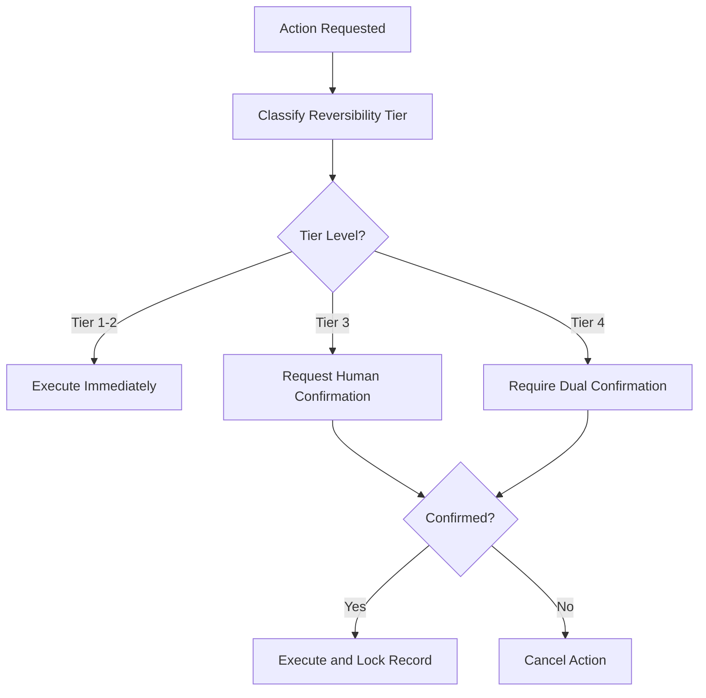

# Layer 12: Irreversibility

## Definition

Irreversibility is the civilizational layer that governs actions which cannot be undone. Some institutional acts are reversible -- a memo can be retracted, a hire can be terminated, a policy can be repealed. But others cross a threshold beyond which rollback is impossible or prohibitively expensive: a patient receives a drug, a missile launches, a contract is executed, a trade settles. Civilizational infrastructure must distinguish between reversible and irreversible actions and apply proportionally higher scrutiny to the latter.

In AI systems, irreversibility is the most dangerous blind spot. Models produce outputs at machine speed, and many of those outputs trigger irreversible downstream effects before any human reviews them. An AI that auto-sends a denial letter to an insurance claimant has taken an irreversible action -- the letter cannot be unsent, the claimant's experience cannot be undone, and the legal exposure begins at the moment of delivery. The FrankMax Marketplace classifies every action on a reversibility spectrum and gates irreversible actions behind mandatory confirmation protocols.

## Why It Matters

When irreversibility infrastructure is absent, organizations discover their exposure only after the damage is done. The cost of an irreversible AI error is not the cost of the error itself -- it is the cost of the error plus the cost of remediation plus the cost of trust destruction. A reversible error (a miscalculated invoice) costs $50 to fix. An irreversible error (a wrongful denial of medical coverage) costs $50,000 in remediation and $500,000 in litigation exposure. Organizations without irreversibility classification treat all AI outputs identically, which means they apply either too much friction (slowing everything) or too little (allowing irreversible errors).

## Implementation in the Marketplace

The platform implements Layer 12 through the **Irreversibility Classification Engine (ICE)**, which assigns every marketplace action to one of four reversibility tiers. Tier 1 (Fully Reversible): outputs that can be discarded with no downstream effect. Tier 2 (Reversible with Cost): outputs that can be retracted but with operational overhead. Tier 3 (Partially Irreversible): outputs that trigger downstream actions, some of which cannot be recalled. Tier 4 (Fully Irreversible): outputs that, once delivered, cannot be undone. Tier 3 and 4 actions require human-in-the-loop confirmation before execution. The ICE integrates with the MCO (Mortality Compliance Object) protocol to ensure that irreversible actions affecting human welfare receive the highest scrutiny.

## Core Systems Mapping

| Core System | Role in Layer 12 |
|---|---|
| Irreversibility Classification Engine | Assigns reversibility tiers to all actions |
| Human-in-the-Loop Gateway | Gates Tier 3 and 4 actions for confirmation |
| MCO Protocol Engine | Applies mortality-aware scrutiny to irreversible health actions |
| Rollback Manager | Executes reversals for Tier 1 and 2 actions |
| Irreversibility Audit Log | Records all tier classifications and confirmation decisions |

## BPMN Workflow

## Audience Relevance

- **Clinical Decision Support Teams**: Medical AI actions affecting patients are often irreversible
- **Insurance Claims Processors**: Denial and approval decisions trigger irreversible downstream effects
- **Legal Operations**: Contract execution and filing actions cannot be undone
- **Financial Settlement Teams**: Trade settlement is the canonical irreversible financial action
- **Government Benefits Administrators**: Benefit determinations affect livelihoods irreversibly

## Revenue Streams

Layer 12 generates revenue through the **Irreversibility Gateway** ($2,000/month) providing managed classification and confirmation infrastructure, the **MCO Compliance Module** ($3,500/month) applying mortality-aware irreversibility controls for healthcare and safety-critical deployments, and the **Reversibility Audit** ($1,000/quarter) documenting classification accuracy and confirmation compliance. This layer commands premium pricing because the cost of getting irreversibility wrong is catastrophic -- customers willingly pay for the certainty that irreversible AI actions receive appropriate scrutiny.
