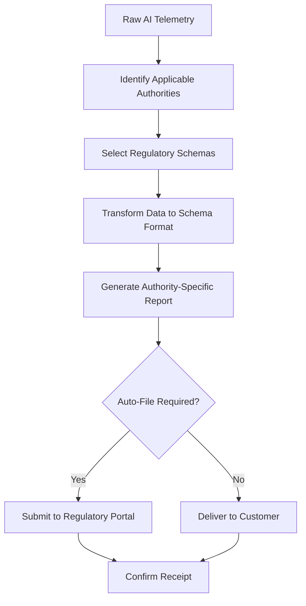

# Layer 15: Legibility to Power

## Definition

Legibility to Power is the civilizational layer that makes institutional operations comprehensible to those who govern, regulate, or oversee them. The concept derives from James C. Scott's observation that states must make populations and economies "legible" -- visible, countable, categorizable -- before they can govern them. Tax collection requires legible income. Conscription requires legible population counts. Regulation requires legible business activities. Legibility is not transparency (making things visible to everyone); it is structured visibility to specific authority structures.

In AI systems, legibility to power means making AI operations comprehensible to regulators, auditors, boards of directors, and oversight committees who have legitimate authority but limited technical expertise. A regulator does not need to understand transformer attention weights. They need to understand: what decisions did the AI make, who was affected, what safeguards were in place, and what went wrong when something failed. The FrankMax Marketplace translates complex AI operations into structured, standardized formats that regulatory and governance bodies can consume without requiring data science expertise.

## Why It Matters

When AI systems are illegible to power, two outcomes are equally damaging. First, regulators impose blunt, overreaching rules because they cannot distinguish responsible AI from irresponsible AI -- if all AI looks the same to them, they regulate all of it the same way. Second, boards and oversight committees cannot fulfill their governance obligations, creating personal liability for directors who are technically responsible for AI decisions they cannot understand. The EU AI Act explicitly requires that high-risk AI systems be "sufficiently transparent to enable users to interpret the system's output and use it appropriately." Illegibility is not merely inconvenient; it is increasingly illegal.

## Implementation in the Marketplace

The platform implements Layer 15 through the **Regulatory Translation Layer (RTL)**, which converts raw AI telemetry into regulator-ready formats. The RTL supports multiple output schemas: NIST AI RMF for US federal agencies, EU AI Act Article 13 transparency requirements, OSFI B-13 for Canadian financial institutions, and ISO 42001 for global enterprises. Each schema maps the same underlying telemetry data to the specific structure, vocabulary, and detail level that the target authority expects. The RTL also generates executive-readable dashboards that present AI operations in business terms rather than technical terms.

## Core Systems Mapping

| Core System | Role in Layer 15 |
|---|---|
| Regulatory Translation Layer | Converts telemetry to regulator-specific formats |
| Schema Registry | Maintains output templates for NIST, EU AI Act, OSFI, ISO |
| Executive Dashboard Generator | Produces board-readable AI operations summaries |
| Regulatory Filing Automator | Submits required reports to regulatory portals |
| Authority Mapping Service | Tracks which regulations apply to which offerings |

## BPMN Workflow

## Audience Relevance

- **Regulatory Affairs Directors**: Primary consumers of legibility infrastructure
- **Board Audit Committees**: Need AI operations presented in governance-compatible formats
- **Government Procurement Officers**: FedRAMP and FISMA require structured legibility
- **External Auditors**: Depend on standardized formats for efficient examination
- **Compliance Officers**: Must translate AI operations into regulatory submissions

## Revenue Streams

Layer 15 generates revenue through the **Regulatory Translation Service** ($2,500/month) providing continuous conversion of AI telemetry to authority-specific formats, the **Auto-Filing Module** ($1,500/month) automating mandatory regulatory submissions, and the **Board Report Package** ($1,000/quarter) generating executive-readable AI governance summaries. Legibility to power is one of the highest-value "fries" because regulatory reporting is non-optional -- every regulated customer must produce these outputs, and the alternative to the marketplace's automated translation is expensive manual compliance work.
