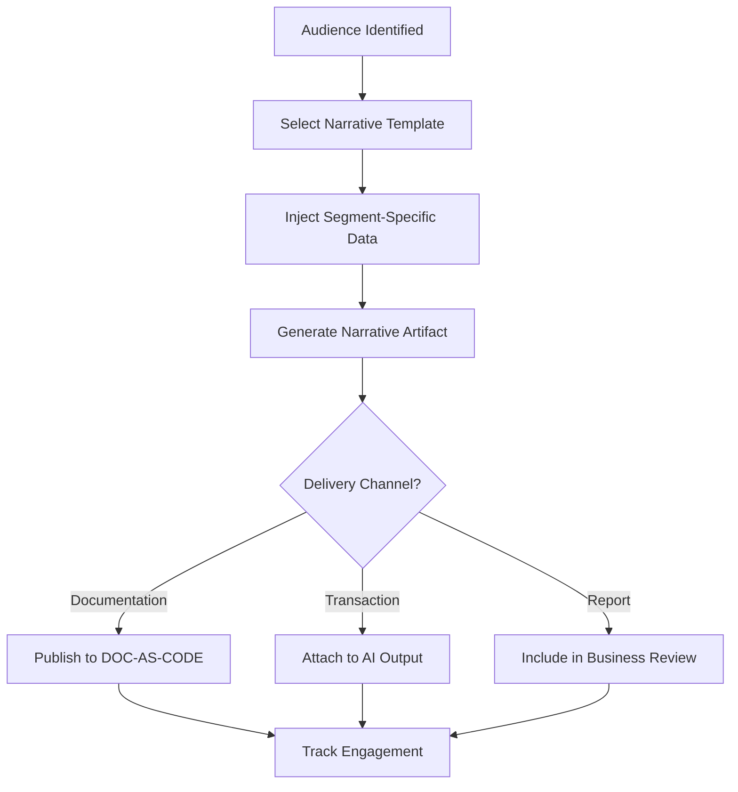

# Layer 9: Narrative Legitimacy

## Definition

Narrative Legitimacy is the civilizational layer that provides the shared story explaining why an institution exists, why its rules are worth following, and why its participants should continue participating. Every durable institution operates within a narrative frame -- democracies invoke the consent of the governed, markets invoke the efficiency of competition, religions invoke divine authority. The narrative does not need to be complete or even fully accurate; it needs to be coherent enough that participants can explain to themselves and others why they are here.

In AI marketplaces, narrative legitimacy answers a specific question: why should an enterprise buy governed AI at 80% discount through FrankMax rather than going directly to OpenAI, Anthropic, or Google? The answer is not merely technical or financial -- it is narrative. The FrankMax narrative is that ungoverned AI is institutional negligence, that governance is infrastructure (not overhead), and that the marketplace model delivers both cost savings and compliance in a single procurement decision. Without this narrative, the marketplace is just another reseller.

## Why It Matters

When narrative legitimacy collapses, institutions lose voluntary participation. Employees disengage. Customers defect. Partners seek alternatives. In AI markets specifically, narrative collapse manifests as "commodity perception" -- if the marketplace cannot articulate why its governance layer matters, customers treat it as a pass-through and negotiate on price alone. Price-only competition is a race to zero margin. The FrankMax model requires customers to understand and accept the narrative that governance creates value -- that the "fries" are worth buying alongside the "burger." Without narrative legitimacy, the attachment rate drops below 40% and the business model fails.

## Implementation in the Marketplace

The platform implements Layer 9 through the **Narrative Infrastructure System (NIS)**, which operates at three levels. First, **market-level narrative**: the DOC-AS-CODE documentation site that articulates the platform's value proposition across all 15 audience segments and 20+ NAICS sectors. Second, **transaction-level narrative**: every AI output includes a governance summary explaining what protections were applied and why they matter. Third, **outcome-level narrative**: quarterly Business Review packages that demonstrate measurable ROI from governance adoption, converting abstract narrative into concrete numbers.

## Core Systems Mapping

| Core System | Role in Layer 9 |
|---|---|
| DOC-AS-CODE Platform | Market-level narrative generation and distribution |
| Governance Summary Generator | Transaction-level narrative attached to every output |
| ROI Calculator | Converts governance metrics into financial narratives |
| Market Positioning Agent | Tailors narrative to specific audience segments |
| Content Syndication Engine | Distributes narrative across channels |

## BPMN Workflow

## Audience Relevance

- **C-Suite Executives**: Need narrative justification for AI governance investment
- **Board Members**: Require coherent story for shareholder communications
- **Procurement Committees**: Narrative legitimacy differentiates vendors in RFP evaluation
- **Regulators**: Expect institutions to articulate their AI governance philosophy
- **Industry Analysts**: Evaluate vendors partly on narrative coherence and market positioning

## Revenue Streams

Layer 9 generates indirect revenue by maintaining the narrative conditions necessary for premium pricing. Direct revenue comes from the **Custom Narrative Package** ($5,000/quarter) producing tailored ROI reports and governance narratives for enterprise customers to present to their boards, and the **Analyst Briefing Service** ($2,500/briefing) providing market positioning content for customers who need to justify their AI vendor choices to industry analysts. Narrative legitimacy is the layer that prevents commoditization and sustains the margin structure of the entire platform.
