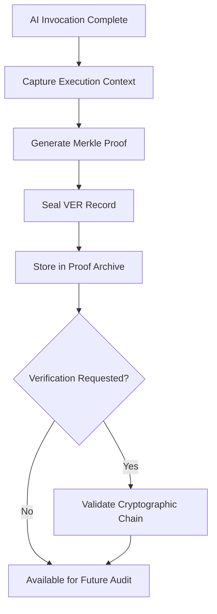

# Layer 6: Proof / Verifiability

## Definition

The Proof and Verifiability layer is the civilizational infrastructure that enables any claim to be independently validated. Truth (Layer 1) establishes what happened. Proof establishes that what happened can be confirmed by a third party who was not present. In legal systems, this is the evidentiary standard. In science, it is reproducibility. In finance, it is the independent audit. Proof infrastructure converts private knowledge into publicly verifiable fact.

In AI systems, verifiability faces a unique challenge: model outputs are non-deterministic by design. The same prompt can produce different outputs on consecutive runs. The FrankMax Marketplace addresses this by capturing the complete execution context -- model version, temperature setting, system prompt, input tokens, random seed where available, and output tokens -- so that any AI decision can be reconstructed or at minimum explained. Proof in this context does not mean deterministic reproduction; it means sufficient documentation to demonstrate that the output was reasonable given the inputs and constraints.

## Why It Matters

When proof infrastructure is absent, organizations cannot defend their AI decisions under scrutiny. A healthcare provider that cannot demonstrate why an AI recommended a particular treatment faces malpractice exposure. A financial institution that cannot reconstruct an algorithmic trading decision faces SEC enforcement. The cost of unverifiable AI is not theoretical -- the EU AI Act imposes fines up to 35 million EUR or 7% of global revenue for high-risk AI systems that lack adequate documentation. Without proof infrastructure, every AI output is an unverifiable assertion that becomes a liability the moment it is questioned.

## Implementation in the Marketplace

The platform implements Layer 6 through the **Verifiable Execution Record (VER)** system, which captures cryptographically sealed snapshots of every AI invocation. Each VER contains the full execution context, the output, and a Merkle proof linking the record to the IAL (Immutable Audit Ledger from Layer 1). Third-party auditors can validate any VER without accessing the underlying model or data -- they verify the cryptographic chain and confirm that the recorded context matches the claimed output. The VER system supports both real-time verification (API-based) and batch verification (auditor tooling).

## Core Systems Mapping

| Core System | Role in Layer 6 |
|---|---|
| Verifiable Execution Record System | Captures and seals execution contexts |
| Merkle Proof Generator | Creates tamper-evident links between records |
| Auditor Verification Toolkit | Third-party validation without system access |
| Reproducibility Engine | Attempts output reconstruction for deterministic models |
| Evidence Export Service | Packages proof artifacts for regulatory submission |

## BPMN Workflow

## Audience Relevance

- **External Auditors**: Require independently verifiable evidence for AI-driven decisions
- **Regulatory Examiners**: Demand reproducible proof for high-risk AI outputs
- **Legal Counsel**: Need defensible evidence packages for litigation
- **Healthcare Quality Officers**: Clinical AI decisions must be documentable for peer review
- **Insurance Actuaries**: Model outputs driving pricing must be verifiable

## Revenue Streams

Layer 6 generates revenue through the **Proof Archive** ($1,800/month) providing managed storage with 10-year retention and cryptographic verification, the **Auditor Toolkit License** ($5,000/year) enabling third-party auditors to validate records independently, and the **Evidence Package Generator** ($250/package) producing regulator-ready documentation bundles. Proof infrastructure has the highest margin in the governance stack (estimated 90%) because the marginal cost of generating a proof record is near zero once the infrastructure exists.
