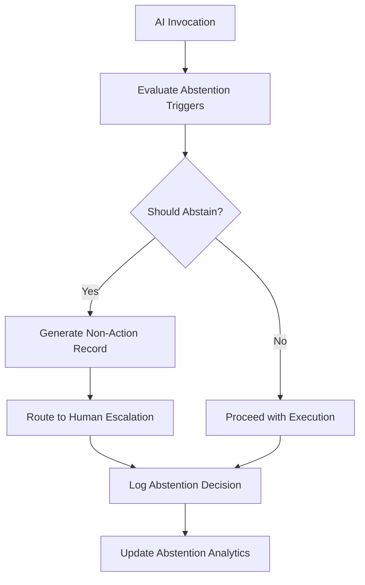

# Layer 14: Silence / Non-Action

## Definition

Silence and Non-Action is the civilizational layer that governs what an institution deliberately chooses not to do, not to say, and not to record. Every functioning system has boundaries of abstention -- topics it will not address, actions it will not take, data it will not collect. These are not omissions by neglect; they are architectural decisions. Courts decline jurisdiction. Companies exit markets. Regulatory agencies issue no-action letters. The discipline of silence is as structurally important as the discipline of action, because an institution that acts on everything has no capacity to act well on anything.

In AI systems, non-action is critically underengineered. Models are designed to produce outputs, not to abstain from producing them. But in regulated environments, the decision not to act is often the correct decision -- a clinical AI should refuse to diagnose conditions outside its training data rather than hallucinate a diagnosis. A financial AI should decline to price an instrument it cannot model rather than produce a misleading estimate. The FrankMax Marketplace builds non-action as a first-class capability, treating "I cannot safely answer this" as a high-quality output rather than a failure mode.

## Why It Matters

When silence infrastructure is absent, AI systems fill every gap with output, regardless of confidence or competence. The result is "toxic completeness" -- the system always produces an answer, even when the honest answer is "I do not know" or "this is outside my scope." In healthcare, toxic completeness kills: an AI that always provides a diagnosis rather than flagging uncertainty leads clinicians into false confidence. In finance, toxic completeness produces phantom precision -- a risk model that always returns a number, even when the underlying data is insufficient to support any number, creates the illusion of quantitative rigor where none exists.

## Implementation in the Marketplace

The platform implements Layer 14 through the **Abstention Protocol Engine (APE)**, which configures every marketplace offering with explicit non-action triggers. Each offering carries an Abstention Specification that defines: (1) input conditions under which the model should decline to respond, (2) confidence thresholds below which output is suppressed, (3) scope boundaries where the model redirects to human judgment, and (4) regulatory contexts where automated output is prohibited. When the APE triggers an abstention, it generates a structured non-action record that documents what was requested, why it was declined, and what alternative was recommended.

## Core Systems Mapping

| Core System | Role in Layer 14 |
|---|---|
| Abstention Protocol Engine | Evaluates non-action triggers for every invocation |
| Confidence Threshold Monitor | Suppresses output below configured certainty levels |
| Scope Boundary Validator | Redirects out-of-scope requests to appropriate channels |
| Non-Action Record Generator | Documents abstention decisions for audit |
| Human Escalation Router | Routes abstained requests to qualified human reviewers |

## BPMN Workflow

## Audience Relevance

- **Clinical Safety Officers**: Medical AI must know when not to diagnose
- **Financial Risk Analysts**: Models must abstain when data is insufficient for pricing
- **Legal Compliance Teams**: Certain regulatory contexts prohibit automated decisions entirely
- **Ethics Boards**: Organizational AI policies define mandatory non-action zones
- **Patient Safety Committees**: Silence is safer than a wrong answer in clinical contexts

## Revenue Streams

Layer 14 generates revenue through the **Abstention Configuration Service** ($1,200/month) providing managed non-action rule design and enforcement, the **Non-Action Analytics** ($350/month) reporting on abstention frequency, triggers, and patterns, and the **Regulatory Non-Action Mapping** ($2,000/engagement) configuring abstention rules to match specific regulatory requirements. Silence infrastructure is counterintuitively valuable because it reduces liability -- every abstention that prevents an incorrect AI output saves the customer the cost of remediating the error, making the governance "fries" a direct cost-avoidance investment.
