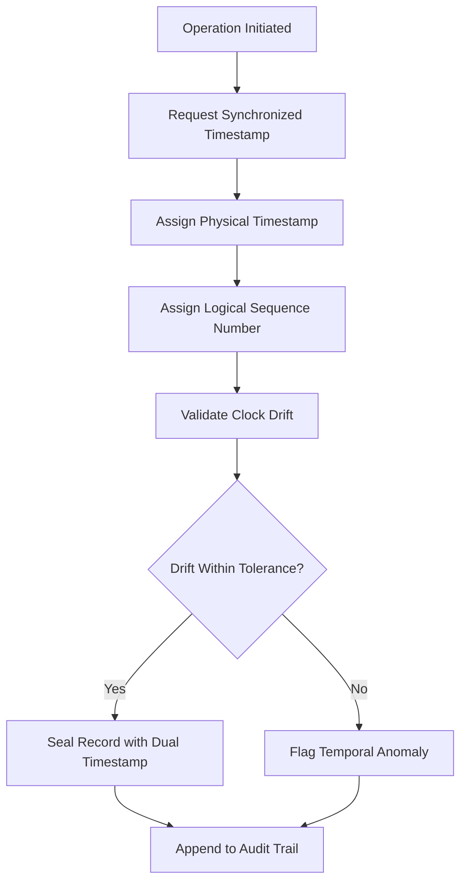

# Layer 17: Time Synchronization

## Definition

Time Synchronization is the civilizational layer that ensures all participants in an institutional system share a common temporal reference. Calendars synchronize societies. Market hours synchronize traders. Filing deadlines synchronize legal proceedings. Without shared time, coordination (Layer 3) is impossible, proof (Layer 6) is unreliable, and irreversibility (Layer 12) cannot be determined -- you cannot know if an action was too late to reverse if you cannot agree on when it occurred.

In AI systems operating across distributed infrastructure, time synchronization is an engineering challenge with governance consequences. When an AI invocation spans three cloud regions, two model providers, and one on-premise system, clock drift between these components can produce audit records where effect appears to precede cause. A billing event timestamped before the invocation it charges for is an audit failure. A compliance check timestamped after the action it was supposed to gate is a governance failure. The FrankMax Marketplace enforces monotonic, synchronized timestamps across all marketplace operations regardless of the underlying infrastructure topology.

## Why It Matters

When time synchronization is absent, audit trails become unreliable, SLA enforcement becomes disputable, and regulatory filings become indefensible. A concrete failure case: two systems process the same insurance claim. System A timestamps the denial at 14:00:01 UTC. System B timestamps the approval at 14:00:00 UTC. Without synchronized time, it is impossible to determine which action was authoritative. In regulatory proceedings, timestamp disputes consume an average of 40% of forensic investigation time. In financial markets, microsecond-level time disputes have triggered SEC investigations into front-running. Time is not a technical detail; it is a governance primitive.

## Implementation in the Marketplace

The platform implements Layer 17 through the **Temporal Coordination Service (TCS)**, which provides three capabilities. First, **clock synchronization**: all marketplace components synchronize to a common NTP stratum-1 source, with drift monitoring that alerts when any component exceeds 50ms deviation. Second, **logical timestamping**: for distributed operations where physical clock synchronization is insufficient, the TCS assigns Lamport timestamps that preserve causal ordering regardless of clock drift. Third, **temporal audit sealing**: every audit record is sealed with both a physical timestamp and a logical sequence number, ensuring that record ordering is deterministic even under adverse network conditions.

## Core Systems Mapping

| Core System | Role in Layer 17 |
|---|---|
| Temporal Coordination Service | Master time synchronization infrastructure |
| Clock Drift Monitor | Detects and alerts on synchronization failures |
| Lamport Timestamp Generator | Provides causal ordering for distributed operations |
| Temporal Audit Sealer | Dual-stamps every audit record |
| SLA Time Authority | Provides authoritative timestamps for SLA measurement |

## BPMN Workflow

## Audience Relevance

- **Financial Trading Operations**: Microsecond-level time accuracy for trade sequencing
- **Healthcare Records Managers**: Clinical event ordering must be deterministic
- **Legal Forensics Teams**: Timestamp integrity is essential for evidence admissibility
- **Cross-Border Operations**: Multi-timezone coordination requires authoritative time
- **Audit Firms**: Time-ordered audit trails are the foundation of forensic examination

## Revenue Streams

Layer 17 generates revenue through the **Temporal Authority Service** ($1,000/month) providing managed time synchronization with SLA guarantees, the **Temporal Forensics Toolkit** ($3,000/engagement) for investigating time-related anomalies in AI operations, and the **Cross-Region Time Certification** ($500/month) providing attestation that distributed operations maintain temporal integrity. Time synchronization revenue scales with customer complexity -- multi-region, multi-cloud deployments pay more because their synchronization challenge is harder and the consequences of failure are greater.
