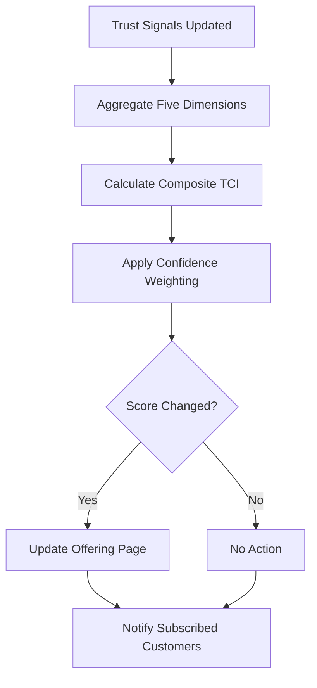

# Layer 8: Trust Compression

## Definition

Trust Compression is the civilizational layer that reduces the cost of trust between parties. In raw form, trust requires direct personal experience -- you trust your doctor because you have seen her work over years. Trust compression mechanisms allow trust to transfer across contexts and scale beyond personal relationships. Credentials compress trust ("she graduated from Johns Hopkins"). Certifications compress trust ("the product is ISO 27001 certified"). Brands compress trust ("it is made by Toyota"). Each mechanism substitutes a costly, slow trust-building process with a cheaper, faster proxy.

In AI marketplaces, trust compression is existential. No enterprise customer will evaluate all 713 offerings individually. They need compressed trust signals: this model is SOC 2 compliant, this governance layer is HIPAA-certified, this vendor has processed 50,000 claims without a compliance breach. The FrankMax Marketplace functions as a trust compression engine -- it absorbs the cost of evaluating, governing, and certifying AI models so that customers can make rapid procurement decisions based on verified trust proxies rather than months-long due diligence.

## Why It Matters

When trust compression is absent, transaction costs dominate. Enterprise AI procurement cycles average 6-9 months because each vendor requires independent security review, compliance validation, legal negotiation, and technical evaluation. For 713 offerings, this is physically impossible -- no organization has the staff to conduct 713 independent evaluations. The result is artificial scarcity: enterprises limit themselves to 3-5 AI vendors not because others lack capability, but because trust evaluation is too expensive. Trust compression shatters this bottleneck by allowing customers to trust the marketplace's evaluation rather than conducting their own.

## Implementation in the Marketplace

The platform implements Layer 8 through the **Trust Compression Index (TCI)**, a composite score assigned to every marketplace offering. The TCI aggregates five trust signals: (1) compliance certification status, (2) historical reliability metrics from the Telemetry Agent, (3) governance attachment rate, (4) customer satisfaction scores, and (5) third-party audit results. The TCI is recalculated daily and displayed on every offering page. Customers can filter the marketplace by minimum TCI threshold, compressing a 6-month evaluation process into a 6-minute search.

## Core Systems Mapping

| Core System | Role in Layer 8 |
|---|---|
| Trust Compression Index Calculator | Aggregates and scores trust signals |
| Certification Registry | Tracks compliance certifications per offering |
| Reliability Metrics Store | Historical uptime, accuracy, and latency data |
| Customer Review Engine | Collects and validates satisfaction scores |
| Third-Party Audit Integration | Ingests external audit results |

## BPMN Workflow

## Audience Relevance

- **Enterprise Procurement**: Need compressed trust signals to accelerate vendor selection
- **CISOs**: Rely on certification proxies rather than conducting 713 security reviews
- **Healthcare IT Directors**: Trust compression enables rapid adoption of clinical AI
- **Government Contracting Officers**: FedRAMP and StateRAMP serve as trust compression mechanisms
- **Insurance Buyers**: Need trust proxies for AI vendors in their supply chain

## Revenue Streams

Layer 8 generates revenue through the **Premium Trust Badge** ($3,000/year per offering) giving vendors enhanced trust visibility in marketplace search results, the **Trust Report API** ($0.05/query) allowing enterprise customers to programmatically query TCI scores, and the **Accelerated Certification Program** ($10,000/certification) where the marketplace conducts compliance evaluation on behalf of model providers. Trust compression is the "kitchen" moat at its most powerful -- every transaction improves the TCI dataset, making the marketplace's trust signals more accurate and harder for competitors to replicate.
