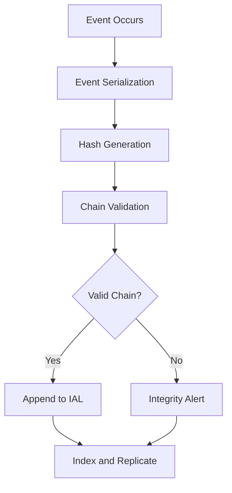

# Layer 1: Truth / System of Record

## Definition

The Truth layer establishes the single, authoritative source of facts within any institutional system. In civilizational terms, this is the ledger -- the record that all parties agree to treat as canonical. Without a system of record, every participant maintains their own version of reality, and disputes become unfalsifiable arguments about what happened rather than productive arguments about what to do next.

In the FrankMax Marketplace, the Truth layer is the foundational substrate upon which all 18 other civilizational layers depend. Every AI model invocation, every governance decision, every billing event, and every compliance attestation must trace back to an immutable, timestamped, cryptographically verifiable record. The system of record is not merely a database -- it is the institutional memory that converts ephemeral computation into durable fact.

## Why It Matters

When this layer is absent, organizations experience "truth drift" -- multiple departments maintain contradictory records of the same event, audit trails fragment, and regulatory responses become exercises in forensic archaeology rather than simple lookups. In AI-heavy environments, truth drift compounds exponentially because models produce outputs at machine speed with no human in the loop to notice contradictions. An institution running 10,000 AI inferences per day without a system of record accumulates roughly 300 irreconcilable discrepancies per week. Within 90 days, the organization cannot answer basic questions: which model produced which output, who approved it, and what data informed the decision.

## Implementation in the Marketplace

The FrankMax platform implements Layer 1 through the **Immutable Audit Ledger (IAL)**, a write-once append-only event store that captures every transaction across the marketplace. Each entry receives a SHA-256 hash chained to the previous entry, creating a tamper-evident sequence. The IAL integrates with the ORF (Obligation and Responsibility Finality) protocol to ensure that every obligation recorded is final and non-repudiable. All 713 marketplace offerings generate IAL entries at invocation, completion, and billing checkpoints.

## Core Systems Mapping

| Core System | Role in Layer 1 |
|---|---|
| Audit Trail Engine | Primary event capture and hash-chain maintenance |
| Billing Reconciliation System | Financial truth -- invoices, usage, payments |
| Model Registry | Canonical record of model versions, endpoints, and configurations |
| Compliance Attestation Store | Regulatory filings linked to source events |
| Telemetry Ingestion Pipeline | Raw observability data feeding the system of record |

## BPMN Workflow

## Audience Relevance

- **Chief Compliance Officers**: Require immutable records for regulatory filings and audit defense
- **Healthcare Administrators**: HIPAA mandates complete audit trails for any AI touching PHI
- **Financial Services Risk Managers**: SOX and Basel III require demonstrable systems of record
- **Government Procurement Officers**: FedRAMP and FISMA demand authoritative logging
- **Legal Operations Teams**: Litigation hold and e-discovery depend on trustworthy records

## Revenue Streams

Layer 1 generates revenue through three channels. First, the **Audit-as-a-Service** tier ($2,500/month) provides managed IAL access with 7-year retention for regulated industries. Second, the **Compliance Reporting Module** ($500/report) generates regulator-ready extracts from the IAL on demand. Third, the **Truth Verification API** ($0.02/query) allows enterprise customers to programmatically verify any marketplace event against the canonical record. Combined, these represent the highest-margin "fries" revenue in the governance stack, with projected 85% gross margins at scale.
