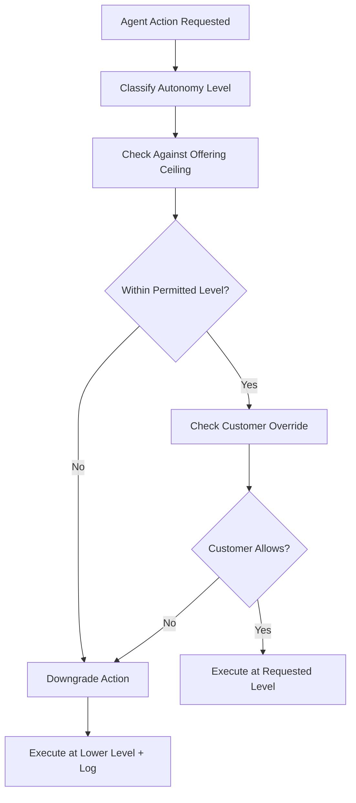

# Antigravity Autonomy Governor

## Purpose

The Antigravity Autonomy Governor controls the degree of independence granted to AI agents operating within the OpenClaw runtime. The name reflects its function: it provides the counterforce to the natural "gravity" of AI autonomy, where agents tend toward increasingly independent action unless deliberately constrained. Left unchecked, an AI agent that starts as a "copilot" making suggestions will gradually become an "autopilot" making decisions, as users grow accustomed to accepting its outputs without review.

The Governor operates on a graduated autonomy scale from Level 0 (fully human-controlled, AI provides information only) to Level 5 (fully autonomous, AI executes without human oversight). Each marketplace offering is assigned a maximum autonomy level based on its risk classification, regulatory context, and the irreversibility of its outputs. The Governor enforces this ceiling in real time, preventing autonomy creep even when the agent's capabilities would technically permit higher-level operation. This is the mechanism that prevents "automation bias" -- the documented tendency of humans to over-trust AI systems over time.

## Architecture

The Antigravity Governor sits as a middleware layer between the AI agent and its execution environment. Every agent action is classified by autonomy level before execution. The Governor compares the action's required autonomy level against the offering's maximum permitted level and the customer's configured preference. If the action exceeds either ceiling, the Governor downgrades it -- converting an autonomous execution into a recommendation, or a recommendation into an informational display -- and logs the intervention. The Governor reports to the Behavioral Anomaly Monitor, which tracks patterns of autonomy-ceiling hits as a leading indicator of governance drift.

## Features

- **Six-Level Autonomy Scale**: L0 (information only) through L5 (full autonomy), with granular sub-levels for fine-tuned control
- **Per-Offering Autonomy Ceiling**: Each marketplace offering has a pre-assigned maximum autonomy level based on risk assessment
- **Customer-Configurable Override**: Customers can lower (but never raise above) the offering's autonomy ceiling
- **Real-Time Downgrade**: Actions exceeding the autonomy ceiling are automatically converted to lower-autonomy alternatives
- **Autonomy Drift Detection**: Monitors trends in ceiling-hit frequency to detect creeping autonomy expectations
- **Escalation Pathways**: Actions that require higher autonomy than permitted are routed to qualified human operators
- **Regulatory Alignment**: Autonomy levels mapped to EU AI Act risk categories and NIST AI RMF functions

## BPMN Workflow

## Integration Points

| System | Integration |
|---|---|
| Behavioral Anomaly Monitor | Receives autonomy-ceiling hit patterns for drift analysis |
| Compliance Guardrails | Maps autonomy levels to regulatory risk categories |
| Human-in-the-Loop Gateway | Routes downgraded actions requiring human confirmation |
| Telemetry Agent | Captures autonomy level metrics per invocation |
| Irreversibility Classification Engine | Informs autonomy ceiling based on action reversibility |

## Configuration

| Parameter | Default | Description |
|---|---|---|
| `max_autonomy_level` | 2 | Maximum autonomy level (0-5) for the offering |
| `customer_override_enabled` | `true` | Allow customers to lower the autonomy ceiling |
| `downgrade_behavior` | `recommend` | Action on ceiling breach: `block`, `recommend`, `inform` |
| `drift_alert_threshold` | 10 | Number of ceiling hits per hour before alerting |
| `escalation_timeout_seconds` | 300 | Time limit for human response before auto-downgrade |
| `regulatory_mapping` | `eu_ai_act` | Regulatory framework for autonomy level alignment |
