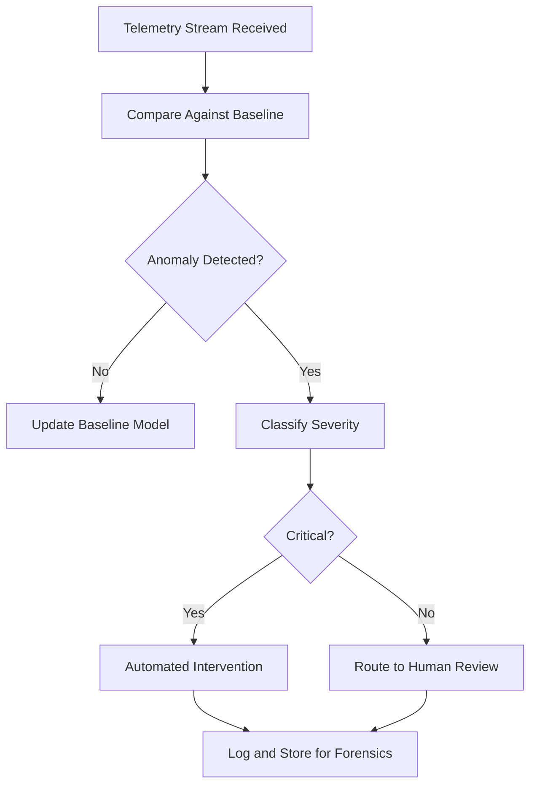

# Behavioral Anomaly Monitor

## Purpose

The Behavioral Anomaly Monitor (BAM) detects unexpected, suspicious, or dangerous patterns in AI agent behavior that individual guardrails and boundary checks would miss. While Compliance Guardrails evaluate each interaction in isolation, the BAM analyzes behavioral patterns across sequences of interactions, identifying anomalies that only become visible in aggregate. A single innocuous query is not a threat. Fifty innocuous queries that collectively map an organization's security perimeter are a threat. The BAM is designed to catch the latter.

The BAM addresses a fundamental limitation of rule-based governance: adversarial actors (and misaligned AI agents) can comply with every individual rule while violating the intent of the system as a whole. This is the "Swiss cheese model" of AI safety -- no single layer catches every threat, but the BAM serves as the cross-cutting detector that identifies patterns where threats have passed through aligned holes in multiple individual defenses. It is the last line of defense before harmful agent behavior reaches the outside world.

## Architecture

The BAM operates as a streaming analytics engine that consumes telemetry from all OpenClaw components via the Telemetry Agent. It maintains behavioral baselines for every agent, every offering, and every customer, using statistical models to define "normal" behavior across multiple dimensions: query frequency, topic distribution, tool usage patterns, autonomy-level requests, guardrail activation rates, and output characteristics. Incoming telemetry is compared against these baselines in real time. Deviations that exceed configured thresholds trigger anomaly alerts, which are classified by severity and routed to the appropriate response -- automated intervention for critical anomalies, human review for ambiguous ones.

## Features

- **Multi-Dimensional Baseline**: Behavioral norms computed across frequency, topic, tool usage, autonomy, and output patterns
- **Streaming Detection**: Real-time anomaly detection with sub-second alert latency for critical threats
- **Adversarial Pattern Library**: Pre-built detectors for known adversarial patterns (prompt injection, data exfiltration, authority escalation)
- **Adaptive Baselines**: Behavioral models update continuously to accommodate legitimate shifts in usage patterns
- **Severity Classification**: Anomalies categorized as informational, warning, serious, or critical with escalation-appropriate responses
- **Cross-Agent Correlation**: Detects coordinated anomalous behavior across multiple agents that may indicate a systemic attack
- **Forensic Replay**: Stores behavioral sequences for post-incident investigation and root cause analysis

## BPMN Workflow

## Integration Points

| System | Integration |
|---|---|
| Telemetry Agent | Primary data source for all behavioral analysis |
| Antigravity Autonomy Governor | Receives autonomy-drift signals for baseline comparison |
| Automated Consequence Engine | Triggers enforcement actions for critical anomalies |
| Compliance Guardrails | Correlates guardrail activations with behavioral patterns |
| Accountability Binding Protocol | Identifies responsible parties for anomalous behavior |

## Configuration

| Parameter | Default | Description |
|---|---|---|
| `baseline_window_days` | 30 | Historical window for computing behavioral baselines |
| `anomaly_threshold_sigma` | 3.0 | Standard deviations from baseline to trigger an anomaly |
| `critical_auto_response` | `suspend` | Action for critical anomalies: `alert`, `throttle`, `suspend` |
| `correlation_window_minutes` | 15 | Time window for cross-agent correlation analysis |
| `forensic_retention_days` | 365 | Retention period for behavioral sequences |
| `adaptive_learning_rate` | 0.01 | Rate at which baselines adapt to new behavior patterns |
