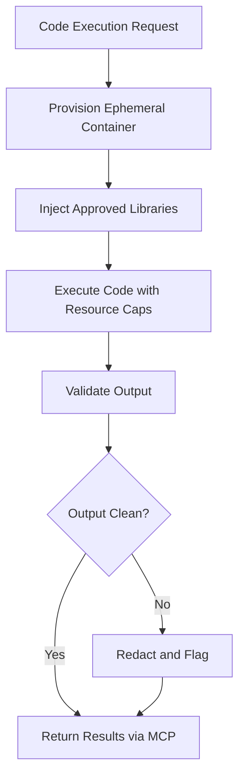

# Claude Code Sandbox

## Purpose

The Claude Code Sandbox provides isolated, governed execution environments for AI agents that need to run code as part of their workflow. Many marketplace offerings require computational steps beyond language generation -- data transformation, statistical analysis, document parsing, API integration testing, and report generation. The Sandbox provides a secure container where AI-generated code can execute with strict resource limits, network restrictions, and output validation, ensuring that code execution cannot compromise the platform or customer data.

The Sandbox addresses the fundamental tension between AI capability and AI safety in code execution. An unconstrained AI agent that can execute arbitrary code is a security liability. An AI agent that cannot execute code at all is limited to text generation and cannot perform the quantitative, data-driven tasks that enterprise customers require. The Sandbox resolves this tension by providing a "yes, but governed" execution model -- agents can run code, but only within defined boundaries, only with approved libraries, and only with outputs that pass validation before delivery.

## Architecture

Each Sandbox instance is an ephemeral container provisioned on demand. The container runs a hardened Linux environment with a pre-approved set of language runtimes (Python, Node.js, R) and libraries. Network access is restricted to an allowlist of approved endpoints. Filesystem access is limited to a temporary workspace that is destroyed after execution. CPU, memory, and execution time are capped per invocation. The Sandbox communicates with the broader OpenClaw runtime exclusively through the MCP Tool Orchestrator, which means all inputs and outputs pass through governance validation.

## Features

- **Ephemeral Containers**: Each execution gets a fresh, isolated environment -- no state leaks between invocations
- **Pre-Approved Library Set**: Curated runtime libraries validated for security and compliance (pandas, numpy, scikit-learn, etc.)
- **Resource Caps**: Configurable limits on CPU (default 2 cores), memory (default 2GB), and execution time (default 60 seconds)
- **Network Allowlisting**: Outbound network access restricted to explicitly approved endpoints
- **Output Validation**: Generated files and data are scanned for PII, secrets, and compliance violations before return
- **Execution Audit Trail**: Complete capture of code executed, inputs consumed, outputs generated, and resources used
- **Multi-Language Support**: Python 3.11, Node.js 20, and R 4.3 runtimes available per sandbox instance

## BPMN Workflow

## Integration Points

| System | Integration |
|---|---|
| MCP Tool Orchestrator | All sandbox I/O routed through MCP |
| Telemetry Agent | Captures resource usage and execution metrics |
| Compliance Guardrails | Validates outputs for PII and regulatory violations |
| Boundary Enforcement Mesh | Enforces scope limits on code execution capabilities |
| Billing Reconciliation | Meters compute resource consumption per invocation |

## Configuration

| Parameter | Default | Description |
|---|---|---|
| `runtime` | `python3.11` | Language runtime: `python3.11`, `nodejs20`, `r4.3` |
| `max_cpu_cores` | 2 | CPU core limit per sandbox instance |
| `max_memory_mb` | 2048 | Memory limit in megabytes |
| `max_execution_seconds` | 60 | Maximum execution time before termination |
| `network_mode` | `allowlist` | Network access: `none`, `allowlist`, `unrestricted` (admin only) |
| `output_scan_level` | `strict` | Output validation: `minimal`, `standard`, `strict` |
