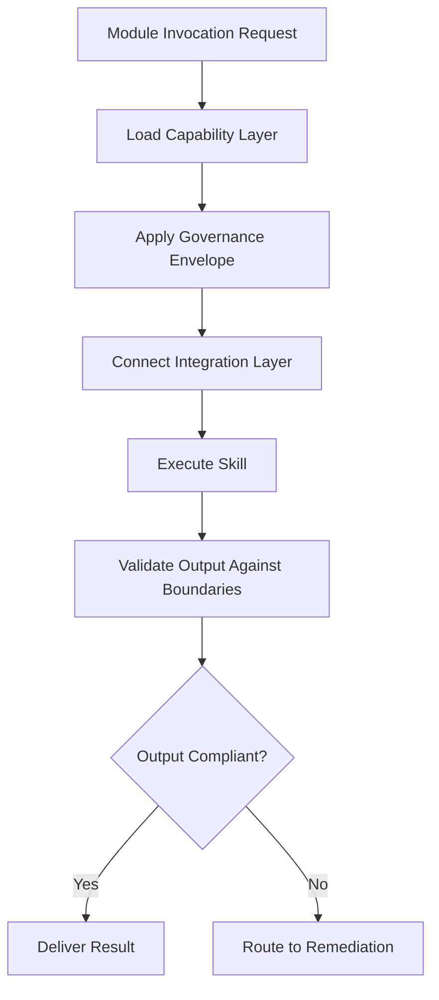

# Claude Skill Modules

## Purpose

Claude Skill Modules are pre-built, governance-wrapped capability packages that extend Claude's base model with domain-specific expertise. Each module encodes a narrow professional skill -- insurance claims adjudication, medical record summarization, financial risk assessment, legal document review -- along with the governance rules, boundary specifications, and compliance annotations required to deploy that skill in regulated environments. A Skill Module is not a prompt template; it is a complete operational unit with defined inputs, outputs, failure modes, and accountability bindings.

The module architecture allows the marketplace to offer 713 distinct AI capabilities without requiring 713 distinct model fine-tunes. Instead, each module combines a base model (Claude, GPT, Gemini, or open-source) with a governance envelope, a domain ontology, and a set of tool integrations orchestrated through MCP. This composable approach means new offerings can be assembled in days rather than months, and governance improvements propagate instantly across all modules that share a common envelope.

## Architecture

Skill Modules follow a three-layer architecture. The **Capability Layer** defines the model, system prompt, and tool set that implement the skill. The **Governance Layer** wraps the capability with boundary specifications, compliance guardrails, and ETLB liability bindings. The **Integration Layer** connects the module to upstream data sources and downstream delivery channels through MCP tool calls. At runtime, the OpenClaw orchestrator instantiates a module by composing these three layers, creating an isolated execution context that is monitored by the Telemetry Agent and the Behavioral Anomaly Monitor.

## Features

- **Domain Ontology Injection**: Each module carries a structured knowledge graph for its target domain (ICD-10 codes for healthcare, NAICS sectors for business, GAAP standards for finance)
- **Governance Envelope**: Pre-configured compliance rules that match the regulatory requirements of the module's target audience
- **Composable Architecture**: Modules can be chained into multi-step pipelines via the Workflow Orchestration Bus
- **Version-Controlled Deployment**: Every module version is immutable and traceable, enabling rollback and audit
- **Automated Testing Suite**: Each module includes regression tests that validate output quality, governance compliance, and boundary enforcement
- **Multi-Model Backend**: Modules can be re-targeted to different base models without changing governance configuration
- **Usage Metering**: Granular per-invocation billing with governance attachment tracking

## BPMN Workflow

## Integration Points

| System | Integration |
|---|---|
| MCP Tool Orchestrator | Routes all tool calls made by skill modules |
| Compliance Guardrails | Enforces regulatory constraints per module |
| Model Registry | Resolves base model version for each module |
| Telemetry Agent | Captures execution metrics and quality signals |
| Billing Reconciliation | Meters per-invocation usage and governance attachment |

## Configuration

| Parameter | Default | Description |
|---|---|---|
| `base_model` | `claude-sonnet` | Underlying model for skill execution |
| `governance_profile` | `standard` | Governance envelope: `minimal`, `standard`, `strict`, `hipaa`, `sox` |
| `max_output_tokens` | 4096 | Maximum output length per invocation |
| `temperature` | 0.3 | Model temperature for skill execution |
| `tool_access` | `restricted` | Tool access level: `none`, `restricted`, `full` |
| `human_review_threshold` | 0.7 | Confidence threshold below which output routes to human review |
