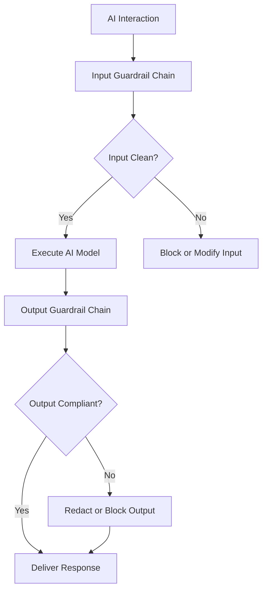

# Compliance Guardrails

## Purpose

Compliance Guardrails are the policy enforcement layer that ensures every AI output generated within the OpenClaw runtime conforms to applicable regulatory requirements, organizational policies, and ethical standards. While the Boundary Enforcement Mesh (Layer 11) controls what an agent is permitted to do, Compliance Guardrails control what an agent is permitted to say. This distinction is critical: a medical AI may be authorized to analyze patient data (boundary check passes) but prohibited from recommending off-label drug use (compliance guardrail activates).

The Guardrails operate as a dual-gate system -- validating both inputs and outputs. On the input side, guardrails screen incoming requests for prohibited content, data classification violations, and scope exceedances. On the output side, guardrails scan AI-generated responses for regulatory violations, PII leakage, harmful content, and claims that exceed the agent's authorized advisory scope. This bidirectional enforcement ensures that compliance is maintained regardless of whether the violation originates from the user's request or the model's response.

## Architecture

Compliance Guardrails are implemented as a chain of policy evaluators that execute in sequence on every AI interaction. Each evaluator is a stateless function that receives the input or output, evaluates it against a specific rule set, and returns a pass/fail/modify verdict. Rule sets are versioned and stored in the Compliance Rule Registry, allowing different offerings to apply different guardrail configurations. The chain supports three enforcement modes: `strict` (fail-closed, any violation blocks the response), `standard` (violations are flagged but output is delivered with warnings), and `permissive` (violations are logged only). Regulated offerings default to `strict`.

## Features

- **Bidirectional Enforcement**: Screens both user inputs and AI outputs for compliance violations
- **Regulatory Rule Library**: Pre-built rule sets for HIPAA, SOX, GDPR, EU AI Act, FedRAMP, and 20+ regulatory frameworks
- **Custom Rule Authoring**: Enterprise customers can define organization-specific guardrails in a declarative policy language
- **PII Detection and Redaction**: Identifies and masks personally identifiable information in AI outputs
- **Classification Ceiling Enforcement**: Prevents AI responses from exceeding the data classification level of the request context
- **Audit-Ready Violation Logs**: Every guardrail activation is recorded with the triggering content, applicable rule, and enforcement action
- **Hot-Reload Rule Updates**: Compliance rules can be updated without restarting the runtime, enabling same-day response to regulatory changes

## BPMN Workflow

## Integration Points

| System | Integration |
|---|---|
| Boundary Enforcement Mesh | Complements scope enforcement with content enforcement |
| Regulatory Translation Layer | Maps guardrail activations to regulatory reporting formats |
| Telemetry Agent | Captures guardrail activation rates and violation patterns |
| Knowledge Grounding | Validates that grounded responses comply with source classification |
| Automated Consequence Engine | Triggers escalation when guardrail violations exceed thresholds |

## Configuration

| Parameter | Default | Description |
|---|---|---|
| `enforcement_mode` | `strict` | Enforcement level: `strict`, `standard`, `permissive` |
| `rule_sets` | `["base"]` | Active compliance rule sets (e.g., `hipaa`, `sox`, `gdpr`) |
| `pii_detection` | `enabled` | PII scanning: `enabled`, `disabled` |
| `pii_action` | `redact` | PII handling: `redact`, `block`, `flag` |
| `custom_rules_path` | `null` | Path to customer-defined guardrail rules |
| `hot_reload_interval_seconds` | 300 | Frequency of rule set refresh checks |
