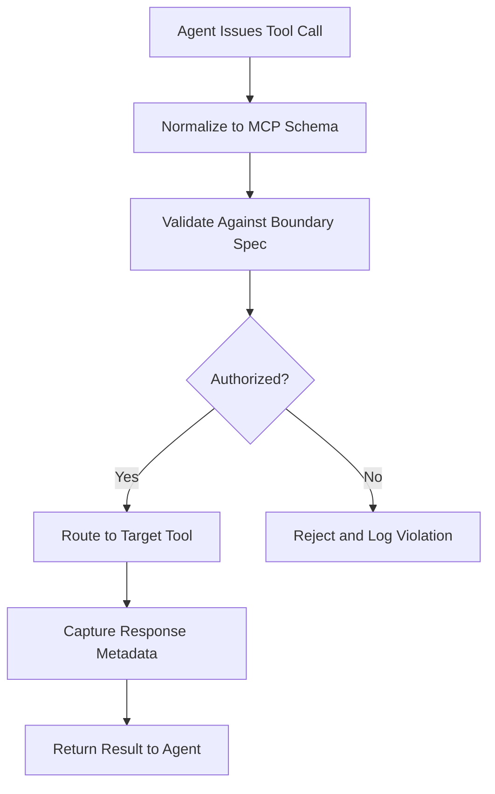

# MCP Tool Orchestrator

## Purpose

The MCP (Model Context Protocol) Tool Orchestrator is the central routing and coordination layer within the OpenClaw runtime. It manages the lifecycle of tool calls across all AI agents operating in the marketplace -- determining which tools an agent may access, validating tool call parameters against governance policies, routing calls to the appropriate backend service, and collecting results. MCP is the open standard that enables AI agents to interact with external systems in a structured, auditable manner rather than through ad-hoc API calls.

The Orchestrator solves the "tool sprawl" problem that plagues enterprise AI deployments. Without it, every agent-tool integration is a bespoke point-to-point connection that must be individually secured, monitored, and governed. With the Orchestrator, all tool interactions flow through a single governance-aware routing layer. This means a new compliance rule (for example, "no agent may call the payment processing tool without ETLB liability binding") can be enforced once at the orchestrator level rather than patched into every individual agent.

## Architecture

The MCP Tool Orchestrator sits between the AI agent runtime and the tool ecosystem. Inbound tool call requests from any agent (Claude, GPT, Gemini, or open-source models) are normalized to the MCP schema. The Orchestrator validates each call against the agent's Boundary Specification (Layer 11), checks execution authority (Layer 2), attaches telemetry hooks, and routes the call to the target tool. Responses flow back through the same path, with the Orchestrator capturing execution metadata for the Immutable Audit Ledger before returning results to the agent.

## Features

- **Universal Tool Registry**: Catalog of all available tools with schema definitions, permission requirements, and governance annotations
- **Policy-Gated Routing**: Every tool call passes through the Boundary Enforcement Mesh before execution
- **Multi-Model Compatibility**: Normalizes tool call formats across Claude, GPT, Gemini, and open-source model protocols
- **Parallel Call Management**: Supports concurrent tool calls with dependency resolution and join semantics
- **Rate Limiting and Quota Enforcement**: Per-agent, per-tool, and per-customer rate limits with configurable burst allowances
- **Automatic Retry with Backoff**: Failed tool calls are retried with exponential backoff and circuit-breaking after threshold failures
- **Call Audit Trail**: Every tool call is recorded in the IAL with request, response, latency, and governance metadata

## BPMN Workflow

## Integration Points

| System | Integration |
|---|---|
| Boundary Enforcement Mesh | Validates every tool call against agent scope |
| Delegated Authority Engine | Confirms execution authority before routing |
| Telemetry Agent | Captures latency, error rates, and usage patterns |
| Billing Reconciliation | Meters tool usage for per-call billing |
| Compliance Guardrails | Applies regulatory constraints to tool interactions |

## Configuration

| Parameter | Default | Description |
|---|---|---|
| `max_concurrent_calls` | 10 | Maximum parallel tool calls per agent session |
| `call_timeout_ms` | 30000 | Timeout for individual tool calls |
| `retry_max_attempts` | 3 | Maximum retry attempts for failed calls |
| `rate_limit_per_minute` | 60 | Default per-agent rate limit |
| `audit_level` | `full` | Telemetry capture depth: `minimal`, `standard`, `full` |
| `boundary_enforcement` | `strict` | Enforcement mode: `strict`, `warn`, `permissive` |
