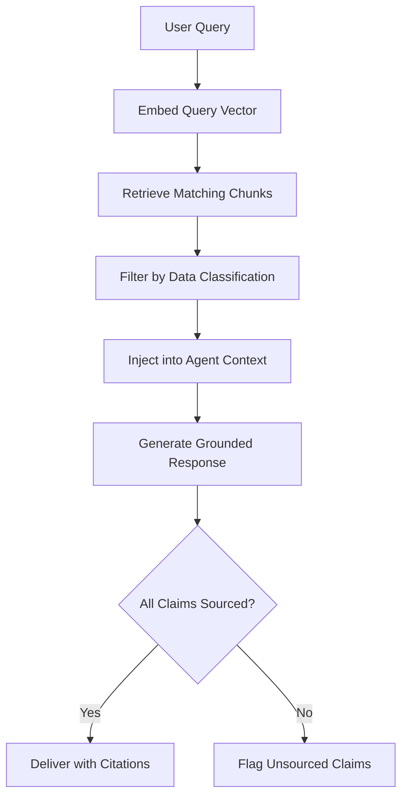

# NotebookLM-style Knowledge Grounding

## Purpose

The Knowledge Grounding system provides AI agents with verified, source-attributed context from curated document collections rather than relying solely on model training data. Inspired by Google's NotebookLM approach, this component allows enterprise customers to upload their institutional knowledge -- policy documents, regulatory filings, clinical guidelines, internal procedures -- and have AI agents ground their responses in these specific sources. Every claim the agent makes is attributed to a specific document, page, and paragraph.

This approach solves the two most dangerous failure modes in enterprise AI: hallucination and stale knowledge. Hallucination occurs when a model generates plausible but false information from its training data. Stale knowledge occurs when a model's training cutoff predates critical regulatory or procedural updates. Knowledge Grounding eliminates both by constraining the agent's information space to verified, current, customer-controlled documents. The agent does not "know" anything beyond what is in the grounded collection -- and everything it cites can be verified by the human reader.

## Architecture

The Knowledge Grounding system operates as a retrieval-augmented generation (RAG) pipeline with governance extensions. Documents uploaded by customers are chunked, embedded, and stored in a vector index with full provenance metadata (source document, version, upload date, classification level). At inference time, the agent's query is embedded and matched against the index. Retrieved chunks are injected into the agent's context with source attribution markers. The agent is instruction-tuned to cite sources for every factual claim and to explicitly state when a question cannot be answered from the grounded collection. The Compliance Guardrails component validates that retrieved chunks respect data classification boundaries.

## Features

- **Source Attribution**: Every AI claim linked to a specific document, section, and paragraph
- **Version-Controlled Collections**: Document collections are versioned, enabling temporal queries ("what did our policy say in Q3 2025?")
- **Data Classification Enforcement**: Retrieved chunks filtered by the requester's clearance level
- **Multi-Format Ingestion**: Supports PDF, DOCX, XLSX, HTML, Markdown, and structured data formats
- **Freshness Monitoring**: Alerts when grounded documents are older than configured staleness thresholds
- **Hallucination Guardrail**: Outputs that cite no grounded source are flagged and optionally suppressed
- **Cross-Collection Queries**: Agents can query across multiple document collections with unified source attribution

## BPMN Workflow

## Integration Points

| System | Integration |
|---|---|
| Compliance Guardrails | Enforces data classification on retrieved chunks |
| Claude Skill Modules | Provides domain-specific context to skill execution |
| Telemetry Agent | Tracks retrieval quality, citation rates, and hallucination flags |
| Boundary Enforcement Mesh | Ensures queries respect document access boundaries |
| Entropy Detection System | Monitors document freshness and flags stale collections |

## Configuration

| Parameter | Default | Description |
|---|---|---|
| `chunk_size_tokens` | 512 | Document chunk size for embedding |
| `retrieval_top_k` | 10 | Number of chunks retrieved per query |
| `similarity_threshold` | 0.75 | Minimum cosine similarity for chunk retrieval |
| `staleness_alert_days` | 90 | Days before a document triggers a freshness alert |
| `hallucination_mode` | `flag` | Unsourced claim handling: `allow`, `flag`, `suppress` |
| `max_collections` | 50 | Maximum document collections per customer |
