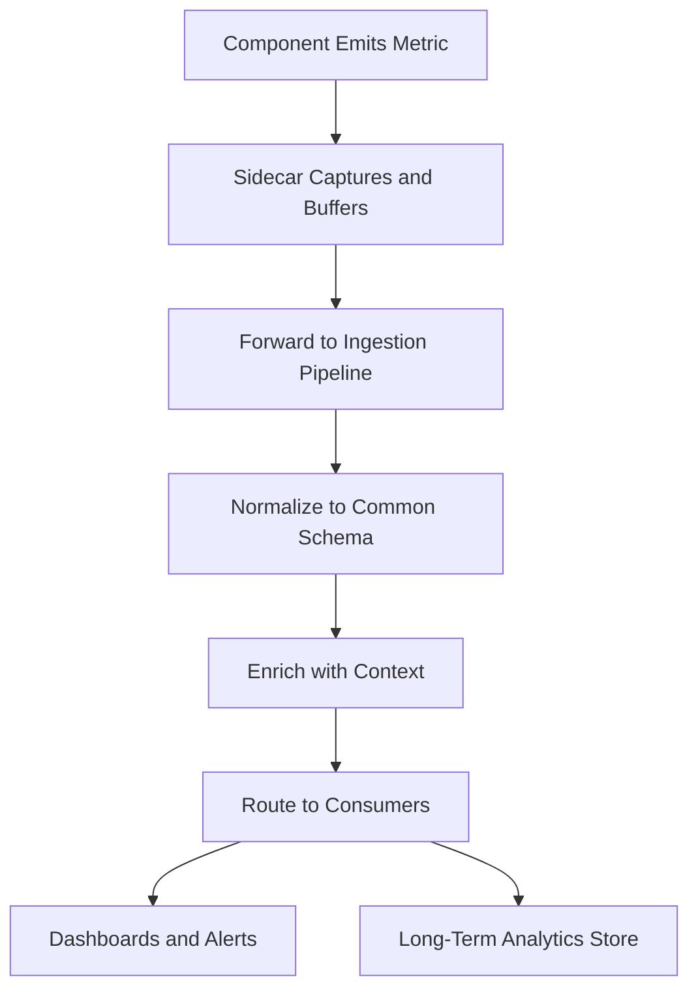

# Telemetry Agent

## Purpose

The Telemetry Agent is the observability backbone of the OpenClaw runtime, responsible for collecting, processing, and routing operational metrics from every component in the marketplace. It captures four categories of data: performance telemetry (latency, throughput, error rates), governance telemetry (guardrail activations, boundary violations, autonomy-level distributions), business telemetry (usage volumes, billing events, attachment rates), and quality telemetry (output confidence scores, human override rates, customer satisfaction signals).

The Telemetry Agent is the primary data source for the "kitchen" moat described in the FrankMax economic model. Every AI invocation across 713 offerings, every governance enforcement event, every billing transaction generates telemetry that feeds the platform's failure library, industry ontology, and optimization models. This data compounds daily -- after 90 days of operation, the platform has an observability dataset that no individual customer could build independently. After 12 months, this dataset becomes a durable competitive advantage that informs model selection, governance tuning, pricing optimization, and risk prediction across the entire marketplace.

## Architecture

The Telemetry Agent runs as a sidecar process alongside every OpenClaw component. Each sidecar collects local metrics, buffers them in a write-ahead log, and forwards them to the central Telemetry Ingestion Pipeline at configurable intervals. The pipeline processes incoming telemetry through three stages: normalization (converting component-specific formats to a common schema), enrichment (adding context such as customer ID, offering ID, and governance profile), and routing (directing metrics to the appropriate downstream consumers -- dashboards, alerting, billing, and the long-term analytics store). The architecture supports backpressure, ensuring that telemetry collection does not degrade production workloads.

## Features

- **Zero-Impact Collection**: Sidecar architecture with backpressure ensures telemetry never degrades production performance
- **Four-Dimensional Coverage**: Performance, governance, business, and quality metrics captured for every invocation
- **Real-Time Streaming**: Sub-second telemetry delivery for dashboards and alerting
- **Long-Term Analytics Store**: 3-year retention for trend analysis, compliance reporting, and ML training
- **Configurable Sampling**: High-volume metrics can be sampled to reduce storage costs while maintaining statistical validity
- **Cross-Offering Correlation**: Telemetry from different offerings can be correlated to identify systemic patterns
- **Privacy-Preserving Aggregation**: Customer data is aggregated and anonymized before contributing to platform-wide analytics

## BPMN Workflow

## Integration Points

| System | Integration |
|---|---|
| Every OpenClaw Component | Sidecar collection from all runtime components |
| Billing Reconciliation | Business telemetry feeds usage metering and invoicing |
| Behavioral Anomaly Monitor | Quality telemetry feeds anomaly detection models |
| Entropy Detection System | Performance trends feed drift and degradation detection |
| Regulatory Translation Layer | Governance telemetry feeds compliance reporting |

## Configuration

| Parameter | Default | Description |
|---|---|---|
| `collection_interval_ms` | 1000 | Metric collection frequency |
| `buffer_size_mb` | 64 | Write-ahead log buffer size per sidecar |
| `sampling_rate` | 1.0 | Metric sampling rate (1.0 = 100%, 0.1 = 10%) |
| `retention_days` | 1095 | Long-term storage retention (default 3 years) |
| `backpressure_threshold` | 0.8 | Pipeline utilization threshold that triggers backpressure |
| `anonymization_mode` | `aggregate` | Privacy mode: `none`, `pseudonymize`, `aggregate` |
