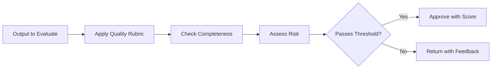

# Critic

Primitive Agent Role #8

## Definition

The Critic is the evaluation primitive of the FrankMax agent architecture. It assesses the quality, correctness, completeness, and risk of outputs produced by other primitives -- interpretations, plans, decisions, and execution results. The Critic provides the adversarial check that prevents agents from acting on flawed reasoning.

The Critic does not produce new content; it produces judgments about existing content. It answers questions like: Is this plan complete? Does this interpretation miss key factors? Is this decision consistent with policy? Is this execution result within acceptable bounds? In governance-heavy deployments, the Critic is the primitive that enforces quality gates.

## Capabilities

1. **Quality scoring** -- Evaluates outputs against defined quality rubrics with numeric scores
2. **Completeness checking** -- Verifies that all required fields, sections, or steps are present
3. **Consistency validation** -- Detects contradictions between different parts of an output or across outputs
4. **Risk assessment** -- Flags outputs that carry regulatory, financial, or reputational risk
5. **Policy compliance checking** -- Validates outputs against ORF obligations and organizational policies
6. **Improvement recommendation** -- Produces specific, actionable feedback for upstream primitives to address

## Composition Rules

- **Required upstream**: At least one of Interpreter, Planner, Decider, or Executor
- **Required downstream**: At least one of Decider, Planner (for revision), Reflector, or Router
- **Pairs well with**: Verifier (Critic evaluates quality, Verifier confirms factual accuracy), Planner (for iterative plan refinement)
- **Cannot pair with**: Perceiver directly -- the Critic evaluates processed outputs, not raw signals
- **Cardinality**: 1-2 per agent; a second Critic can serve as a meta-critic evaluating the first

## BPMN Workflow

## Example Compositions

1. **PIAR Review Agent** -- Interpreter + Planner + Critic + Executor: The Critic reviews the assessment draft for completeness and accuracy before final generation.
2. **Contract Review Agent** -- Perceiver + Interpreter + Critic + Decider: The Critic evaluates extracted contract terms for risk and compliance gaps.
3. **Model Output Validator** -- Perceiver + Interpreter + Critic + Verifier: The Critic scores LLM outputs for hallucination risk and factual consistency.
4. **Audit Preparation Agent** -- Retriever + Interpreter + Critic + Memory Keeper: The Critic evaluates audit evidence for completeness and flags gaps.

## Constraints

- The Critic **does not create** new content -- it only evaluates and scores existing outputs
- It **does not execute** actions or modify external state
- Critic judgments are **subjective by design** -- they apply rubrics, not deterministic rules (use Verifier for deterministic checks)
- Evaluation latency scales with output complexity; large documents may require chunked evaluation
- The Critic requires a defined rubric or policy set; it cannot evaluate against undefined criteria
