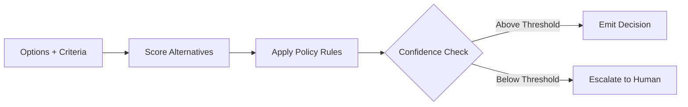

# Decider

Primitive Agent Role #5

## Definition

The Decider is the judgment primitive of the FrankMax agent architecture. It evaluates options, applies decision criteria, and selects a course of action from the alternatives generated by Planners, Interpreters, or Critics. Every agent that must choose between paths -- approve vs. reject, route A vs. route B, escalate vs. resolve -- contains a Decider.

The Decider operates under explicit decision policies that are auditable and traceable. Every decision is logged with the inputs considered, the criteria applied, the alternatives evaluated, and the rationale for the selected option. This is critical for ORF (Obligation and Responsibility Finality) compliance.

## Capabilities

1. **Multi-criteria evaluation** -- Scores alternatives against weighted decision matrices
2. **Threshold enforcement** -- Applies configurable approval/rejection thresholds per decision type
3. **Confidence-gated escalation** -- Routes decisions below a confidence threshold to human reviewers
4. **Policy binding** -- Enforces ETLB (Execution-Time Liability Binding) rules at decision time
5. **Audit trail generation** -- Produces a complete decision record for every judgment call
6. **Consensus arbitration** -- Resolves conflicting recommendations from multiple upstream primitives

## Composition Rules

- **Required upstream**: At least one of Interpreter, Planner, Critic, or Retriever
- **Required downstream**: At least one of Executor, Router, or Monitor
- **Pairs well with**: Critic (for pre-decision challenge), Verifier (for post-decision validation)
- **Cannot pair with**: Perceiver directly -- decisions require interpreted or planned context
- **Cardinality**: Typically 1 per agent; complex agents may use 2 (pre-check Decider + final Decider)

## BPMN Workflow

## Example Compositions

1. **Claims Adjudication Agent** -- Perceiver + Retriever + Interpreter + Decider + Executor: The Decider applies policy rules to approve, deny, or escalate claims.
2. **Vendor Selection Agent** -- Retriever + Interpreter + Planner + Decider: The Decider selects optimal vendors based on cost, compliance, and performance criteria.
3. **Risk Triage Agent** -- Perceiver + Interpreter + Decider + Router: The Decider classifies risk severity and routes to the appropriate response team.
4. **Budget Approval Agent** -- Perceiver + Retriever + Interpreter + Decider + Executor: The Decider applies spending authority rules and thresholds.

## Constraints

- The Decider **does not execute** actions -- it selects them and passes to Executor or Router
- It **does not generate options** -- alternatives must be provided by upstream primitives
- Decisions are **non-reversible** once emitted without a new decision cycle with updated inputs
- It requires at least 2 alternatives to evaluate; single-option inputs are passed through with a warning
- Human escalation latency is unbounded and blocks the agent pipeline until resolution
