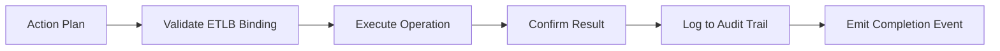

# Executor

Primitive Agent Role #6

## Definition

The Executor is the action primitive of the FrankMax agent architecture. It takes decisions and plans from upstream primitives and translates them into concrete operations -- API calls, database writes, document generation, notification dispatch, workflow triggers, and external system integrations.

The Executor is the only primitive that modifies external state. Every other primitive in the architecture is read-only or internal. This makes the Executor the most tightly controlled primitive: every execution is gated by ETLB liability bindings, logged for ORF compliance, and bounded by MCO mortality rules that enforce automatic termination conditions.

## Capabilities

1. **API invocation** -- Calls registered external APIs with retry logic, circuit breaking, and timeout enforcement
2. **Document generation** -- Produces reports, assessments, notifications, and structured outputs
3. **Database mutation** -- Writes records to platform and client data stores with transactional guarantees
4. **Notification dispatch** -- Sends alerts via email, Slack, webhook, or SMS through registered channels
5. **Workflow triggering** -- Initiates downstream workflows, spawns sub-agents, or advances BPMN process states
6. **Idempotency enforcement** -- Ensures repeated executions of the same action produce identical results
7. **Rollback capability** -- Supports compensating transactions for reversible operations

## Composition Rules

- **Required upstream**: At least one of Decider, Planner, or Router
- **Required downstream**: Typically Monitor or Verifier (to confirm execution success)
- **Pairs well with**: Monitor (for execution tracking), Verifier (for output validation), Memory Keeper (for execution logging)
- **Cannot pair with**: Perceiver or Interpreter directly -- actions must pass through a decision layer
- **Cardinality**: 1 per agent is typical; complex agents may use N Executors for parallel action streams

## BPMN Workflow

## Example Compositions

1. **PIAR Generator Agent** -- Planner + Executor + Verifier: The Executor generates the final assessment document after plan completion.
2. **Claims Payout Agent** -- Decider + Executor + Monitor: The Executor initiates payment transfers and updates claims status.
3. **DocuFlow Agent** -- Planner + Executor + Memory Keeper: The Executor routes documents to target systems and archives metadata.
4. **Alert Dispatcher Agent** -- Decider + Executor: The Executor sends notifications through configured channels based on Decider output.

## Constraints

- The Executor **cannot decide** -- it only acts on decisions already made by upstream primitives
- Every execution **requires a valid ETLB binding** -- unbound executions are rejected
- It **cannot perceive or interpret** -- it has no awareness of input meaning, only action specifications
- Execution timeout defaults to 30 seconds per operation (configurable up to 300 seconds)
- MCO mortality rules enforce automatic termination if execution enters an unrecoverable error loop
