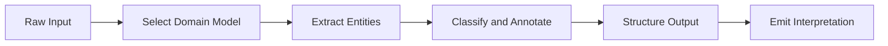

# Interpreter

Primitive Agent Role #3

## Definition

The Interpreter is the sense-making primitive of the FrankMax agent architecture. It takes raw observations from Perceivers and result sets from Retrievers and transforms them into structured meaning -- classifications, entity extractions, sentiment assessments, summarizations, and domain-specific annotations.

Where the Perceiver sees data and the Retriever finds data, the Interpreter understands data. It applies domain models, ontologies, and LLM-powered reasoning to convert information into actionable intelligence. The Interpreter is the most LLM-intensive primitive in the stack.

## Capabilities

1. **Entity extraction** -- Identifies organizations, people, dates, monetary values, NAICS codes, and custom entity types
2. **Classification** -- Assigns domain labels (risk tier, compliance category, sentiment polarity) to input data
3. **Summarization** -- Produces concise abstracts from lengthy documents, conversations, or data streams
4. **Relationship mapping** -- Detects and labels relationships between extracted entities
5. **Anomaly annotation** -- Flags data points that deviate from expected patterns with severity scores
6. **Multi-language normalization** -- Processes inputs in 40+ languages and normalizes output to English or target locale

## Composition Rules

- **Required upstream**: At least one of Perceiver, Retriever, or Memory Keeper
- **Required downstream**: At least one of Planner, Decider, Critic, or Router
- **Pairs well with**: Retriever (for context-enriched interpretation), Critic (for interpretation validation)
- **Cannot pair with**: Executor directly -- interpretations must pass through a decision or planning layer
- **Cardinality**: Typically 1 per agent, though complex agents may use 2 (one per domain)

## BPMN Workflow

## Example Compositions

1. **DocuFlow Agent** -- Perceiver + Interpreter + Planner + Executor: The Interpreter extracts fields, classifies document type, and structures data for the Planner to route.
2. **Sentiment Analysis Agent** -- Perceiver + Interpreter + Memory Keeper: The Interpreter classifies sentiment from customer communications and stores trends.
3. **Regulatory Change Agent** -- Perceiver + Retriever + Interpreter + Critic + Decider: The Interpreter parses regulatory text, extracts obligations, and classifies impact severity.
4. **Claims Triage Agent** -- Perceiver + Interpreter + Router: The Interpreter classifies incoming claims by type and urgency so the Router can dispatch appropriately.

## Constraints

- The Interpreter **does not decide** -- it provides meaning but does not choose actions
- It **does not execute** API calls, write to databases, or trigger external systems
- Interpretation accuracy depends on the quality of upstream Perceiver normalization and Retriever relevance
- LLM token consumption scales with input volume; cost controls must be set at the agent level
- The Interpreter does not maintain state across invocations without a Memory Keeper
