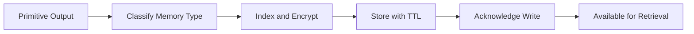

# Memory Keeper

Primitive Agent Role #10

## Definition

The Memory Keeper is the persistence primitive of the FrankMax agent architecture. It stores, indexes, and retrieves agent state, conversation history, execution logs, learned patterns, and accumulated knowledge across agent invocations. Without the Memory Keeper, every agent invocation starts from zero.

The Memory Keeper enables agents to learn from past executions, maintain context across sessions, build institutional knowledge over time, and provide the audit trail required by ORF compliance. It is the primitive that transforms stateless agents into adaptive systems -- and it is the foundation of the "Kitchen" moat (telemetry, failure library, industry ontology).

## Capabilities

1. **State persistence** -- Stores and retrieves agent state across invocations with versioning
2. **Conversation history** -- Maintains ordered interaction logs for multi-turn agent sessions
3. **Execution logging** -- Records every primitive invocation, input, output, and timing for audit trails
4. **Pattern accumulation** -- Stores learned patterns, failure signatures, and success templates for reuse
5. **Knowledge indexing** -- Indexes stored content for fast retrieval by the Retriever primitive
6. **TTL management** -- Enforces configurable time-to-live policies for different memory categories
7. **Encryption at rest** -- All stored data is encrypted with entity-level keys for multi-tenant isolation

## Composition Rules

- **Required upstream**: Any primitive can write to Memory Keeper
- **Required downstream**: Retriever (for knowledge recall), Reflector (for learning from history), Monitor (for historical baselines)
- **Pairs well with**: Every primitive -- Memory Keeper is the universal composition partner
- **Cannot pair with**: No restrictions; Memory Keeper is the most composable primitive
- **Cardinality**: 1 per agent (shared across all primitives in the agent)

## BPMN Workflow

## Example Compositions

1. **Institutional Knowledge Agent** -- Perceiver + Interpreter + Memory Keeper + Retriever: The Memory Keeper accumulates organizational knowledge from processed documents over time.
2. **Failure Library Agent** -- Monitor + Critic + Memory Keeper + Reflector: The Memory Keeper stores failure patterns so the Reflector can derive preventive insights.
3. **Session Context Agent** -- Perceiver + Interpreter + Memory Keeper + Planner: The Memory Keeper maintains multi-turn conversation state for complex advisory sessions.
4. **Telemetry Archive Agent** -- Perceiver + Memory Keeper + Retriever: The Memory Keeper stores all platform telemetry for historical analysis and trend detection.

## Constraints

- The Memory Keeper **does not reason** about stored data -- it persists and retrieves without interpretation
- It **does not make decisions** based on stored patterns -- that requires Interpreter or Reflector downstream
- Storage costs scale linearly with volume; cost controls must be configured per entity
- Memory retrieval latency increases with store size; index optimization is required for stores exceeding 1M records
- Data deletion requires explicit MCO mortality compliance -- Memory Keeper does not auto-purge without policy
