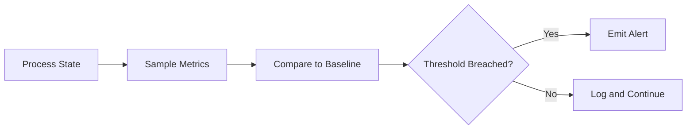

# Monitor

Primitive Agent Role #7

## Definition

The Monitor is the continuous observation primitive of the FrankMax agent architecture. Unlike the Perceiver (which ingests point-in-time signals), the Monitor watches ongoing processes, tracks state changes over time, detects drift from expected baselines, and raises alerts when thresholds are breached.

The Monitor is the feedback loop primitive. It operates after execution to confirm that outcomes match expectations, and it operates during long-running processes to detect deviations before they compound. Every production agent that executes actions should include a Monitor to close the loop between intent and result.

## Capabilities

1. **Continuous state tracking** -- Watches process states, metric values, and system health over configurable intervals
2. **Baseline comparison** -- Compares current values against historical baselines and expected ranges
3. **Threshold alerting** -- Triggers alerts when monitored values breach configurable upper/lower bounds
4. **Drift detection** -- Identifies gradual deviation from expected behavior that may not trigger hard thresholds
5. **Heartbeat verification** -- Confirms that dependent systems and agents are alive and responsive
6. **SLA tracking** -- Monitors execution against service-level agreement targets (latency, uptime, accuracy)

## Composition Rules

- **Required upstream**: At least one of Executor, Router, or Perceiver
- **Required downstream**: At least one of Critic, Decider, Reflector, or Router (for escalation)
- **Pairs well with**: Executor (for post-action monitoring), Critic (for deviation analysis), Memory Keeper (for metric history)
- **Cannot pair with**: Planner directly -- monitoring data must be interpreted before re-planning
- **Cardinality**: 1-N per agent; complex agents use multiple Monitors for different metric domains

## BPMN Workflow

## Example Compositions

1. **SLA Guardian Agent** -- Monitor + Critic + Decider + Executor: The Monitor tracks SLA metrics, the Critic evaluates breach severity, the Decider chooses remediation, and the Executor acts.
2. **Cost Burn Rate Agent** -- Perceiver + Monitor + Decider: The Monitor tracks cumulative AI spend against budget thresholds.
3. **Agent Health Agent** -- Monitor + Router + Executor: The Monitor heartbeat-checks all running agents and routes failures to restart logic.
4. **Compliance Drift Agent** -- Perceiver + Monitor + Critic + Verifier: The Monitor watches compliance posture over time and detects gradual degradation.

## Constraints

- The Monitor **does not act** -- it observes and alerts but does not execute remediation
- It **does not interpret** the meaning of deviations -- that requires a Critic or Interpreter downstream
- Monitoring intervals have a minimum granularity of 1 second and a maximum of 24 hours
- It requires a defined baseline or threshold configuration; it cannot monitor in open-ended discovery mode
- High-frequency monitoring (sub-second) incurs additional compute costs billed per sample
