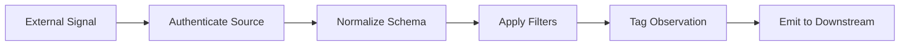

# Perceiver

Primitive Agent Role #1

## Definition

The Perceiver is the sensory layer of the FrankMax agent architecture. It ingests raw signals from external and internal sources -- API payloads, document uploads, streaming telemetry, user interactions, webhook events -- and normalizes them into structured observations that downstream primitives can process.

Every agent that must react to the outside world begins with at least one Perceiver instance. Without perception, no other primitive has data to act on. The Perceiver does not interpret or decide; it converts noise into signal and passes it forward.

## Capabilities

1. **Multi-modal ingestion** -- Accepts text, structured data (JSON/XML), images, PDFs, and streaming event payloads
2. **Schema normalization** -- Maps heterogeneous inputs to the platform's canonical observation schema
3. **Signal filtering** -- Applies configurable thresholds to discard low-relevance or duplicate signals
4. **Timestamp alignment** -- Normalizes event timestamps to UTC with nanosecond precision for audit trails
5. **Source authentication** -- Validates that inbound data originates from a trusted, registered source
6. **Rate-limit enforcement** -- Throttles ingestion to prevent downstream overload during burst events
7. **Observation tagging** -- Attaches metadata (source ID, confidence score, NAICS sector) to every observation

## Composition Rules

- **Required upstream**: None (Perceiver is always the entry point)
- **Required downstream**: At least one of Interpreter, Retriever, or Router
- **Pairs well with**: Monitor (for continuous perception loops), Memory Keeper (for observation history)
- **Cannot pair with**: Another Perceiver in series -- parallel Perceivers are used for multi-source ingestion
- **Cardinality**: A single agent may contain 1-N Perceivers, one per data source

## BPMN Workflow

## Example Compositions

1. **Market Scanner Agent** -- Perceiver + Retriever + Interpreter + Decider: The Perceiver ingests real-time pricing feeds; the Retriever pulls historical benchmarks; the Interpreter compares them; the Decider flags anomalies.
2. **Document Intake Agent** -- Perceiver + Interpreter + Memory Keeper: The Perceiver accepts uploaded documents, the Interpreter extracts structured fields, and the Memory Keeper archives the result.
3. **Compliance Watch Agent** -- Perceiver + Monitor + Critic + Verifier: The Perceiver streams regulatory feed updates, the Monitor tracks changes over time, the Critic evaluates impact, and the Verifier confirms applicability.
4. **Telemetry Collector Agent** -- Perceiver + Router + Memory Keeper: The Perceiver ingests platform telemetry events, the Router dispatches to the appropriate processing pipeline, and the Memory Keeper stores raw observations for replay.

## Constraints

- The Perceiver **does not interpret** data -- it has no domain knowledge and cannot assign meaning to observations
- It **cannot make decisions** or trigger downstream actions directly; it must hand off to another primitive
- It **does not persist** observations on its own -- a Memory Keeper is required for storage
- It operates in **stateless mode** by default; any statefulness requires explicit composition with Memory Keeper
- Maximum payload size per observation: 10 MB (configurable per deployment)
