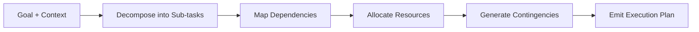

# Planner

Primitive Agent Role #4

## Definition

The Planner is the strategy-formulation primitive of the FrankMax agent architecture. Given interpreted data and a goal state, it decomposes complex objectives into ordered sequences of sub-tasks, identifies dependencies, allocates resources, and produces executable plans that downstream primitives (Decider, Executor) can act on.

The Planner bridges the gap between understanding (Interpreter) and action (Executor). It reasons about sequencing, parallelism, contingency, and resource constraints. In multi-agent systems, the Planner is often the primitive that coordinates work across agent boundaries.

## Capabilities

1. **Goal decomposition** -- Breaks high-level objectives into discrete, measurable sub-tasks
2. **Dependency mapping** -- Identifies prerequisite relationships between sub-tasks and enforces ordering
3. **Resource allocation** -- Estimates compute, time, and token budgets for each sub-task
4. **Contingency planning** -- Generates fallback paths for sub-tasks with failure probability above threshold
5. **Parallel identification** -- Detects sub-tasks that can execute concurrently to minimize total plan duration
6. **Constraint satisfaction** -- Ensures plans respect ORF obligations, ETLB bindings, and MCO mortality rules
7. **Plan serialization** -- Outputs plans in the platform's canonical plan schema (JSON) for audit and replay

## Composition Rules

- **Required upstream**: At least one of Interpreter, Retriever, or Critic
- **Required downstream**: At least one of Decider, Executor, or Router
- **Pairs well with**: Critic (for plan review before execution), Reflector (for post-execution plan improvement)
- **Cannot pair with**: Perceiver directly -- raw observations must be interpreted before planning
- **Cardinality**: Typically 1 per agent; nested planners are used for hierarchical task decomposition

## BPMN Workflow

## Example Compositions

1. **AI Cost Optimization Agent** -- Perceiver + Retriever + Interpreter + Planner + Executor: The Planner builds a step-by-step cost reduction plan based on usage interpretation.
2. **Campaign Orchestration Agent** -- Perceiver + Interpreter + Planner + Router + Executor: The Planner sequences campaign activities, allocates budgets, and routes tasks to specialized sub-agents.
3. **Incident Response Agent** -- Perceiver + Interpreter + Planner + Decider + Executor + Monitor: The Planner generates a triage-then-remediate plan with contingency branches.
4. **PIAR Generator Agent** -- Retriever + Interpreter + Planner + Critic + Executor: The Planner structures the assessment into sections, schedules data gathering, and sequences review cycles.

## Constraints

- The Planner **does not execute** -- it produces plans but does not carry them out
- It **does not perceive** raw data -- all inputs must be pre-processed by upstream primitives
- Plan complexity is bounded by a configurable maximum depth (default: 5 levels) to prevent runaway decomposition
- The Planner requires a defined goal state; it cannot operate in open-ended exploration mode
- Plans are immutable once emitted; modifications require a new planning cycle with Critic feedback
