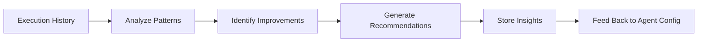

# Reflector

Primitive Agent Role #12

## Definition

The Reflector is the meta-cognition primitive of the FrankMax agent architecture. It analyzes an agent's own execution history -- what worked, what failed, what was slow, what was wasteful -- and produces insights that improve future performance. The Reflector closes the learning loop.

Where the Monitor watches processes in real-time, the Reflector looks backward. It performs post-hoc analysis of completed workflows to identify patterns: recurring failures, suboptimal routing decisions, underperforming prompts, and missed opportunities. Over time, Reflector outputs feed back into Planner configurations, Decider thresholds, and Critic rubrics, making the entire agent system adaptive.

## Capabilities

1. **Execution pattern analysis** -- Identifies recurring success and failure patterns across historical executions
2. **Performance regression detection** -- Detects degradation in agent accuracy, latency, or cost efficiency over time
3. **Prompt effectiveness scoring** -- Evaluates which prompt configurations produce the best outcomes
4. **Root cause analysis** -- Traces failures back through the primitive chain to identify the originating fault
5. **Optimization recommendation** -- Produces specific configuration changes to improve agent performance
6. **Learning extraction** -- Distills execution history into reusable knowledge templates for the Memory Keeper

## Composition Rules

- **Required upstream**: Memory Keeper (for execution history), Monitor (for metric data), or Critic (for evaluation data)
- **Required downstream**: Planner (for plan improvement), Memory Keeper (for storing insights), or Decider (for threshold updates)
- **Pairs well with**: Memory Keeper (provides history), Critic (provides evaluations), Planner (consumes recommendations)
- **Cannot pair with**: Perceiver or Executor directly -- the Reflector operates on historical data, not live signals or actions
- **Cardinality**: 0-1 per agent; not every agent needs reflection (short-lived agents typically omit it)

## BPMN Workflow

## Example Compositions

1. **Agent Performance Optimizer** -- Memory Keeper + Reflector + Planner: The Reflector analyzes past execution logs to recommend plan structure improvements.
2. **Failure Library Builder** -- Monitor + Critic + Memory Keeper + Reflector: The Reflector distills failure patterns into reusable templates.
3. **Prompt Tuning Agent** -- Memory Keeper + Reflector + Executor: The Reflector evaluates prompt effectiveness and updates prompt templates.
4. **Cost Optimization Reflector** -- Monitor + Memory Keeper + Reflector + Decider: The Reflector identifies cost hotspots and recommends model/token configuration changes.

## Constraints

- The Reflector **does not act** in real-time -- it operates on historical data, not live execution
- It **does not directly modify** agent configurations -- recommendations must be approved by a Decider or human
- Reflection quality depends on the completeness of execution logs in the Memory Keeper
- It requires a minimum execution history (default: 10 completed workflows) before producing reliable insights
- Reflector analysis is computationally expensive and is typically scheduled (hourly/daily), not invoked per-execution
