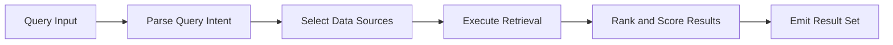

# Retriever

Primitive Agent Role #2

## Definition

The Retriever is the knowledge-fetching primitive of the FrankMax agent architecture. Given a query or observation from an upstream primitive, it locates and returns relevant data from structured databases, vector stores, document repositories, external APIs, and the platform's shared knowledge graph.

The Retriever does not generate new knowledge -- it finds existing knowledge and delivers it in a format the next primitive can consume. It is the bridge between what an agent perceives and what it needs to know in order to reason.

## Capabilities

1. **Vector similarity search** -- Queries embedding stores to find semantically relevant documents and passages
2. **Structured query execution** -- Runs SQL, GraphQL, or API calls against registered data sources
3. **Knowledge graph traversal** -- Walks entity-relationship graphs to surface connected facts
4. **Multi-source fusion** -- Merges results from multiple retrieval backends into a single ranked result set
5. **Relevance scoring** -- Assigns confidence scores to each retrieved item based on query alignment
6. **Access control enforcement** -- Respects entity-level and NAICS-sector permissions on all data sources
7. **Cache-aware retrieval** -- Uses platform-level caches to avoid redundant fetches within configurable TTL windows

## Composition Rules

- **Required upstream**: At least one of Perceiver, Interpreter, Planner, or Router
- **Required downstream**: At least one of Interpreter, Planner, or Decider
- **Pairs well with**: Memory Keeper (for caching retrieved results), Perceiver (for real-time data augmentation)
- **Cannot pair with**: Executor directly -- retrieved data must pass through a reasoning primitive first
- **Cardinality**: A single agent may contain 1-N Retrievers, each targeting different data sources

## BPMN Workflow

## Example Compositions

1. **PIAR Generator Agent** -- Perceiver + Retriever + Interpreter + Planner + Executor: The Retriever pulls client history, regulatory context, and comparable assessments to feed the Interpreter's analysis.
2. **Billing Leakage Detector** -- Perceiver + Retriever + Critic + Verifier: The Retriever fetches invoicing records and contract terms so the Critic can identify discrepancies.
3. **Competitive Intelligence Agent** -- Perceiver + Retriever + Interpreter + Decider: The Retriever queries public filings, patent databases, and news feeds to build competitive profiles.
4. **Claims Processing Agent** -- Perceiver + Retriever + Interpreter + Verifier + Executor: The Retriever pulls policy terms, prior claims history, and adjudication rules.

## Constraints

- The Retriever **does not interpret** the data it returns -- it delivers raw or ranked results without analysis
- It **cannot modify** source data -- all retrieval operations are read-only
- It **requires explicit data source registration** -- it cannot discover or access unregistered sources
- Retrieval latency is bounded by the slowest source in a multi-source query; no partial results are emitted
- Maximum result set size: 500 items per query (configurable per deployment)
