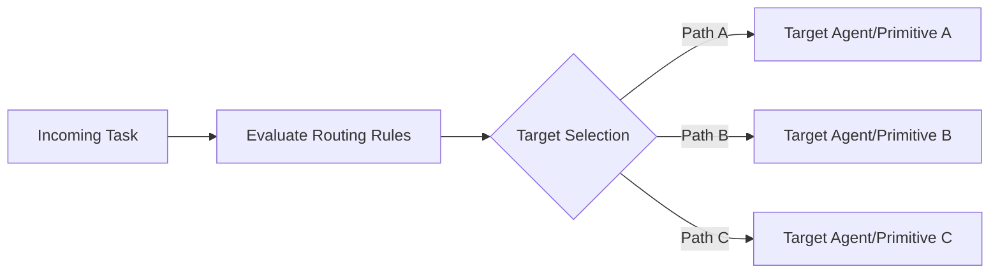

# Router

Primitive Agent Role #11

## Definition

The Router is the dispatch primitive of the FrankMax agent architecture. It directs data, tasks, and control flow to the appropriate downstream primitives, agents, or external systems based on configurable routing rules. The Router enables branching, fan-out, load balancing, and conditional dispatch within and across agent boundaries.

In multi-agent systems, the Router is the primitive that enables composition at scale. It connects agents to each other, distributes work across parallel processing paths, and ensures that each task reaches the primitive best equipped to handle it. The Router is the connective tissue of the platform.

## Capabilities

1. **Rule-based routing** -- Dispatches inputs to targets based on configurable if/then/else rules
2. **Content-based routing** -- Inspects payload content (NAICS code, entity type, priority) to select targets
3. **Load-balanced fan-out** -- Distributes work across multiple identical targets for parallel processing
4. **Priority queuing** -- Orders dispatched tasks by priority level to ensure critical items process first
5. **Circuit breaking** -- Detects unhealthy targets and routes around them automatically
6. **Cross-agent dispatch** -- Routes tasks from one agent to another within a multi-agent system

## Composition Rules

- **Required upstream**: Any primitive can feed the Router
- **Required downstream**: At least one target primitive or agent
- **Pairs well with**: Perceiver (for intake routing), Decider (for decision-based routing), Monitor (for health-aware routing)
- **Cannot pair with**: No restrictions; Router is highly composable
- **Cardinality**: 1-N per agent; multi-Router configurations enable complex dispatch topologies

## BPMN Workflow

## Example Compositions

1. **Intake Dispatcher Agent** -- Perceiver + Interpreter + Router: The Router dispatches classified intake items to the appropriate specialized agent.
2. **Multi-Sector Processor Agent** -- Perceiver + Router + N Executors: The Router fans out work to sector-specific executors based on NAICS code.
3. **Escalation Agent** -- Monitor + Critic + Router + Decider: The Router dispatches alerts to the appropriate response team based on severity.
4. **Load Balancer Agent** -- Perceiver + Router + Monitor: The Router distributes incoming requests across available agent instances based on load.

## Constraints

- The Router **does not transform** data -- it dispatches it unchanged to targets
- It **does not make complex decisions** -- routing rules must be pre-defined or fed by an upstream Decider
- Routing rules are evaluated in priority order; first match wins (no multi-match by default)
- Fan-out cardinality is bounded by platform concurrency limits (default: 50 parallel targets)
- The Router does not guarantee delivery order across parallel paths; use sequencing primitives for ordered processing
