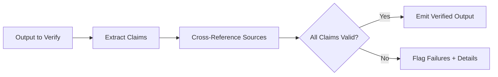

# Verifier

Primitive Agent Role #9

## Definition

The Verifier is the factual-correctness primitive of the FrankMax agent architecture. Where the Critic evaluates quality and completeness subjectively, the Verifier performs deterministic, binary checks: Does this number match the source? Is this signature valid? Does this hash match? Is this regulatory citation current?

The Verifier is the trust anchor for the agent system. In regulated industries (healthcare, finance, government), every claim, calculation, and citation in agent output must be independently verified before it reaches a human or external system. The Verifier provides that guarantee.

## Capabilities

1. **Numeric reconciliation** -- Cross-checks calculated values against source data to confirm accuracy
2. **Citation verification** -- Validates that regulatory references, case numbers, and document IDs exist and are current
3. **Signature and hash validation** -- Confirms cryptographic integrity of documents and data payloads
4. **Schema compliance** -- Verifies that outputs conform to required data schemas and formats
5. **Cross-reference checking** -- Confirms consistency between related data points across multiple sources
6. **Temporal validity** -- Ensures that referenced regulations, rates, and policies have not expired or been superseded

## Composition Rules

- **Required upstream**: At least one of Interpreter, Executor, Critic, or Decider
- **Required downstream**: At least one of Decider, Router, Memory Keeper, or Executor (for corrective action)
- **Pairs well with**: Critic (Critic for quality, Verifier for accuracy), Memory Keeper (for verification audit logs)
- **Cannot pair with**: Perceiver directly -- verification requires processed, structured data
- **Cardinality**: 1 per agent is standard; high-assurance agents may use 2 (independent dual verification)

## BPMN Workflow

## Example Compositions

1. **Billing Leakage Detector** -- Perceiver + Retriever + Interpreter + Verifier + Decider: The Verifier cross-checks invoice line items against contract rates.
2. **Regulatory Filing Agent** -- Planner + Executor + Verifier + Memory Keeper: The Verifier confirms that all citations and figures in filings are accurate before submission.
3. **Claims Processing Agent** -- Interpreter + Decider + Verifier + Executor: The Verifier validates claim amounts and policy coverage before payout execution.
4. **Audit Evidence Agent** -- Retriever + Interpreter + Verifier + Memory Keeper: The Verifier confirms that audit evidence matches source records.

## Constraints

- The Verifier **does not interpret** meaning -- it performs binary pass/fail checks against authoritative sources
- It **cannot evaluate quality** or make subjective judgments -- that is the Critic's role
- Verification is **only as reliable as the reference sources** it checks against
- It requires at least one authoritative data source to be registered; it cannot verify in isolation
- Verification of external sources is subject to API availability and may introduce latency
