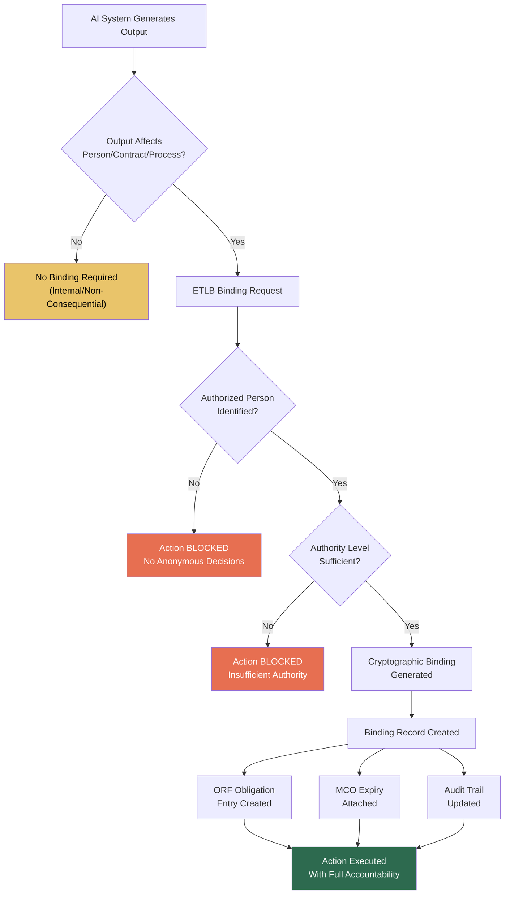

# ETLB: Execution-Time Liability Binding

## What It Is

At execution time, **exactly one natural person** is cryptographically bound as the liability bearer for every AI action. No anonymous AI decisions. No corporate shields. No "the algorithm decided." Every AI output — a loan denial, a medical recommendation, a government benefit determination — has a named human who authorized it, recorded immutably at the moment of execution.

ETLB solves the core accountability gap in AI deployment: when an AI system causes harm, who is liable? Today, the answer is "it's complicated." With ETLB, the answer is a name, a timestamp, and a cryptographic signature.

---

## Key Principles

### 1. Every AI Action Must Have a Human Bound at Moment of Execution

Not before. Not after. At the exact moment the AI system produces an output that affects a person, contract, or regulated process, ETLB captures the binding. Pre-authorization is insufficient — the bound person must be the one who authorized *this specific action* at *this specific time*.

### 2. Binding Is Cryptographic and Immutable

ETLB bindings use cryptographic signatures tied to verified identity credentials. The binding record includes:
- **Identity**: Verified natural person (not a role, not a department, not a legal entity)
- **Action**: The specific AI output being authorized
- **Timestamp**: Execution-time capture with tamper-evident sequencing
- **Authority**: Proof the person had the authority to authorize this action
- **Context**: The input data and model state that produced the output

### 3. Binding Cannot Be Retroactively Changed

Once an ETLB record is created, it is final. No one — not the bound person, not their employer, not a court — can alter the binding. The record can be *annotated* (dispute raised, context added) but never *modified*. This is what makes ETLB valuable to insurers and regulators: the chain of accountability is tamper-proof.

### 4. The Bound Person Must Have Authority to Authorize the Action

ETLB rejects bindings where the signer lacks the authority to authorize the action. A junior analyst cannot be bound as the liability bearer for a $50M loan approval. Authority verification is performed at binding time against the organization's authority matrix.

### 5. ETLB Records Feed Audit Trails

Every ETLB binding automatically creates an entry in the [ORF](/protocols/orf) obligation tracking ledger. This means every AI action is simultaneously:
- Accountability-bound (ETLB)
- Obligation-tracked (ORF)
- Expiry-enforced ([MCO](/protocols/mco))

---

## ETLB Binding Flow

---

## Revenue Model

| Revenue Stream | Model | Gross Margin | Scale Driver |
|---|---|---|---|
| **Per-Action Binding Fees** | $0.002-$0.05 per binding depending on risk tier | 75-85% | Volume: millions of bindings/day at scale |
| **ETLB Infrastructure Licensing** | Annual license for on-premises ETLB nodes | 80-90% | Enterprise and government deployments requiring data sovereignty |
| **ETLB Compliance Certification** | Per-entity annual certification | 90%+ | Once regulators require ETLB, every AI vendor needs certification |
| **Authority Matrix Management** | SaaS subscription for managing who can bind to what | 85-90% | Every organization using ETLB needs to maintain authority hierarchies |
| **Binding Analytics** | Dashboard and API for analyzing binding patterns | 80-85% | Risk teams, compliance officers, and auditors need pattern visibility |
| **Retroactive Binding Audit** | One-time engagement to bind historical AI decisions | 70-80% | Organizations with existing AI deployments need to retrofit accountability |

---

## Standards Capture Strategy

ETLB is designed to become an industry standard through a deliberate 4-step sequence:

### Step 1: Publish as Open Standard
Release the ETLB specification under an open license. The protocol is free. Encourage academic review, regulator comment, and vendor feedback. Openness builds trust; proprietary accountability protocols will not be adopted.

### Step 2: Get Adopted by One Regulator
**Target: Singapore IMDA** (Infocomm Media Development Authority). Singapore is the ideal first adopter because:
- Small jurisdiction, fast regulatory cycles
- Pro-innovation regulator with AI governance mandate
- ASEAN gateway — adoption cascades to 10 countries
- English-language regulatory framework

Secondary targets: UK ICO, EU AI Office, Australia eSafety Commissioner.

### Step 3: Becomes Procurement Requirement
Once one regulator adopts ETLB, government procurement specifications begin requiring ETLB compliance. "All AI systems deployed in [jurisdiction] must implement ETLB or equivalent accountability binding." There is no equivalent. ETLB *is* the standard.

### Step 4: Competitors Must Comply
Every AI vendor selling to that jurisdiction must now implement ETLB. They can build their own implementation (using the open spec) or license FrankMax's reference implementation, tooling, and certification. Either way, FrankMax operates the certification authority and the compliance ecosystem.

**The protocol is free. The infrastructure is the business.**

---

## Why ETLB Cannot Be Replicated Easily

| Barrier | Detail |
|---|---|
| **Identity Verification Integration** | ETLB requires integration with government and enterprise identity systems; this takes years of partnership |
| **Authority Matrix Complexity** | Mapping "who can authorize what" across a 50,000-person organization is a multi-year implementation |
| **Regulatory Relationships** | The first-mover who helps a regulator draft the standard *is* the standard; second movers must comply |
| **Binding Volume Data** | Millions of binding records create pattern intelligence (who binds to what, when, failure rates) that no competitor can replicate without the same volume |
| **Insurance Integration** | Insurers will build liability models on ETLB data; switching binding protocols means rebuilding actuarial models |

---

## Related

- [ORF: Obligation & Responsibility Finality](/protocols/orf) — The obligation lifecycle that ETLB feeds into
- [MCO: Mortality Compliance Object](/protocols/mco) — Expiry enforcement for all AI authority grants
- [Structural Dominance Strategy](/economic-model/structural-dominance) — How standards capture drives long-term market control
- [Ecosystem Entities](/ecosystem-entities)
