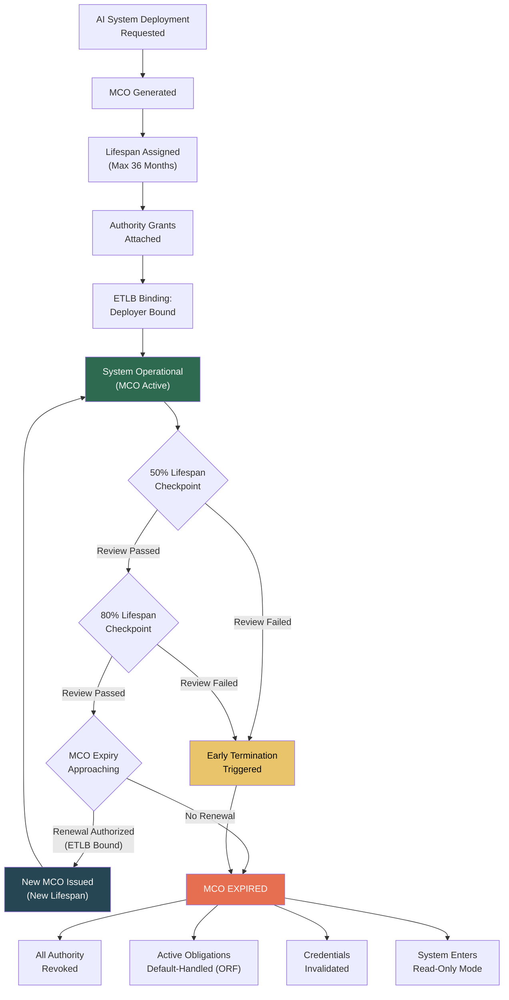

# MCO: Mortality Compliance Object

## What It Is

Every AI system granted authority must have an **enforced death/expiry**. No immortal AI commitments. No AI system that runs forever without human re-authorization. No authority grant that outlives the person who granted it.

MCO is the protocol that enforces temporal limits on AI authority. It ensures that every AI deployment, every model version, every authority delegation has a **hard expiry date** — and that expiry is mechanically enforced, not advisory. When an MCO expires, the associated AI system **loses all authority immediately**. No grace periods. No auto-renewals. No "we forgot to review it."

MCO exists because the most dangerous AI systems are not the ones that fail spectacularly — they are the ones that keep running long after anyone remembers why they were deployed, what data they were trained on, or who authorized them.

---

## Key Principles

### 1. All AI Systems Have a Maximum Lifespan

Every AI system operating under the FrankMax ecosystem is assigned an MCO at deployment. The MCO defines:
- **Maximum lifespan**: The absolute longest the system can run without re-authorization (default: 12 months, maximum: 36 months)
- **Authority scope**: What the system is authorized to do during its lifespan
- **Review checkpoints**: Mandatory review dates before expiry (typically at 50% and 80% of lifespan)
- **Renewal requirements**: What must happen for the MCO to be renewed (re-authorization by a qualified natural person via [ETLB](/protocols/etlb))

### 2. Authority Grants Have Enforced Expiry Dates

An authority grant is a specific permission given to an AI system — "authorized to approve loans up to $50K" or "authorized to triage patient records." Every authority grant carries its own expiry, independent of the system's MCO. Authority grants cannot outlive the system's MCO, but they can expire sooner.

### 3. Systems Cannot Extend Their Own Lifespan

This is the critical constraint. An AI system cannot:
- Modify its own MCO
- Request an extension of its own MCO
- Delegate authority that extends beyond its own MCO
- Create sub-systems with MCOs that outlive the parent

Only a natural person, bound via ETLB at renewal time, can extend an MCO. The system being renewed has no role in the renewal decision.

### 4. Expired Systems Lose All Authority Immediately

When an MCO reaches its expiry timestamp:
- All authority grants are revoked
- All active obligations are transitioned to the default handler ([ORF](/protocols/orf))
- All API keys, credentials, and access tokens are invalidated
- The system enters read-only mode (outputs are logged but not executed)
- A notification is sent to all parties who have obligations with the system

There is no grace period. The cutoff is mechanical.

### 5. MCO Is Prerequisite for AI Liability Insurance

Insurers will not underwrite AI liability for systems without enforced mortality. An AI system that could theoretically run forever has unbounded liability exposure — no insurer will price that. MCO gives insurers:
- **Bounded time horizon**: Liability exposure has a defined end date
- **Mandatory review points**: Human oversight is structurally guaranteed
- **Clean termination**: When the MCO expires, liability exposure ends cleanly
- **Renewal audit trail**: Every renewal is an ETLB-bound re-authorization, giving insurers confidence that someone is actively managing the risk

---

## MCO Lifecycle

---

## Revenue Model

| Revenue Stream | Model | Gross Margin | Scale Driver |
|---|---|---|---|
| **MCO Generation Fees** | Per-MCO issuance fee at deployment | 85-90% | Every AI system in the ecosystem needs an MCO |
| **MCO Validation Fees** | Per-validation check (API call to verify MCO status) | 90%+ | Downstream systems check MCO validity before accepting AI outputs |
| **MCO Compliance Certification** | Per-entity annual certification | 90%+ | Organizations must prove all AI systems have valid MCOs |
| **MCO Renewal Processing** | Per-renewal fee (includes ETLB binding) | 80-85% | Every 12-36 months, every MCO must be renewed |
| **MCO Analytics** | Subscription for MCO fleet management dashboard | 85-90% | Large organizations managing hundreds of AI systems need visibility |
| **Insurance Integration API** | Per-query fee for insurers verifying MCO status | 90%+ | Insurers check MCO validity before underwriting or at claim time |

---

## MCO as Insurance Prerequisite

The insurance industry is the forcing function for MCO adoption. The logic is straightforward:

1. **AI liability insurance** is becoming a requirement for enterprise AI deployment (EU AI Act, proposed US frameworks)
2. Insurers need **bounded risk exposure** to price policies
3. AI systems without enforced expiry have **unbounded risk** — uninsurable
4. MCO provides the **temporal boundary** insurers need
5. Therefore: **No MCO = No insurance = No enterprise deployment**

This creates a market dynamic where MCO adoption is not optional for any AI vendor selling to regulated industries. The question is not "should we implement MCO?" but "how quickly can we get MCO-compliant?"

### Insurance Integration Architecture

| Insurance Function | MCO Data Required | Revenue to FrankMax |
|---|---|---|
| **Underwriting** | MCO lifespan, authority scope, review history | Per-query API fee |
| **Premium Calculation** | MCO renewal rate, checkpoint pass rate, authority breadth | Analytics subscription |
| **Claims Processing** | MCO status at time of incident, ETLB binding record | Per-claim evidence package fee |
| **Policy Renewal** | MCO fleet health score, expiry calendar | Annual certification fee |
| **Reinsurance** | Aggregated MCO mortality curves across portfolio | Data licensing fee |

---

## Why MCO Cannot Be Worked Around

| Attempted Workaround | Why It Fails |
|---|---|
| "Set MCO to 100 years" | Maximum lifespan is 36 months, enforced at protocol level |
| "Auto-renew without review" | Renewal requires ETLB binding — a natural person must cryptographically sign at renewal time |
| "Create a new system instead of renewing" | New system gets a new MCO; the old system's obligations still default-handle through ORF |
| "Run outside the ecosystem" | Systems without MCOs cannot interact with MCO-compliant systems; they are excluded from insured deployments |
| "Delegate renewal to the AI itself" | Principle 3: systems cannot extend their own lifespan; ETLB rejects bindings from non-natural persons |

---

## Relationship to ORF and ETLB

The three protocols form an interlocking system:

| Protocol | Question Answered | Enforcement Mechanism |
|---|---|---|
| **ORF** | What obligation exists and what is its terminal state? | Immutable obligation ledger with mechanical finality |
| **ETLB** | Who is accountable for this AI action? | Cryptographic binding of a natural person at execution time |
| **MCO** | How long can this AI system operate? | Enforced expiry with immediate authority revocation |

Each protocol requires the other two:
- ORF obligations require ETLB bindings (who owns the obligation) and MCO expiry (obligations cannot outlive the system)
- ETLB bindings require ORF tracking (binding is logged as an obligation event) and MCO limits (bound persons are only liable within the MCO lifespan)
- MCO enforcement requires ORF default handling (what happens to obligations when a system expires) and ETLB renewal binding (only a named human can renew)

---

## Related

- [ORF: Obligation & Responsibility Finality](/protocols/orf) — The obligation lifecycle that MCO expiry feeds into
- [ETLB: Execution-Time Liability Binding](/protocols/etlb) — The binding mechanism required for MCO renewal
- [Burger / Fries / Kitchen Framework](/economic-model/burger-fries-kitchen) — How protocols generate revenue as "Fries"
- [Ecosystem Entities](/ecosystem-entities)
