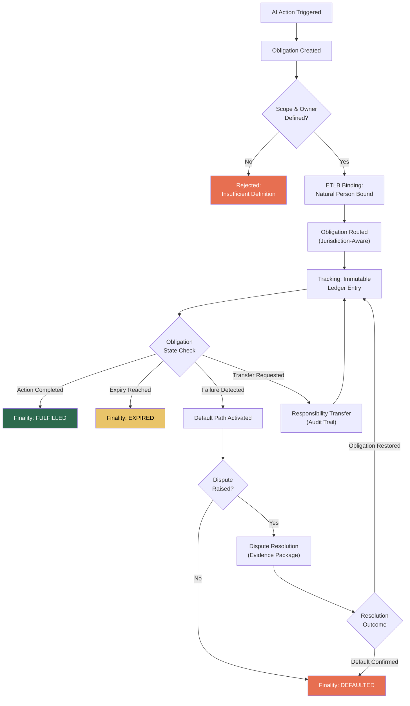

# ORF: Obligation & Responsibility Finality

## What It Is

The foundational coordination protocol of the FrankMax ecosystem. ORF defines the rules by which obligations are **created**, **bound**, **tracked**, **fulfilled**, and **terminated** with irrevocable finality at every stage. Every AI action that touches a customer, a contract, a citizen, or a regulated process generates an obligation. ORF ensures that obligation has a defined scope, an identifiable owner, an enforced expiry, and a mechanically determined outcome.

Think of ORF as the **TCP/IP of AI governance**: just as TCP/IP provides reliable packet delivery without caring whether the application is email or video, ORF provides reliable obligation delivery without caring whether the AI action is a loan approval, a medical diagnosis, or a government benefit determination.

Without ORF, AI systems create obligations that float — unowned, untracked, never resolved. With ORF, every obligation has exactly one of three terminal states: **fulfilled**, **expired**, or **defaulted**. No exceptions.

---

## Protocol Components

| Component | Function | Marketplace Product |
|---|---|---|
| **Obligation Creation** | Every AI action creates an obligation with defined scope, owner, and expiry | Obligation Creation Engine |
| **Responsibility Binding** | At execution time, one natural person is cryptographically bound as the liability bearer ([ETLB](/protocols/etlb)) | Responsibility Binding Service |
| **Obligation Routing** | Cross-border, cross-entity routing with jurisdiction-aware enforcement | Obligation Router |
| **Obligation Tracking** | Immutable ledger tracking state from creation through finality | Obligation Tracking Dashboard |
| **Finality Determination** | Mechanically enforced determination: fulfilled, expired, or defaulted | Finality Certification Service |
| **Responsibility Transfer** | Governed transfer of responsibility between parties with full audit trail | Responsibility Transfer Protocol |
| **Obligation Expiry** | All obligations have enforced expiry; no immortal commitments ([MCO](/protocols/mco)) | Expiry Management System |
| **Default Handling** | Pre-committed default paths activated when obligations fail | Default Resolution Engine |
| **Dispute Resolution** | Structured dispute paths with machine-generated evidence packages | Dispute Resolution Service |

---

## Obligation Lifecycle

---

## Revenue Streams

| Revenue Stream | Gross Margin | Model | Why It Works |
|---|---|---|---|
| **ORF Compliance Certification** | 90%+ | Per-entity annual certification | Regulators will require proof of obligation management; certification is recurring |
| **Obligation Routing** | 75-85% | Per-obligation transaction fee | Cross-border routing is high-value; no one else has jurisdiction-aware obligation routing |
| **Finality Attestation** | 85-90% | Per-attestation fee | Auditors and insurers need machine-verifiable proof an obligation reached terminal state |
| **Default Insurance** | 60-70% | Premium per obligation | Pre-committed default paths make obligations insurable; underwriters need structured data |
| **Audit Trail Access** | 85-95% | Subscription + per-query | Regulators, auditors, and legal teams need immutable obligation histories on demand |
| **SDK/API Access** | 80-90% | Usage-based + license | Developers building compliant AI systems need ORF primitives in their stack |

---

## Target Audiences

### Governments (Cross-Ministry Coordination)
Governments deploy AI across agencies — benefits, tax, immigration, defense. Each deployment creates obligations to citizens. ORF ensures every AI-generated obligation (benefit determination, permit approval, enforcement action) is tracked from creation to finality across ministries.

### International Institutions (Treaty Obligations)
The World Bank, UN agencies, and development banks fund AI deployments across sovereign borders. ORF provides the coordination layer for tracking obligations that span jurisdictions, currencies, and legal systems.

### Multinationals (Cross-Subsidiary Governance)
A multinational running AI across 40 subsidiaries in 25 countries needs to know which subsidiary owns which obligation. ORF routes obligations to the correct entity and ensures finality is determined under the correct jurisdiction.

### Banks and Insurers (Contract Lifecycle)
Every loan, policy, and claim generates obligations. ORF maps directly onto existing contract lifecycle management but adds cryptographic binding, immutable tracking, and mechanical finality — what regulators are beginning to demand for AI-assisted decisions.

### Consulting Firms (Engagement Tracking)
Advisory firms deploying AI on client engagements need to track which obligations belong to the firm versus the client. ORF provides clean separation of responsibility with transferable, auditable obligation records.

---

## Standards Capture Strategy

ORF is designed for adoption as an open standard:

1. **Publish** the ORF specification as an open protocol (CC-BY-SA)
2. **Pilot** with one regulator (target: Singapore IMDA or UK ICO)
3. **Embed** ORF compliance into procurement requirements
4. **Certify** — once ORF is a procurement requirement, every vendor selling AI to that government must be ORF-compliant
5. **Collect** — FrankMax operates the certification authority, the reference implementation, and the tooling ecosystem

The protocol is free. The compliance infrastructure is the business.

---

## Related

- [ETLB: Execution-Time Liability Binding](/protocols/etlb) — The binding mechanism ORF uses at execution time
- [MCO: Mortality Compliance Object](/protocols/mco) — The expiry enforcement mechanism ORF requires for all obligations
- [Burger / Fries / Kitchen Framework](/economic-model/burger-fries-kitchen) — How protocols generate revenue
- [Ecosystem Entities](/ecosystem-entities)
