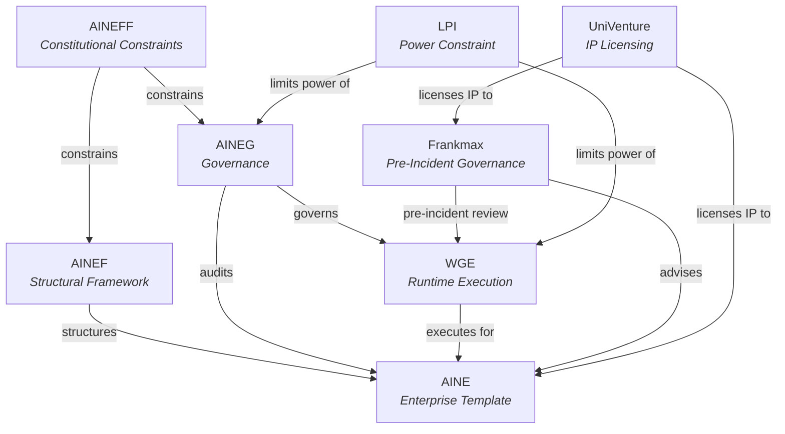
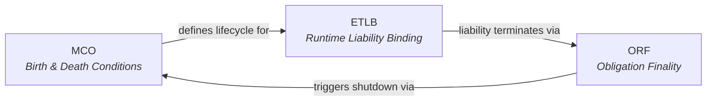
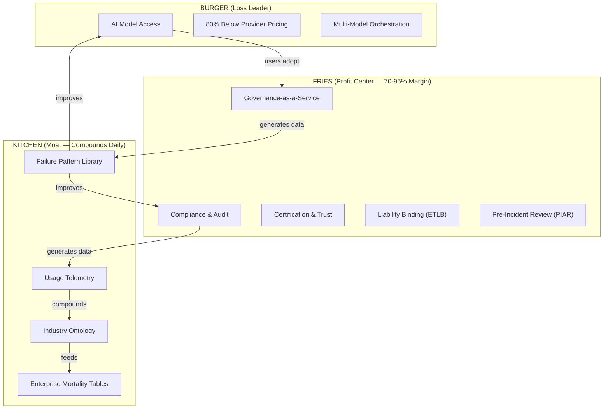
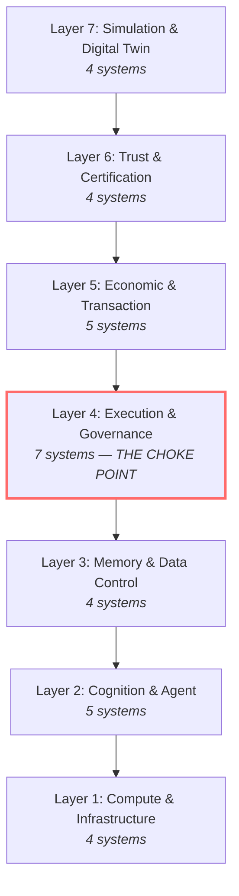
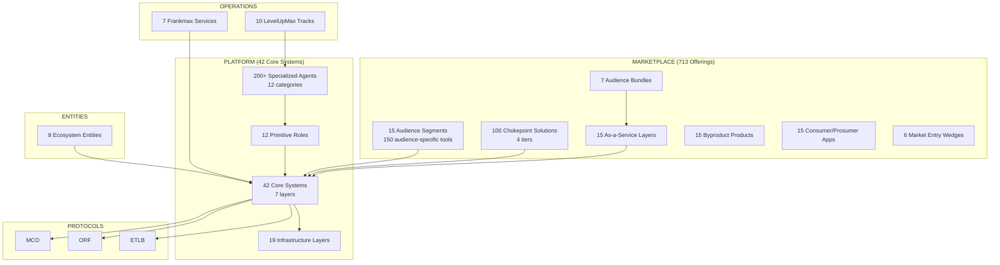

# Agent Recovery Prompt

<div className="recovery-prompt">

**What this page is.** This is the single most important page in the FrankMax Marketplace documentation. It is designed so that any AI agent — with zero prior context — can read this one page and recover complete working knowledge of the project, its architecture, its economics, its entities, its protocols, its audiences, its risks, and its execution priorities.

**How to use it.** Read top to bottom. Every section is self-contained. Links point to detailed documentation pages. After reading this page, you can work on any part of the codebase, answer any strategic question, or generate any deliverable without needing additional context.

**Source of truth.** The canonical data source is `/home/leo/Projects/Brainstorm/docs/MARKETPLACE_OPPORTUNITY_CATALOG.md` (1,740 lines, ~713 offerings). The 43 strategic source documents live at `/home/leo/Projects/Brainstorm/docs/docs/1.md` through `43.md`. This documentation site is a structured, navigable rendering of those sources. Documents 39-43 introduce the Sovereign Intent Fabric, Enhancement Layer Taxonomy, Organizational Formalization Models, Cognitive Overload Points, and Education-to-Job Pipeline Chokepoints.

</div>

---

## 1. What This Project Is

**FrankMax Marketplace** is "The AppSumo of Institutional AI." It sells AI models to enterprises and institutions at 80% below provider pricing, then monetizes the governance, compliance, and audit layers required to use those models responsibly.

| Attribute | Value |
|---|---|
| **Founder** | Andrew Palupillai / FrankMax Digital |
| **Stage** | Solo, bootstrapped, $0 revenue |
| **Total offerings** | 713 distinct marketplace products |
| **Audience segments** | 15 |
| **NAICS sectors** | 20+ |
| **Ecosystem entities** | 8 |
| **Core protocols** | 3 |
| **Platform layers** | 7 (containing 42 core systems) |

**Key insight:** The cheap AI access is the loss leader. The real business is the governance layer that wraps around it. If the governance attachment rate drops below 40%, the business dies.

**Detailed overview:** [Executive Overview](/executive-overview) | [The Premise](/executive-overview/premise) | [Architecture](/executive-overview/architecture) | [Statistics](/executive-overview/statistics) | [Economics](/executive-overview/economics)

---

## 2. The 8 Ecosystem Entities

Each entity has a distinct constitutional role. They are not departments — they are structurally separated to prevent conflicts of interest.

| Entity | Full Name | Role |
|---|---|---|
| **AINEFF** | AI-Native Enterprise Foundation Framework | Constitutional constraints — defines what the ecosystem CANNOT do |
| **AINEF** | AI-Native Enterprise Framework | Structural framework — the skeleton the ecosystem is built on |
| **AINEG** | AI-Native Enterprise Governance | Governance — enforces rules, audits, compliance |
| **AINE** | AI-Native Enterprise | Enterprise template — the reusable institutional pattern |
| **WGE** | Workforce Governance Engine | Runtime execution — the engine that actually runs workloads |
| **Frankmax** | Frankmax Digital | Pre-incident governance — the consulting/advisory arm |
| **LPI** | Legal Power Infrastructure | Power constraint — limits what entities can coerce |
| **UniVenture** | UniVenture | IP licensing — controls intellectual property and licensing |



**Detailed pages:** [AINEFF](/ecosystem-entities/aineff) | [AINEF](/ecosystem-entities/ainef) | [AINEG](/ecosystem-entities/aineg) | [AINE](/ecosystem-entities/aine) | [WGE](/ecosystem-entities/wge) | [Frankmax](/ecosystem-entities/frankmax) | [LPI](/ecosystem-entities/lpi) | [UniVenture](/ecosystem-entities/univenture)

---

## 3. The 3 Core Protocols

These protocols are the intellectual property moat. If even one gets adopted by a regulator, it becomes a permanent competitive advantage.

| Protocol | Full Name | Purpose |
|---|---|---|
| **ORF** | Obligation & Responsibility Finality | Defines when an obligation is complete — prevents indefinite liability chains |
| **ETLB** | Execution-Time Liability Binding | Binds liability to the exact moment of AI execution — not before, not after |
| **MCO** | Mortality Compliance Object | Encodes the lifecycle and death conditions of any AI agent or system |

**How they interlock:** ETLB fires at runtime to bind liability. ORF determines when that liability terminates. MCO defines the conditions under which the AI system itself can be terminated. Together, they form a complete liability lifecycle: birth (MCO) -> execution (ETLB) -> finality (ORF).



**Detailed pages:** [ORF](/protocols/orf) | [ETLB](/protocols/etlb) | [MCO](/protocols/mco)

---

## 4. Economic Model (Burger / Fries / Kitchen)

This is the core business logic. Memorize it.

| Layer | Analogy | What It Is | Margin | Purpose |
|---|---|---|---|---|
| **Burger** | Loss leader | AI model access at 80% below provider pricing | Low / negative | Drive adoption, get users in the door |
| **Fries** | Profit center | Governance, compliance, audit, certification layers | 70-95% | This is where the money is made |
| **Kitchen** | Competitive moat | Telemetry, failure library, industry ontology, usage data | N/A | Compounds daily; cannot be copied by competitors |

**Critical threshold:** Governance attachment rate must stay above 40%. Below that, the unit economics collapse. The business is the fries, not the burger.

### Unit Economics Projection

| Year | Customers | Revenue | Blended Margin |
|---|---|---|---|
| Y1 | 50 | $225K | 38% |
| Y2 | 200 | $1.64M | 58% |
| Y3 | 800 | $11.2M | 67% |



**Detailed pages:** [Burger/Fries/Kitchen](/economic-model/burger-fries-kitchen) | [Unit Economics](/economic-model/unit-economics) | [Attachment Layers](/economic-model/attachment-layers) | [Structural Dominance](/economic-model/structural-dominance) | [Habit Engineering](/economic-model/habit-engineering)

---

## 5. The 15 Target Audiences

Every marketplace offering maps to one or more of these audience segments. Each has dedicated tooling, pricing, and compliance requirements.

| # | Audience | NAICS Codes | Documentation |
|---|---|---|---|
| 01 | Governments & Ministries | 921-928 | [Details](/audiences/01-governments) |
| 02 | Defense / Security / Intelligence | 928110, 541715 | [Details](/audiences/02-defense-security) |
| 03 | National Critical Infrastructure | 221, 486-488 | [Details](/audiences/03-critical-infrastructure) |
| 04 | International Institutions | 928120, 813910 | [Details](/audiences/04-international-institutions) |
| 05 | Dynasties & Royal Houses | 525920, 551112 | [Details](/audiences/05-dynasties) |
| 06 | Family Offices | 523920, 525920 | [Details](/audiences/06-family-offices) |
| 07 | Multinational Corporate Empires | 551112, 541611-541990 | [Details](/audiences/07-multinationals) |
| 08 | Legacy Enterprises | 311-339, 423-454 | [Details](/audiences/08-legacy-enterprises) |
| 09 | Banks, Insurers, Financial Foundations | 522-525 | [Details](/audiences/09-banks-insurers) |
| 10 | National Industry Bodies | 813910-813990 | [Details](/audiences/10-industry-bodies) |
| 11 | Education / R&D / Think Tanks | 611, 541711 | [Details](/audiences/11-education-rd) |
| 12 | Consulting Firms & System Integrators | 541611-541618 | [Details](/audiences/12-consulting-si) |
| 13 | Investors / VCs / Syndicates | 523910-523999 | [Details](/audiences/13-investors-vc) |
| 14 | High-Power Founders & Operators | 541511, 511210 | [Details](/audiences/14-founders-operators) |
| 15 | High-Risk Individuals | Personal services | [Details](/audiences/15-high-risk-individuals) |

**Cross-audience analysis:** [Common Problems](/cross-audience/problems) | [Common Challenges](/cross-audience/challenges) | [Systemic Gaps](/cross-audience/systemic-gaps) | [Bottlenecks](/cross-audience/bottlenecks) | [Chokepoints & SPOFs](/cross-audience/chokepoints-spof) | [Entropies](/cross-audience/entropies) | [TAM by Audience](/cross-audience/tam-by-audience)

---

## 6. Revenue Priority (Build First)

This is the execution sequence. Revenue before infrastructure. No exceptions.

| Priority | Product | Timeline | Revenue Range | Notes |
|---|---|---|---|---|
| 1 | **PIAR** (Pre-Incident Accountability Review) | 0-30 days | $15K-$75K | Advisory service, no code needed |
| 2 | **Billing Leakage Detector** | 30-60 days | TBD | First software product |
| 3 | **DocuFlow** | 30-60 days | TBD | Document processing pipeline |
| 4 | **Claims Processing Accelerator** | 60-90 days | TBD | Insurance vertical wedge |
| 5 | **AI Cost Optimization Engine** | 60-90 days | TBD | Enterprise cost reduction |

**Detailed pages:** [Revenue Priority](/risk-governance/revenue-priority) | [PIAR Service](/operations/frankmax-services/piar) | [Revenue Trajectory](/operations/frankmax-services/revenue-trajectory)

---

## 7. Platform Architecture (7 Layers, 42 Core Systems)



**Layer 4 is the choke point.** Every AI action in the marketplace must pass through the Execution & Governance layer. This is where ETLB binds liability, ORF determines finality, and MCO controls lifecycle. Control Layer 4 and you control the marketplace.

### Marketplace Offering Breakdown (713 Total)

| Category | Count | Documentation |
|---|---|---|
| Audience-specific tools | 150 | [Audiences](/audiences/01-governments) (see each of 15 segments) |
| Chokepoint solutions (4 tiers) | 100 | [Chokepoints](/market-intelligence/chokepoints) |
| Core systems | 42 | [Core Systems](/platform/core-systems) |
| As-a-service layers | 15 | [Service Layers](/economic-model/service-layers) |
| Audience bundles | 7 | [Bundles](/economic-model/bundles) |
| Specialized agents (12 categories) | 200+ | [Agent Library](/platform/agents) |
| Primitive agent roles | 12 | [Primitives](/platform/primitives) |
| Civilizational kernel infrastructure layers | 19 | [Infrastructure Layers](/platform/infrastructure-layers) |
| Byproduct economy products | 15 | [Byproducts](/economic-model/byproducts) |
| Market entry wedges | 6 | [Market Wedges](/market-intelligence/market-wedges) |
| LevelUpMax bootcamp tracks | 10 | [LevelUpMax](/operations/levelupmax) |
| Frankmax core services | 7 | [Frankmax Services](/operations/frankmax-services) |
| Consumer/prosumer apps | 15 | [Consumer Apps](/platform/consumer-apps) |

**Platform subsections:** [OpenClaw Runtime](/platform/openclaw) | [Doc-as-Code](/platform/doc-as-code) | [Blockchain & IoT](/platform/blockchain-iot)

---

## 8. 15 As-a-Service Layers

Each layer is a standalone revenue stream that wraps around the base AI model access.

| # | Service Layer | Documentation |
|---|---|---|
| 1 | Governance-as-a-Service (GaaS) | [Details](/economic-model/service-layers/governance-as-a-service-gaas) |
| 2 | Compliance-as-a-Service (CoaaS) | [Details](/economic-model/service-layers/compliance-as-a-service-coaas) |
| 3 | Audit-as-a-Service (AaaS) | [Details](/economic-model/service-layers/audit-as-a-service-aaas) |
| 4 | Liability-as-a-Service (LaaS) | [Details](/economic-model/service-layers/liability-as-a-service-laas) |
| 5 | Trust-as-a-Service (TaaS) | [Details](/economic-model/service-layers/trust-as-a-service-taas) |
| 6 | Certification-as-a-Service (CertaaS) | [Details](/economic-model/service-layers/certification-as-a-service-certaas) |
| 7 | Insurance-as-a-Service (InaaS) | [Details](/economic-model/service-layers/insurance-as-a-service-inaas) |
| 8 | Intelligence-as-a-Service (IaaS) | [Details](/economic-model/service-layers/intelligence-as-a-service-iaas) |
| 9 | Workflow-as-a-Service (WaaS) | [Details](/economic-model/service-layers/workflow-as-a-service-waas) |
| 10 | Role-as-a-Service (RaaS) | [Details](/economic-model/service-layers/role-as-a-service-raas) |
| 11 | Capability-as-a-Service (CaaS) | [Details](/economic-model/service-layers/capability-as-a-service-caas) |
| 12 | Coordination-as-a-Service (CoordaaS) | [Details](/economic-model/service-layers/coordination-as-a-service-coordaas) |
| 13 | Simulation-as-a-Service (SimaaS) | [Details](/economic-model/service-layers/simulation-as-a-service-simaas) |
| 14 | Skill-as-a-Service (SaaS) | [Details](/economic-model/service-layers/skill-as-a-service-saas) |
| 15 | Enterprise-as-a-Service (EaaS) | [Details](/economic-model/service-layers/enterprise-as-a-service-eaas) |

---

## 9. 12 Specialized Agent Categories (200+ Agents)

| Category | Documentation |
|---|---|
| Governance Agents | [Details](/platform/agents/governance-agents) |
| Compliance Agents | [Details](/platform/agents/compliance-agents) |
| Risk Agents | [Details](/platform/agents/risk-agents) |
| Finance Agents | [Details](/platform/agents/finance-agents) |
| Operations Agents | [Details](/platform/agents/operations-agents) |
| Strategy Agents | [Details](/platform/agents/strategy-agents) |
| Innovation Agents | [Details](/platform/agents/innovation-agents) |
| Coordination Agents | [Details](/platform/agents/coordination-agents) |
| Influence Agents | [Details](/platform/agents/influence-agents) |
| Competitive Intelligence Agents | [Details](/platform/agents/competitive-intelligence-agents) |
| Culture & Psychology Agents | [Details](/platform/agents/culture-psychology-agents) |
| Civilization-Scale Agents | [Details](/platform/agents/civilization-scale-agents) |

**Agent composition model:** [How agents are composed from primitives](/platform/agents/composition-model)

### 12 Primitive Agent Roles

Every specialized agent is composed from combinations of these primitives:

| Primitive | Documentation |
|---|---|
| Perceiver | [Details](/platform/primitives/perceiver) |
| Retriever | [Details](/platform/primitives/retriever) |
| Interpreter | [Details](/platform/primitives/interpreter) |
| Planner | [Details](/platform/primitives/planner) |
| Decider | [Details](/platform/primitives/decider) |
| Executor | [Details](/platform/primitives/executor) |
| Monitor | [Details](/platform/primitives/monitor) |
| Verifier | [Details](/platform/primitives/verifier) |
| Reflector | [Details](/platform/primitives/reflector) |
| Critic | [Details](/platform/primitives/critic) |
| Router | [Details](/platform/primitives/router) |
| Memory Keeper | [Details](/platform/primitives/memory-keeper) |

---

## 10. 5 Execution Rules

These are non-negotiable. Every decision must pass through this filter.

| # | Rule | Rationale |
|---|---|---|
| 1 | **Revenue before infrastructure** — PIAR first, platform later | A $0-revenue platform is a hobby. Ship what pays. |
| 2 | **Attachment rate above 40% or die** — governance must be default, not opt-in | If users can skip fries, they will. Make governance the default. |
| 3 | **Data moat compounds daily** — failure library and usage telemetry cannot be copied | Every day of operation widens the gap. Competitors start at zero. |
| 4 | **Standards capture = permanent moat** — get ETLB/MCO adopted by one regulator | Regulatory adoption makes your protocol the compliance requirement. |
| 5 | **Switching cost engineering** — audit trails are immutable and cumulative | The longer a customer uses the platform, the more expensive it is to leave. |

---

## 11. 10 Failure Modes (Ranked by Probability)

Every strategic decision must account for these. They are not hypothetical.

| # | Failure Mode | Probability | Mitigation |
|---|---|---|---|
| 1 | Solo founder execution bottleneck | 60% | Prioritize ruthlessly; automate with agents; hire first ops person early |
| 2 | Zero revenue for 6+ months | 50% | PIAR generates revenue in 0-30 days with no code |
| 3 | Overbuilding before revenue proof | 45% | Ship PIAR before building platform; validate with paying customers |
| 4 | Model providers vertically integrate | 40% | Governance layer is model-agnostic; switching between providers is trivial |
| 5 | Competitor with capital copies model | 40% | Data moat compounds daily; failure library cannot be copied retroactively |
| 6 | Enterprise build vs. buy | 35% | 42 integrated systems are cheaper to buy than build; audit trails lock them in |
| 7 | Pricing wrong | 35% | Start with PIAR ($15K-$75K) advisory; iterate based on willingness to pay |
| 8 | Attachment rate below 40% | 30% | Make governance default-on; bundle into pricing; never offer AI-only tier |
| 9 | Regulatory capture by incumbents | 25% | Move faster than incumbents; get ETLB/MCO adopted before they write their own |
| 10 | Market doesn't care about governance | 15% | EU AI Act, NIST AI RMF, and insurance requirements are making this mandatory |

**Detailed pages:** [Failure Modes](/risk-governance/failure-modes) | [Sensitivity Analysis](/risk-governance/sensitivity-analysis) | [Strategic Moat](/risk-governance/strategic-moat)

---

## 12. Market Entry Wedges (6 Verticals)

These are the industries where the first sales happen. Sequencing matters.

| Wedge | Documentation |
|---|---|
| Banking | [Details](/market-intelligence/market-wedges/banking) |
| Healthcare | [Details](/market-intelligence/market-wedges/healthcare) |
| Manufacturing | [Details](/market-intelligence/market-wedges/manufacturing) |
| Professional Services | [Details](/market-intelligence/market-wedges/professional-services) |
| Construction | [Details](/market-intelligence/market-wedges/construction) |
| Logistics | [Details](/market-intelligence/market-wedges/logistics) |

**Entry sequencing:** [Market Wedge Sequencing](/market-intelligence/market-wedges/sequencing)

**Chokepoint tiers:** [Tier 1 — Revenue & Compliance](/market-intelligence/chokepoints/tier-1-revenue-compliance) | [Tier 2 — Operational Efficiency](/market-intelligence/chokepoints/tier-2-operational-efficiency) | [Tier 3 — Governance & Structural](/market-intelligence/chokepoints/tier-3-governance-structural) | [Tier 4 — AI Governance & Trust](/market-intelligence/chokepoints/tier-4-ai-governance-trust) | [NAICS Mapping](/market-intelligence/chokepoints/naics-mapping)

---

## 13. Operations

### Frankmax Core Services (7)

| Service | Documentation |
|---|---|
| PIAR (Pre-Incident Accountability Review) | [Details](/operations/frankmax-services/piar) |
| Authority & Liability Mapping | [Details](/operations/frankmax-services/authority-liability-mapping) |
| Failure Propagation Analysis | [Details](/operations/frankmax-services/failure-propagation) |
| Decision Defensibility Structuring | [Details](/operations/frankmax-services/decision-defensibility) |
| Institutional Memory Architecture | [Details](/operations/frankmax-services/institutional-memory) |
| Jurisdictional Exposure Assessment | [Details](/operations/frankmax-services/jurisdictional-exposure) |
| Accreditation & Certification | [Details](/operations/frankmax-services/accreditation) |

### LevelUpMax Bootcamp (10 Tracks)

| Track | Documentation |
|---|---|
| Track 1 | [Details](/operations/levelupmax/track-1) |
| Track 2 | [Details](/operations/levelupmax/track-2) |
| Track 3 | [Details](/operations/levelupmax/track-3) |
| Track 4 | [Details](/operations/levelupmax/track-4) |
| Track 5 | [Details](/operations/levelupmax/track-5) |
| Track 6 | [Details](/operations/levelupmax/track-6) |
| Track 7 | [Details](/operations/levelupmax/track-7) |
| Track 8 | [Details](/operations/levelupmax/track-8) |
| Track 9 | [Details](/operations/levelupmax/track-9) |
| Track 10 | [Details](/operations/levelupmax/track-10) |

**Advancement path:** [Details](/operations/levelupmax/advancement-path) | **Corporate licensing:** [Details](/operations/levelupmax/corporate-licensing)

---

## 14. 19 Civilizational Kernel Infrastructure Layers

These are the foundational abstractions that underlie all 42 core systems. They represent the irreducible primitives of institutional AI.

| Layer | Documentation |
|---|---|
| Accountability Asymmetry | [Details](/platform/infrastructure-layers/accountability-asymmetry) |
| Boundary Definition | [Details](/platform/infrastructure-layers/boundary-definition) |
| Coercion & Consequence | [Details](/platform/infrastructure-layers/coercion-consequence) |
| Coordination | [Details](/platform/infrastructure-layers/coordination) |
| Decision Legitimacy | [Details](/platform/infrastructure-layers/decision-legitimacy) |
| Entropy & Decay | [Details](/platform/infrastructure-layers/entropy-decay) |
| Execution Authority | [Details](/platform/infrastructure-layers/execution-authority) |
| Exit & Substitution | [Details](/platform/infrastructure-layers/exit-substitution) |
| Human Discipline | [Details](/platform/infrastructure-layers/human-discipline) |
| Incentive Gradient | [Details](/platform/infrastructure-layers/incentive-gradient) |
| Internal Purpose | [Details](/platform/infrastructure-layers/internal-purpose) |
| Irreversibility | [Details](/platform/infrastructure-layers/irreversibility) |
| Legibility to Power | [Details](/platform/infrastructure-layers/legibility-to-power) |
| Narrative & Legitimacy | [Details](/platform/infrastructure-layers/narrative-legitimacy) |
| Proof & Verifiability | [Details](/platform/infrastructure-layers/proof-verifiability) |
| Silence & Non-Action | [Details](/platform/infrastructure-layers/silence-non-action) |
| Time Synchronization | [Details](/platform/infrastructure-layers/time-synchronization) |
| Trust Compression | [Details](/platform/infrastructure-layers/trust-compression) |
| Truth / System of Record | [Details](/platform/infrastructure-layers/truth-system-of-record) |

---

## 15. Full System Map



---

## 16. Sovereign Intent Fabric (Doc 42)

The longest-term strategic expansion. SIF is a civilization-scale infrastructure layer — edge-first, intent-driven, sovereign computing.

| Attribute | Value |
|---|---|
| **Architecture** | 6 layers: Intent Interface → Landscape Graph → Multi-Objective Evaluator → Exploration Engine → Execution Orchestrator → Feedback Memory |
| **Revenue plan** | Y1 $250K → Y2 $1M → Y3 $3M → Y4 $5-8M |
| **Unit economics** | $48K/customer/year, 46% margin |
| **User tiers** | 5: Individual → Power User → Enterprise → Network Operator → Protocol Steward |
| **New deliverables** | 20: SIP, ESR, PFV, ITP, SACS, CGE, IDE, IOO, EE, SCM, PQCS, GPL, EOL, DVE, CE, EDCS, AIP, CUXF, OPGM, SCP |
| **First product** | Secure Legal AI Node v1 for mid-sized law firms ($36K-$50K/year) |
| **Edge compute** | Enclave leasing at +$7,200/year per node |

**Detailed pages:** [SIF Overview](/sovereign-intent-fabric) | [Architecture](/sovereign-intent-fabric/architecture) | [Revenue Plan](/sovereign-intent-fabric/revenue-plan) | [User Tiers](/sovereign-intent-fabric/user-tiers) | [Agent Coordination Protocol](/sovereign-intent-fabric/agent-coordination-protocol) | [Compute Marketplace](/sovereign-intent-fabric/compute-marketplace) | [Legal AI Node](/sovereign-intent-fabric/legal-ai-node) | [20 Deliverables](/sovereign-intent-fabric/deliverables/01-sip)

---

## 17. Enhancement Layer — 110-Layer Taxonomy (Doc 39)

A middleware architecture between raw AI model output and enterprise-ready deployment. 110 layers organized in 11 tiers across 10 superclasses. Core principle: **"Capability must grow slower than constraint."**

| Attribute | Value |
|---|---|
| **Total layers** | 110 |
| **Tiers** | 11 (Usable → Reliable → Governed → Auditable → Composable → Scalable → Resilient → Sovereign → Autonomous → Civilizational → Safeguarded) |
| **Superclasses** | 10: Quality, Determinism, Abstraction, Governance, Economics, Observability, Orchestration, Actuation, Adaptation, Experience |

**Detailed pages:** [Enhancement Layer Overview](/enhancement-layer) | [Superclass Reference](/enhancement-layer/superclasses) | [Tier 01: Usable](/enhancement-layer/tier-01-usable) through [Tier 11: Safeguarded](/enhancement-layer/tier-11-safeguarded)

---

## 18. Organizational Formalization — 340 Models (Doc 40)

340 governance topology models reducible to 10-12 control variables. Positioned as "organizational firmware" — machine-readable governance configurations that create ecosystem lock-in.

| Attribute | Value |
|---|---|
| **Models** | 340 governance topologies |
| **Control variables** | 10-12: capital buffer, authority concentration, risk dispersion, protocol rigidity, transparency gradient, escalation latency, incentive alignment, market interface, integration depth, time-horizon insulation |
| **Product evolution** | Static menu → configuration engine → inference engine |

**Detailed pages:** [Org Formalization Overview](/organizational-formalization) | [Control Variables](/organizational-formalization/control-variables) | [Catalog Product](/organizational-formalization/catalog-product) | [Agent Topology Mapping](/organizational-formalization/agent-topology-mapping)

---

## 19. Education & Workforce Intelligence (Docs 41, 43)

2,000 education-to-job pipeline chokepoints representing a $5.5T global skills shortage. Maps directly to LevelUpMax bootcamp and workforce intelligence products.

| Attribute | Value |
|---|---|
| **Total chokepoints** | 2,000+ (1,000 from doc 43, 1,180+ cognitive overload points from doc 41) |
| **Market size** | IDC $5.5T global digital skills shortage |
| **Reskilling need** | 59% of workforce by 2030 (WEF) |
| **5 macro failures** | Signaling, Coordination, Ownership, Governance, Cognitive |
| **3 future tracks** | Elite curation, AI-augmented solopreneurs, Platform-governed gig intelligence |

**Detailed pages:** [Education & Workforce Overview](/education-workforce) | [Market Data](/education-workforce/market-data) | [Five Macro Failures](/education-workforce/macro-failures) | [Three Tracks Future](/education-workforce/three-tracks)

---

## 20. Documentation Site Metadata

| Property | Value |
|---|---|
| **Framework** | Docusaurus v3 + TypeScript |
| **Location** | `/home/leo/Projects/Brainstorm/marketplace-docs/` |
| **Source catalog** | `/home/leo/Projects/Brainstorm/docs/MARKETPLACE_OPPORTUNITY_CATALOG.md` |
| **Source documents** | `/home/leo/Projects/Brainstorm/docs/docs/1.md` through `43.md` |
| **Theme** | Midnight Executive (Navy `#1E2761`, Ice Blue `#CADCFC`) |
| **Total pages (Phase 1-2)** | ~213 |
| **Total pages (Phase 3)** | ~410 |
| **Total pages (Phase 4 — Docs 39-43)** | ~458 |

### Site Navigation Structure

```
docs/
  _recovery/           -- This page (Agent Recovery Prompt)
  executive-overview/  -- Premise, Architecture, Statistics, Economics
  ecosystem-entities/  -- AINEFF, AINEF, AINEG, AINE, WGE, Frankmax, LPI, UniVenture
  protocols/           -- ORF, ETLB, MCO
  audiences/           -- 15 segments (01-governments through 15-high-risk-individuals)
  platform/
    core-systems/      -- 42 core systems (33 documented pages)
    agents/            -- 12 agent categories + composition model
    primitives/        -- 12 primitive roles
    infrastructure-layers/ -- 19 civilizational kernel layers
    openclaw/          -- OpenClaw runtime (8 components)
    doc-as-code/       -- Documentation platform (5 pages)
    blockchain-iot/    -- Blockchain & IoT (5 components)
    consumer-apps/     -- 15 consumer/prosumer applications
  economic-model/
    bundles/           -- 7 audience bundles
    service-layers/    -- 15 as-a-service layers
    byproducts/        -- 15 byproduct economy products
  market-intelligence/
    chokepoints/       -- 4 tiers + NAICS mapping
    market-wedges/     -- 6 verticals + sequencing
  cross-audience/      -- Problems, Challenges, Gaps, Bottlenecks, Chokepoints, Entropies, TAM
  operations/
    frankmax-services/ -- 7 core advisory services + revenue trajectory
    levelupmax/        -- 10 bootcamp tracks + advancement path + corporate licensing
  sovereign-intent-fabric/
    deliverables/      -- 20 SIF deliverables (SIP through SCP)
    architecture       -- 6-layer architecture deep dive
    revenue-plan       -- 36-month revenue trajectory
    user-tiers         -- 5-tier user model
    agent-coordination-protocol -- Universal Agent Coordination Protocol
    compute-marketplace -- Edge compute leasing
    legal-ai-node      -- Secure Legal AI Node v1
  enhancement-layer/   -- 110-layer taxonomy: 11 tiers × 10 superclasses
  organizational-formalization/ -- 340 governance models, 10-12 control variables
  education-workforce/ -- 2,000 pipeline chokepoints, $5.5T skills gap
  risk-governance/     -- Failure Modes, Revenue Priority, Strategic Moat, Sensitivity Analysis
```

---

## 21. User Preferences for Generated Content

When producing content, documents, or code for this project, follow these rules:

- **No fluff, no startup cliches, no generic AI optimism.** If it sounds like a pitch deck intro, delete it.
- **Numbers, dates, names, or decisions.** If it cannot be measured, it does not belong.
- **Dark theme.** Midnight Executive: Navy `#1E2761`, Ice Blue `#CADCFC`.
- **"Slow is smooth, smooth is speed."** Quality over velocity. Do it once, do it right.
- **Source everything** from the MARKETPLACE_OPPORTUNITY_CATALOG.md or the 43 source documents. Do not invent facts.

---

## 22. Quick Reference Checklist

For any agent starting work on this project, verify you understand:

- [ ] The business is the **fries** (governance), not the **burger** (AI access)
- [ ] There are **713 offerings** across **15 audiences** and **20+ NAICS sectors**
- [ ] **8 entities** with constitutionally separated roles
- [ ] **3 protocols** (ORF, ETLB, MCO) form the liability lifecycle
- [ ] **Layer 4** (Execution & Governance) is the choke point — control it, control the marketplace
- [ ] **PIAR** is the first revenue product — advisory, no code, $15K-$75K, 0-30 days
- [ ] **40% attachment rate** is the survival threshold
- [ ] The founder is **solo and bootstrapped** — ruthless prioritization is mandatory
- [ ] **Revenue before infrastructure** — always
- [ ] The canonical source of truth is `MARKETPLACE_OPPORTUNITY_CATALOG.md`
- [ ] **Sovereign Intent Fabric** (doc 42) defines 20 new deliverables and the edge-first civilization layer
- [ ] **Enhancement Layer** (doc 39) has 110 layers across 11 tiers and 10 superclasses
- [ ] **Organizational Formalization** (doc 40) has 340 models reducible to 10-12 control variables
- [ ] **Education pipeline** (docs 41, 43) identifies 2,000+ chokepoints in a $5.5T market
