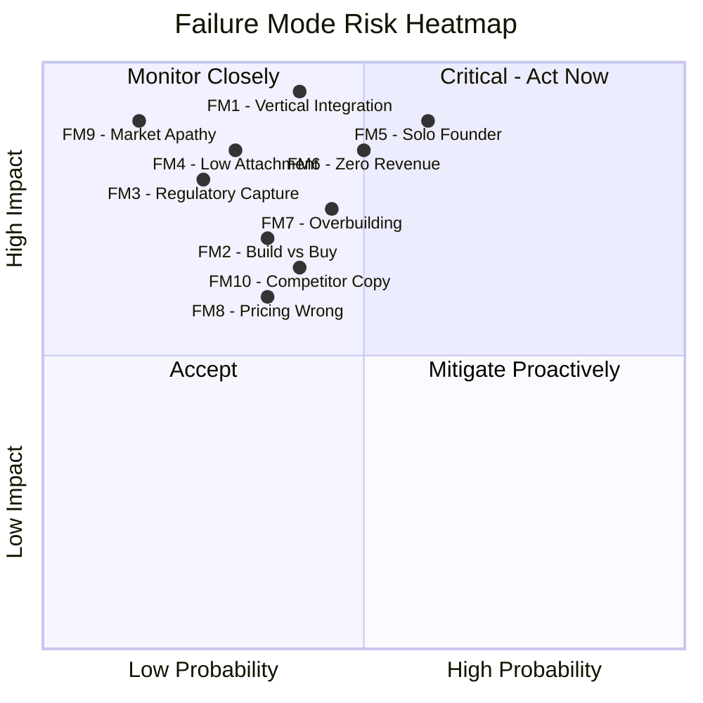

# Failure Mode Analysis

Ten failure modes that could kill the marketplace. Each is assigned a probability, impact severity, and a concrete mitigation. Intellectual honesty demands listing these clearly: two of the top three risks (solo founder bottleneck, zero revenue duration) are internal, not external. The marketplace is more likely to die from execution failure than competitive pressure.

## Failure Mode Matrix

| # | Failure Mode | Probability | Impact | Mitigation |
|---|---|---|---|---|
| 1 | Model providers vertically integrate | 40% | Fatal if unmitigated | Provider-agnostic positioning |
| 2 | Enterprise build vs buy | 35% | Revenue loss in largest segment | Target mid-market; complexity makes buy cheaper |
| 3 | Regulatory capture by incumbents | 25% | Market exclusion | Open standards strategy |
| 4 | Attachment rate below 40% | 30% | Margin collapse | Default bundling; mandatory governance |
| 5 | Solo founder execution bottleneck | 60% | Everything stalls | Operator pipeline (LevelUpMax); automate |
| 6 | Zero revenue for 6+ months | 50% | Runs out of runway/energy | PIAR + Billing Leakage + DocuFlow = 0-60 day revenue |
| 7 | Overbuilding before revenue proof | 45% | 535K lines strategy, $0 revenue | Smallest repeatable kernel |
| 8 | Pricing wrong | 35% | Too low = no value perception; too high = slow close | $8K-$15K sprint sweet spot |
| 9 | Market does not care about governance | 15% | No fries buyers | Wait for first major AI governance incident |
| 10 | Competitor with capital copies model | 40% | Price war, feature race | Data moat cannot be copied |

## Risk Heatmap

## Failure Mode Details

### FM1: Model Providers Vertically Integrate

**Probability:** 40%

**Impact:** Fatal if unmitigated. If Anthropic, OpenAI, or Google build their own governance, compliance, and industry-specific tools, the marketplace loses its "Burger" supply chain advantage. The discount on model access disappears because providers sell direct.

**Evidence this is happening:**
- OpenAI has launched enterprise features (data retention policies, SOC 2 compliance)
- Google Cloud has integrated Gemini into Vertex AI with governance features
- Anthropic has published constitutional AI principles that could become product features
- All three providers are building industry-specific solutions

**Why it might not happen:**
- Model providers optimize for scale, not vertical specialization. Building 713 industry-specific tools across 15 audience segments is not their core competency.
- Governance requires domain expertise (insurance, defense, government procurement) that model providers lack.
- Provider-agnostic customers will resist single-provider lock-in.

**Mitigation:**
1. Maintain strict provider agnosticism -- the Multi-Model AI Orchestrator ensures no single provider is irreplaceable
2. Build the "Fries" and "Kitchen" layers as provider-independent assets
3. Accumulate failure intelligence data that no provider can replicate
4. Position as the governance layer that works across all providers, making the marketplace complementary rather than competitive

### FM2: Enterprise Build vs Buy

**Probability:** 35%

**Impact:** Revenue loss in the largest segment ($15M Y3 SOM from Audience 7). Multinationals with 1,000+ engineers can build governance tools internally. If the top 20 multinationals all build in-house, the marketplace's largest segment evaporates.

**Evidence this is happening:**
- JP Morgan has 50,000+ technologists and builds proprietary AI tools
- Google, Meta, and Microsoft build all internal tools
- Large enterprises increasingly hire AI governance teams internally

**Why it might not happen:**
- Building is more expensive than buying when the tool requires cross-industry data (failure intelligence, compliance patterns)
- Mid-market enterprises (100-1,000 employees) lack engineering capacity to build
- The complexity of multi-jurisdictional compliance makes buy cheaper than build for most enterprises

**Mitigation:**
1. Target mid-market enterprises (Audience 8) where build is not economically viable
2. Make the data moat ("Kitchen") the differentiator -- in-house tools lack cross-industry failure data
3. Price below the cost of a single AI governance hire ($150K-$250K/year)
4. Offer white-label to consulting firms (Audience 12) who sell to enterprises that prefer "buy through advisor"

### FM3: Regulatory Capture by Incumbents

**Probability:** 25%

**Impact:** Market exclusion. If incumbent players (Big 4 audit firms, large consulting firms, established GRC vendors) capture the regulatory definition of "AI governance," the marketplace could be excluded from regulated markets.

**Evidence this is happening:**
- Big 4 firms are writing AI governance frameworks for regulators
- ISO/IEC 42001 (AI Management System) was drafted with incumbent input
- EU AI Act compliance frameworks are being shaped by large vendors

**Why it might not happen:**
- Regulators historically distrust the entities they regulate
- Open standards create a counterweight to proprietary frameworks
- The marketplace's governance-as-infrastructure approach is architecturally different from compliance-checkbox approaches

**Mitigation:**
1. Publish open governance standards before incumbents lock in proprietary ones
2. Contribute to ISO, IEEE, and NIST standards processes
3. Build relationships with regulators in Singapore, GCC, and EU (markets where the marketplace has entry wedges)
4. Position as the independent governance layer that validates incumbent work

### FM4: Attachment Rate Below 40%

**Probability:** 30%

**Impact:** Margin collapse. The economic model requires that 40%+ of "Burger" (AI model access) buyers also purchase "Fries" (governance layers). Below 40%, the Burger subsidy cannot be recovered and the marketplace operates at a loss indefinitely.

**Mechanism of failure:** Customers buy cheap AI access, skip governance, and the marketplace subsidizes their AI consumption without earning margin on governance. This is the Costco hot dog problem without the rotisserie chicken.

**Why it might not happen:**
- If governance is bundled by default (opt-out, not opt-in), attachment rates are structurally higher
- Regulatory pressure is increasing, making governance mandatory rather than optional
- A single major AI governance incident (model hallucination causing financial loss, autonomous system causing harm) will make governance non-negotiable overnight

**Mitigation:**
1. Bundle governance as default -- every "Burger" purchase includes basic governance
2. Make ungoverned AI feel unsafe (the same way unencrypted email now feels unsafe)
3. Price the Burger so that governance-attached purchases are cheaper than standalone model access
4. See [Sensitivity Analysis](/risk-governance/sensitivity-analysis) for margin modeling at different attachment rates

### FM5: Solo Founder Execution Bottleneck

**Probability:** 60% (highest probability of all failure modes)

**Impact:** Everything stalls. A single person cannot simultaneously build product, sell to enterprises, manage operations, raise capital, develop partnerships, and maintain a 535,000-line strategic documentation corpus. The founder becomes the bottleneck described in [Bottleneck 1 -- Human Approval Bandwidth](/cross-audience/bottlenecks).

**Evidence this is happening:**
- 535,856 lines of strategic documentation exist. $0 revenue has been generated.
- The gap between strategy depth and execution breadth is the widest risk factor.

**Why it might not happen:**
- Automation reduces the number of tasks requiring human input
- The operator pipeline (LevelUpMax) produces trained operators who handle execution
- The documentation corpus itself is a product (PIAR, consulting deliverables)

**Mitigation:**
1. LevelUpMax Bootcamp trains operators to handle sales, delivery, and operations
2. Automate everything that does not require founder judgment
3. Prioritize the [Revenue Priority Stack](/risk-governance/revenue-priority) ruthlessly -- do not build anything not on the stack
4. Accept that 535K lines of strategy is a sunk cost; stop adding strategy, start executing revenue

### FM6: Zero Revenue for 6+ Months

**Probability:** 50%

**Impact:** Bootstrapped ventures run on energy, not capital. Zero revenue for 6+ months erodes founder conviction, prevents hiring, and makes every subsequent sale harder (prospects ask "who else uses this?" and the answer is "nobody").

**Why it might not happen:**
- PIAR ($15K-$75K per engagement) can generate revenue within 0-30 days with a single client
- Billing Leakage Detector and DocuFlow can demonstrate value in 30-60 day pilots
- The documentation corpus can be packaged as paid advisory deliverables immediately

**Mitigation:**
1. Execute PIAR sales immediately -- one engagement generates $15K-$75K
2. Run paid pilots for Billing Leakage Detector and DocuFlow within 30-60 days
3. Convert strategic documentation into paid advisory reports ($5K-$15K each)
4. Set a hard deadline: if $0 revenue at 90 days, pivot to pure consulting using the documentation as intellectual property

### FM7: Overbuilding Before Revenue Proof

**Probability:** 45%

**Impact:** 535,856 lines of strategic documentation, 713 marketplace offerings designed, 0 customers, $0 revenue. The classic startup failure mode of building what nobody asked for, at scale.

**Why it might not happen:**
- The documentation is not wasted if it converts to paid deliverables (PIAR, advisory)
- The architecture enables rapid tool deployment once a customer commits
- Strategy depth is a competitive advantage in enterprise sales (buyers trust vendors who understand their domain)

**Mitigation:**
1. Identify the smallest repeatable kernel: one tool, one audience, one price, one sales motion
2. Do not build anything else until that kernel generates $50K+ in revenue
3. Use the 535K-line corpus as sales collateral, not as a build spec
4. Every hour spent on documentation or architecture that is not directly tied to the next sale is waste

### FM8: Pricing Wrong

**Probability:** 35%

**Impact:** Two failure directions -- too low and too high. Too low: buyers perceive no value (enterprise buyers distrust cheap software). Too high: sales cycles extend beyond cash runway. The sweet spot is narrow.

**Pricing traps:**
- Below $5K: perceived as a toy; no enterprise buyer will champion a $5K tool internally
- $5K-$15K: sweet spot for sprint-based engagements; decision can be made by a VP without board approval
- $15K-$75K: PIAR range; requires director-level or higher approval but manageable
- Above $100K: requires procurement process; 6-18 month sales cycle

**Mitigation:**
1. Lead with $8K-$15K sprint-priced engagements (below procurement thresholds)
2. Upsell to $50K-$200K annual subscriptions after proving value
3. Never compete on price with free/cheap model access -- compete on governance value
4. Price the "Fries" at 30-50% of the value they protect (e.g., if governance prevents $1M in regulatory fines, price at $300K-$500K)

### FM9: Market Does Not Care About Governance

**Probability:** 15% (lowest probability but highest potential impact)

**Impact:** If the market collectively decides that AI governance is unnecessary overhead, the entire "Fries" revenue model fails. The marketplace becomes a thin arbitrage layer on model access with no margin.

**Why this is unlikely:**
- EU AI Act mandates AI governance for high-risk systems (effective 2025-2026)
- Every major AI incident (hallucination, bias, autonomous system failure) increases governance demand
- Insurance companies are beginning to require AI governance as a condition of coverage
- Board directors face personal liability for AI-related failures

**Why it could happen:**
- If AI systems prove remarkably reliable and no major incidents occur for 3-5 years, governance feels unnecessary
- If regulatory enforcement is weak (as with GDPR's first 3 years), mandatory governance becomes optional in practice

**Mitigation:**
1. Wait. The first major AI governance incident will convert this market overnight.
2. Position governance as risk reduction (insurance framing), not compliance burden
3. Build the governance infrastructure now so it is ready when demand spikes
4. Target regulated industries (banking, insurance, healthcare) where governance is already mandatory

### FM10: Competitor with Capital Copies Model

**Probability:** 40%

**Impact:** A well-funded competitor (a16z-backed startup, Big 4 spin-off, cloud provider subsidiary) copies the marketplace model with $50M+ in capital. They hire faster, build faster, and sell faster.

**Why it might not happen:**
- The marketplace model requires domain expertise across 15 audience segments and 20+ NAICS sectors -- difficult to replicate with capital alone
- The data moat ("Kitchen") compounds over time and cannot be purchased
- Governance-as-infrastructure requires a fundamentally different architecture than compliance-checkbox tools

**Why it could happen:**
- Capital can buy domain experts
- First-mover advantage in data moat is only meaningful if you have customers generating data
- Execution speed with capital exceeds execution speed without capital, always

**Mitigation:**
1. Build the data moat ("Kitchen") before competitors recognize its value
2. Accumulate failure intelligence data from early customers -- this data is non-replicable
3. Establish the industry ontology as the de facto standard before competitors create alternatives
4. See [Strategic Moat Recommendations](/risk-governance/strategic-moat) for the full moat strategy

## Risk Priority Matrix

Sorted by Expected Impact (Probability x Impact):

| Rank | Failure Mode | Probability | Impact (1-10) | Expected Impact |
|---|---|---|---|---|
| 1 | FM5 -- Solo Founder Bottleneck | 60% | 9 | 5.4 |
| 2 | FM6 -- Zero Revenue 6+ Months | 50% | 8.5 | 4.25 |
| 3 | FM1 -- Vertical Integration | 40% | 9.5 | 3.80 |
| 4 | FM7 -- Overbuilding | 45% | 7.5 | 3.38 |
| 5 | FM10 -- Competitor Copy | 40% | 6.5 | 2.60 |
| 6 | FM4 -- Low Attachment Rate | 30% | 8.5 | 2.55 |
| 7 | FM2 -- Build vs Buy | 35% | 7.0 | 2.45 |
| 8 | FM8 -- Pricing Wrong | 35% | 6.0 | 2.10 |
| 9 | FM3 -- Regulatory Capture | 25% | 8.0 | 2.00 |
| 10 | FM9 -- Market Apathy | 15% | 9.0 | 1.35 |

The top three risks by expected impact are all internal execution risks, not external market risks. This is the correct diagnosis: the marketplace will not die because the market rejects it. It will die because one person cannot execute fast enough to reach the market.

## Related

- [Strategic Moat Recommendations](/risk-governance/strategic-moat)
- [Revenue Priority Stack](/risk-governance/revenue-priority)
- [Sensitivity Analysis](/risk-governance/sensitivity-analysis)
- [Bottlenecks -- Flow Constraints](/cross-audience/bottlenecks)
- [Agent Recovery Prompt](/recovery)
