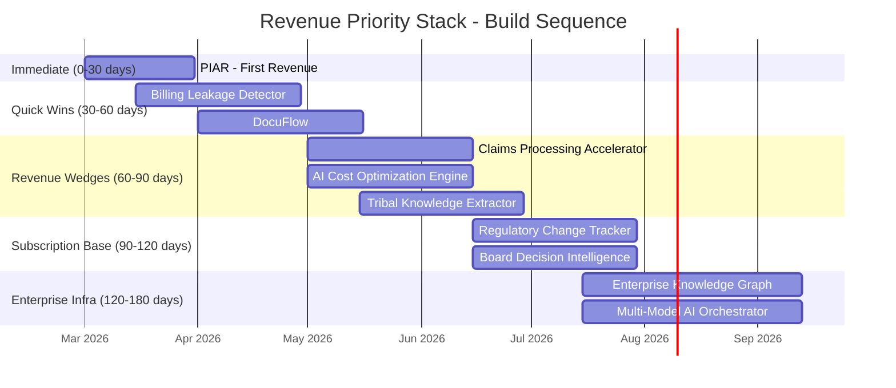

# Revenue Priority Stack

What to build first, in what order, and why. Sorted by speed-to-revenue, not by TAM size or strategic importance. The operating principle: **revenue before architecture, architecture before scale.** Nothing matters until the first dollar clears.

## Priority Ranking

| Rank | Product / Service | Revenue Range | Days to Revenue | Target Audience | Rationale |
|---|---|---|---|---|---|
| 1 | **PIAR** (Pre-Investment Architecture Review) | $15K-$75K | 0-30 | 7, 8, 9 | Consulting deliverable; no product build required; uses existing documentation |
| 2 | **Billing Leakage Detector** | $8K-$50K pilot | 30-60 | 7, 8, 9 | Immediate ROI proof; detects 2-7% revenue leakage; pays for itself in week 1 |
| 3 | **DocuFlow** (Document Intelligence) | $8K-$50K pilot | 30-60 | 7, 8 | High-volume, low-risk deployment; document processing is a universal pain point |
| 4 | **Claims Processing Accelerator** | $15K-$75K pilot | 60-90 | 9 | Insurance-specific wedge; quantifiable time savings; regulated industry = sticky |
| 5 | **AI Cost Optimization Engine** | $8K-$30K | 60-90 | 7, 8, 14 | "We save you money on AI" is the easiest enterprise sale; ROI is the product |
| 6 | **Tribal Knowledge Extractor** | $15K-$50K | 60-90 | 8, 10 | Aging workforce crisis creates urgency; baby boomer retirement wave is now |
| 7 | **Regulatory Change Tracker** | $10K-$40K/yr | 90-120 | 7, 9 | Subscription revenue; regulatory changes are continuous; once adopted, never canceled |
| 8 | **Board Decision Intelligence** | $20K-$80K/yr | 90-120 | 7, 8, 9 | High-value buyer (board directors); premium positioning; quarterly cadence |
| 9 | **Enterprise Knowledge Graph** | $30K-$100K | 120-180 | 7, 8 | Larger deployment; requires integration; higher switching costs |
| 10 | **Multi-Model AI Orchestrator** | $20K-$80K/yr | 120-180 | 7, 8 | Infrastructure play; requires multi-provider integration; long setup |

## Revenue Timeline

## Priority Details

### Priority 1: PIAR (Pre-Investment Architecture Review)

**Revenue:** $15K-$75K per engagement

**Days to first revenue:** 0-30

**Why this is number 1:** PIAR requires zero product development. It is a consulting engagement that leverages the existing 535,856-line strategic documentation corpus as intellectual property. One founder + one laptop + one presentation = revenue. The client gets a comprehensive architecture review of their AI investment posture. The marketplace gets revenue, a reference customer, and deep insight into the client's pain points (which inform product development for Priorities 2-10).

**Sales motion:**
1. Identify a CIO, CTO, or VP Engineering at a target enterprise (Audiences 7, 8, 9)
2. Pitch: "We will assess your AI investment architecture and identify the governance gaps that will cost you money in 12 months"
3. Deliver a 30-50 page report with specific, quantified findings
4. Close within 2 weeks of first meeting

**Upsell path:** PIAR findings naturally surface the need for Billing Leakage Detector (Priority 2), DocuFlow (Priority 3), and governance layers (the "Fries")

**Required investment:** $0. Time only.

### Priority 2: Billing Leakage Detector

**Revenue:** $8K-$50K pilot, scaling to $50K-$200K annual

**Days to first revenue:** 30-60

**Why this is number 2:** The Billing Leakage Detector answers the only question that matters in enterprise sales: "How much money will this save me?" The answer is 2-7% of revenue. For a $100M enterprise, that is $2M-$7M in recovered revenue. The detector pays for itself in the first week. Enterprise buyers can justify the purchase on pure ROI without governance buy-in.

**Sales motion:**
1. Offer a free 7-day leakage scan on a sample transaction dataset
2. Show the dollar amount of detected leakage (this number sells the product)
3. Convert to a paid 30-day pilot ($8K-$15K)
4. Convert to annual subscription ($50K-$200K) after pilot proves sustained value

**Attachment rate driver:** Once the Billing Leakage Detector is deployed, governance layers (ETLB audit trails, MCO expiry on detection models) are natural extensions. Expected attachment rate: 50-65%.

**Required investment:** Core detection engine development. Estimated 4-8 weeks of engineering effort.

### Priority 3: DocuFlow (Document Intelligence)

**Revenue:** $8K-$50K pilot, scaling to $50K-$150K annual

**Days to first revenue:** 30-60

**Why this is number 3:** Every enterprise processes documents. Invoices, contracts, compliance filings, board materials, regulatory submissions. DocuFlow automates extraction, classification, and routing. It is a horizontal tool that works across all audiences and functions. Low risk of failure (document processing is a mature AI capability). High visibility (reduces visible manual labor immediately).

**Sales motion:**
1. Identify a document-heavy process (accounts payable, contract review, regulatory filing)
2. Offer a 14-day pilot processing a sample document set
3. Show time saved and error reduction
4. Convert to annual subscription

**Attachment rate driver:** DocuFlow touches compliance-sensitive documents, creating a natural on-ramp for governance layers (ETLB tracking on processed documents, MCO expiry on classification models).

**Required investment:** Wrapper around existing document processing APIs (Claude, GPT-4V). Estimated 2-4 weeks of engineering effort.

### Priority 4: Claims Processing Accelerator

**Revenue:** $15K-$75K pilot, scaling to $100K-$500K annual

**Days to first revenue:** 60-90

**Why this is number 4:** Insurance-specific. Claims processing is the single largest operational cost for insurers. Automating claims intake, validation, fraud detection, and routing reduces cycle time from weeks to hours. Insurance is the marketplace's designated wedge industry (Audience 9) because insurers understand risk pricing (making them natural governance buyers) and face regulatory mandates that create recurring compliance revenue.

**Sales motion:**
1. Target mid-tier insurers ($500M-$5B GWP) where procurement is faster than at large carriers
2. Offer a 30-day pilot on a single claims line (auto, property, or liability)
3. Measure: claims processing time reduction, fraud detection rate, error reduction
4. Convert to enterprise deployment across all claims lines

**Attachment rate driver:** Insurance is regulated. Claims processing AI requires audit trails (ETLB), model validation (MCO), and compliance evidence (ORF). Expected attachment rate: 65-80%.

**Required investment:** Claims-specific model fine-tuning and integration with claims management systems. Estimated 6-10 weeks of engineering effort.

### Priority 5: AI Cost Optimization Engine

**Revenue:** $8K-$30K, scaling to $30K-$100K annual

**Days to first revenue:** 60-90

**Why this is number 5:** The simplest possible value proposition: "You are spending too much on AI. We will reduce your AI costs by 30-60%." This tool analyzes an enterprise's AI API usage, identifies waste (redundant calls, oversized models for simple tasks, unused capacity), and recommends optimizations. The 80% discount on model access (the "Burger") becomes the proof point.

**Sales motion:**
1. Offer a free AI spend audit (requires only API usage logs)
2. Show the dollar savings available
3. Charge a percentage of savings (10-20%) or flat subscription

**Attachment rate driver:** Organizations that optimize AI costs through the marketplace become dependent on the marketplace's provider-agnostic orchestration layer. Once migrated, switching back to direct provider access is expensive.

**Required investment:** Usage analytics dashboard and optimization recommendation engine. Estimated 4-6 weeks of engineering effort.

### Priority 6: Tribal Knowledge Extractor

**Revenue:** $15K-$50K per engagement

**Days to first revenue:** 60-90

**Why this is number 6:** The baby boomer retirement wave is creating an acute urgency in legacy enterprises. An estimated 10,000 baby boomers retire daily in the US alone. Each departure takes decades of undocumented institutional knowledge. The Tribal Knowledge Extractor captures this knowledge through structured AI-assisted interviews and converts it into searchable, structured knowledge bases.

**Sales motion:**
1. Target industries with aging workforces: utilities, manufacturing, government, aerospace
2. Pitch: "Your most knowledgeable people are retiring. What happens to what they know?"
3. Run a pilot extraction with 3-5 subject matter experts over 30 days
4. Deliver a structured knowledge base with searchable, cross-referenced expertise

**Attachment rate driver:** Moderate. Knowledge extraction is a project, not a subscription. Upsell to Enterprise Knowledge Graph (Priority 9) for ongoing knowledge management.

**Required investment:** Interview protocol design and knowledge structuring pipeline. Estimated 4-8 weeks of engineering effort.

### Priority 7: Regulatory Change Tracker

**Revenue:** $10K-$40K/yr subscription

**Days to first revenue:** 90-120

**Why this is number 7:** Regulatory Change Tracker is the first pure subscription product. Once deployed, it monitors regulatory changes across all relevant jurisdictions and alerts the organization to changes that affect its operations. This is the "utility bill" of governance -- once turned on, it is never turned off because the risk of missing a regulatory change exceeds the subscription cost.

**Sales motion:**
1. Target compliance officers and general counsel at multinationals and financial institutions
2. Demonstrate coverage across the client's operating jurisdictions
3. Offer a 30-day trial with retrospective analysis ("here is what you missed last quarter")
4. Convert to annual subscription

**Attachment rate driver:** High. Regulatory tracking is inherently governance-adjacent. Clients who subscribe to regulatory tracking are pre-qualified governance buyers.

**Required investment:** Regulatory data ingestion pipeline, change detection algorithms, and jurisdiction-specific rulesets. Estimated 8-12 weeks of engineering effort.

### Priority 8: Board Decision Intelligence

**Revenue:** $20K-$80K/yr subscription

**Days to first revenue:** 90-120

**Why this is number 8:** Premium product for premium buyers. Board directors are the highest-value individual buyers in the enterprise. Board Decision Intelligence synthesizes board materials into decision-ready briefings, identifies information gaps, and tracks the connection between board decisions and organizational outcomes.

**Sales motion:**
1. Target board chairs and lead independent directors
2. Offer a single board meeting trial (synthesize one meeting's materials)
3. Demonstrate time savings and decision quality improvement
4. Convert to annual subscription

**Attachment rate driver:** Very high. Board-level tools naturally incorporate governance, compliance, and risk management. Expected attachment rate: 70-85%.

**Required investment:** Board material ingestion, synthesis algorithms, and decision tracking framework. Estimated 8-12 weeks of engineering effort.

### Priority 9: Enterprise Knowledge Graph

**Revenue:** $30K-$100K implementation + $20K-$50K/yr subscription

**Days to first revenue:** 120-180

**Why this is number 9:** Larger deployment requiring integration with enterprise systems. The Enterprise Knowledge Graph connects information across departments, systems, and time. It requires data pipeline integration, which increases implementation time but also increases switching costs (Moat 5).

**Required investment:** Knowledge graph architecture, data pipeline connectors, and search/query interface. Estimated 12-16 weeks of engineering effort.

### Priority 10: Multi-Model AI Orchestrator

**Revenue:** $20K-$80K/yr subscription

**Days to first revenue:** 120-180

**Why this is number 10:** Infrastructure play. The Multi-Model AI Orchestrator enables enterprises to route AI tasks across Claude, GPT, Gemini, and open-source models based on cost, performance, and compliance requirements. This is the technical foundation of the "Burger" (discounted model access) but requires multi-provider API integration and routing logic.

**Required investment:** Multi-provider API abstraction, routing engine, and cost optimization algorithms. Estimated 12-20 weeks of engineering effort.

## Revenue Accumulation Model

| Month | Cumulative Products Deployed | Monthly Revenue (Conservative) | Monthly Revenue (Aggressive) |
|---|---|---|---|
| 1 | PIAR only | $15K | $75K |
| 2 | + Billing Leakage, DocuFlow pilots | $25K | $125K |
| 3 | + Claims Accelerator, Cost Optimizer | $40K | $200K |
| 4 | + Tribal Knowledge, Reg Tracker | $55K | $275K |
| 6 | + Board Intelligence | $75K | $375K |
| 9 | + Knowledge Graph, Orchestrator | $100K | $500K |
| 12 | Full stack + renewals | $150K | $750K |

**Year 1 total (conservative):** $900K-$1.2M

**Year 1 total (aggressive):** $4.5M-$6M

The conservative estimate assumes 1 client per product. The aggressive estimate assumes 3-5 clients per product with upsell to governance layers.

## Decision Rules

1. **Do not build Priority N+1 until Priority N has generated revenue.** Exception: Priorities 2 and 3 can be built in parallel because they are independent.
2. **Every hour spent on a product below Priority 5 is an hour stolen from Priorities 1-5.** Until Priorities 1-5 generate combined revenue of $50K/month, nothing below Priority 5 should be built.
3. **If PIAR generates $0 in 30 days, the sales motion is broken.** Fix the sales motion before building any product.
4. **Revenue concentration risk:** Do not allow any single client to exceed 30% of total revenue. Diversify across audiences and products.
5. **Attachment rate tracking starts at Priority 2.** Every pilot must track whether the client purchases governance layers. If attachment rate is below 30% after 5 pilots, the bundling strategy needs revision.

## Related

- [Failure Mode Analysis](/risk-governance/failure-modes)
- [Strategic Moat Recommendations](/risk-governance/strategic-moat)
- [Sensitivity Analysis](/risk-governance/sensitivity-analysis)
- [TAM by Audience](/cross-audience/tam-by-audience)
- [Agent Recovery Prompt](/recovery)
