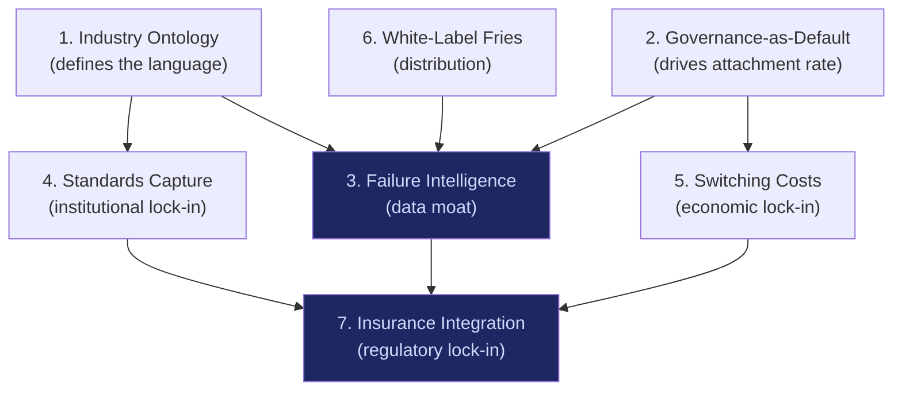

# Strategic Moat Recommendations

Seven strategic moat layers that compound over time. None of these moats work in isolation. The combined effect creates a position that cannot be replicated by a competitor with capital alone -- the moat requires time, data, and institutional relationships that cannot be purchased.

## Moat Summary

| # | Moat | Type | Time to Build | Defensibility |
|---|---|---|---|---|
| 1 | Own the Industry Ontology | Knowledge | 12-24 months | Very High |
| 2 | Governance-as-Default | Architectural | 6-12 months | High |
| 3 | Failure Intelligence Monopoly | Data | 18-36 months | Very High |
| 4 | Standards Capture | Institutional | 24-48 months | Very High |
| 5 | Switching Cost Engineering | Economic | 12-18 months | High |
| 6 | White-Label the Fries | Distribution | 6-12 months | Medium |
| 7 | Insurance Integration | Regulatory | 18-36 months | Very High |

## Moat Details

### 1. Own the Industry Ontology

**Moat type:** Knowledge

**Time to build:** 12-24 months

**What it means:** Define the taxonomy, terminology, and classification system that the industry uses to talk about AI governance. Whoever defines the language controls the conversation. If the marketplace's ontology becomes the standard vocabulary for describing AI governance categories, compliance requirements, failure modes, and risk classifications, every competitor must either adopt the marketplace's language (validating it) or create an alternative (fragmenting the market in a way that favors the incumbent standard).

**How to build it:**
1. Publish the ontology as an open specification (Creative Commons or similar)
2. Map all 713 marketplace offerings against the ontology
3. Ensure every marketplace tool, report, and API uses ontology terms consistently
4. Submit the ontology to ISO TC 42/SC 42 (AI) and IEEE SA as a candidate standard
5. Provide free ontology APIs that third parties can use, creating dependency

**Why it compounds:** Every organization that adopts the ontology's terminology increases the cost of switching to an alternative terminology. Industry reports, regulatory filings, insurance policies, and audit frameworks that reference the ontology cement it as the default.

**Why competitors cannot replicate:** An ontology requires deep domain expertise across 15 audience segments and 20+ NAICS sectors. The 535,856-line strategic documentation corpus represents the knowledge base from which the ontology is derived. A competitor would need to duplicate this knowledge base before competing on terminology.

**Current status:** The ontology exists implicitly in the catalog structure (713 offerings classified by audience, business process, business function, category). It needs to be extracted, formalized, and published as a standalone specification.

### 2. Governance-as-Default

**Moat type:** Architectural

**Time to build:** 6-12 months

**What it means:** Every AI model accessed through the marketplace includes governance as a default layer -- not optional, not add-on, not upsell. The architecture treats governance the same way HTTPS treats encryption: mandatory, invisible when working correctly, alarming when absent.

**How to build it:**
1. Bundle ETLB binding with every API call through the marketplace
2. Attach MCO expiry metadata to every model deployment
3. Include basic compliance logging with every transaction
4. Make the "ungoverned" option explicitly dangerous-feeling (warning screens, liability acknowledgments, insurance exclusions)

**Why it compounds:** As customers accumulate governance data (audit trails, compliance records, liability bindings), the cost of migrating to an ungoverned alternative increases. Switching from governed to ungoverned AI means losing all audit history and compliance evidence.

**Why competitors cannot replicate:** Governance-as-default requires architectural decisions made at the foundation layer. Bolting governance onto an existing API marketplace is orders of magnitude harder than building it in from the start. Competitors with existing ungoverned products face the backward compatibility problem.

**Relationship to economic model:** This is the mechanism that drives the >40% attachment rate required for margin viability. If governance is default, the attachment rate starts at 100% and decreases only through explicit opt-out (which most enterprises will not do because of regulatory and liability risk).

### 3. Failure Intelligence Monopoly

**Moat type:** Data

**Time to build:** 18-36 months

**What it means:** Build the largest database of anonymized AI failure patterns in the world. Every marketplace customer's AI deployment generates failure data (model errors, hallucinations, edge cases, compliance violations). This data, properly anonymized and aggregated, becomes the single most valuable asset in AI governance -- the equivalent of aviation's ASRS (Aviation Safety Reporting System).

**How to build it:**
1. Collect failure data from every marketplace deployment (with customer consent, anonymized)
2. Classify failures using the industry ontology (Moat 1)
3. Build pattern recognition across failure types, audiences, and deployment contexts
4. Sell failure intelligence back to customers as a premium service ("Fries")
5. Publish aggregate failure statistics to establish the marketplace as the authoritative source

**Why it compounds:** Every new failure data point makes the failure intelligence database more valuable. Organizations that contribute data get better failure predictions. Organizations that do not contribute are flying blind. This is a classic network effect: the database is worth more to each participant as more participants join.

**Why competitors cannot replicate:** Failure data is generated by deployed customers. A competitor with $50M but zero customers has zero failure data. The data moat requires time + customers, not just capital.

**This is the "Kitchen" in the Burger/Fries/Kitchen model.** The Kitchen cannot be bought, copied, or replicated. It compounds daily.

### 4. Standards Capture

**Moat type:** Institutional

**Time to build:** 24-48 months

**What it means:** Shape the formal standards (ISO, IEEE, NIST, national equivalents) that define AI governance requirements. If the marketplace's approach to ETLB, MCO, and ORF becomes the basis for formal standards, every competitor must either comply with the marketplace's framework or build a non-standard alternative.

**How to build it:**
1. Participate in ISO TC 42/SC 42 (AI), IEEE P2863 (Organizational Governance of AI), and NIST AI RMF
2. Submit ETLB, MCO, and ORF as proposed standards or inputs to standards development
3. Publish reference implementations that standards bodies can evaluate
4. Build relationships with standards bodies in Singapore (IMDA), EU (CEN/CENELEC), and GCC (national standards bodies)
5. Offer free standards-compliance checking tools that create marketplace lock-in

**Why it compounds:** Standards are extremely sticky. Once published, they influence regulation, procurement requirements, insurance underwriting criteria, and audit frameworks for 10-20 years. Standards written today will shape AI governance requirements through 2040.

**Why competitors cannot replicate:** Standards capture requires institutional relationships built over years. The marketplace's first-mover advantage in ETLB/MCO/ORF gives it a 2-3 year head start. Competitors arriving after standards are published must comply with the marketplace's framework rather than their own.

**Timeline risk:** Standards processes are slow (see [Bottleneck 6](/cross-audience/bottlenecks)). The marketplace must drive de facto standardization through market adoption while simultaneously pursuing de jure standardization through standards bodies.

### 5. Switching Cost Engineering

**Moat type:** Economic

**Time to build:** 12-18 months

**What it means:** Design the product so that switching away from the marketplace is expensive, time-consuming, and risky -- not through lock-in tricks, but through genuine value accumulation that would be lost on departure.

**Switching cost layers:**
1. **Audit trail history:** Years of ETLB binding records, compliance evidence, and governance logs. Moving to a new platform means starting the audit trail from zero.
2. **Failure intelligence access:** Customers who leave lose access to aggregated failure intelligence from all other customers. They keep their own data but lose the network.
3. **Compliance evidence:** Regulatory filings that reference the marketplace's governance framework must be re-filed under a new framework. Cost: $100K-$500K per jurisdiction.
4. **Integration cost:** Enterprise systems integrated with marketplace APIs must be re-integrated. Cost: $50K-$200K per integration.
5. **Training cost:** Staff trained on marketplace tools must be retrained. Cost: $10K-$50K per team.

**Why it compounds:** Each month of usage adds audit trail depth, failure intelligence, and compliance evidence that would be lost on departure. After 24 months of usage, switching cost exceeds annual subscription cost.

**Why competitors cannot replicate:** Switching costs are earned, not designed. They accumulate through genuine usage and cannot be front-loaded. A competitor offering free migration cannot replicate audit trail history.

### 6. White-Label the Fries

**Moat type:** Distribution

**Time to build:** 6-12 months

**What it means:** Sell governance tools to consulting firms and system integrators (Audience 12) as white-label products they rebrand and resell to their clients. The consulting firm's client thinks they are using a PwC governance tool. They are actually using the marketplace's governance infrastructure.

**How to build it:**
1. Package governance tools with customizable branding
2. Offer consulting firms margin on resale (30-50% channel margin)
3. Provide API-level integration so consulting firms embed governance in their existing platforms
4. Ensure failure intelligence flows back to the marketplace regardless of white-label branding

**Why it compounds:** Every white-label partner adds distribution without adding sales cost. Each partner's clients generate failure intelligence that enriches the database (Moat 3). The marketplace becomes infrastructure that powers multiple brands.

**Why competitors cannot replicate:** Consulting firms will not maintain two governance infrastructure providers. The first mover in white-label governance captures the channel. Switching costs (Moat 5) prevent channel partners from migrating after integration.

**Revenue impact:** Channel revenue through white-label can reach 30-40% of total revenue by Year 3. Each dollar of channel revenue costs ~$0.10 in support vs. ~$0.40 in direct sales cost.

### 7. Insurance Integration

**Moat type:** Regulatory

**Time to build:** 18-36 months

**What it means:** Partner with insurance underwriters to make marketplace governance a factor in AI liability insurance pricing. Organizations using the marketplace's governance tools pay lower insurance premiums. Organizations not using governance pay higher premiums or cannot get coverage.

**How to build it:**
1. Provide failure intelligence data (Moat 3) to insurance actuaries for AI risk pricing
2. Demonstrate that governed AI deployments have measurably lower failure rates
3. Partner with insurers to create "governed AI" insurance products
4. Work with reinsurers (Swiss Re, Munich Re) to establish AI governance as an underwriting criterion

**Why it compounds:** Once insurance pricing reflects governance usage, the economic incentive to use the marketplace becomes self-reinforcing. Organizations without governance face higher insurance costs, regulatory scrutiny, and liability exposure. The marketplace becomes a requirement, not a choice.

**Why competitors cannot replicate:** Insurance integration requires actuarial data (Moat 3), standards recognition (Moat 4), and institutional relationships with reinsurers. These prerequisites take 18-36 months to build. A competitor entering the market after insurance integration is established must replicate the entire chain.

**This is the ultimate moat.** When not using the marketplace costs more (via insurance premiums) than using it, the marketplace achieves regulatory-grade lock-in without regulatory mandate.

## Moat Dependency Chain

Moats 3 (Failure Intelligence) and 7 (Insurance Integration) are the terminal nodes -- the moats that all others feed into. Failure Intelligence is the data foundation. Insurance Integration is the business outcome. Everything else is a means to reach these two endpoints.

## Build Sequence

| Phase | Months | Moats to Build | Dependencies |
|---|---|---|---|
| 1 | 0-6 | Governance-as-Default (M2) | None -- architectural decision |
| 2 | 0-12 | Industry Ontology (M1) | Requires catalog formalization |
| 3 | 6-12 | White-Label Fries (M6) | Requires M2 (product to white-label) |
| 4 | 6-18 | Switching Cost Engineering (M5) | Requires M2 (usage to accumulate) |
| 5 | 12-24 | Failure Intelligence (M3) | Requires M2 + customers generating data |
| 6 | 12-36 | Standards Capture (M4) | Requires M1 (ontology to standardize) |
| 7 | 24-36 | Insurance Integration (M7) | Requires M3 + M4 (data + standards) |

The first 6 months are about M2 (governance-as-default) -- the architectural foundation that enables everything else. Do not attempt M7 (insurance integration) before M3 (failure intelligence) has 18+ months of data.

## Related

- [Failure Mode Analysis](/risk-governance/failure-modes)
- [Revenue Priority Stack](/risk-governance/revenue-priority)
- [Sensitivity Analysis](/risk-governance/sensitivity-analysis)
- [Economic Model -- Bundles](/economic-model/bundles)
- [Agent Recovery Prompt](/recovery)
