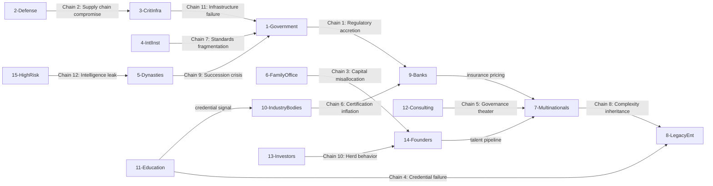

**[← Back to Sovereign Entropy Analysis](/sovereign-entropy-analysis)**

## Interdependency Risk Map

Entropy does not respect audience boundaries. Degradation in one audience propagates to others through structural, economic, regulatory, and informational channels. The following 12 interdependency chains represent the highest-consequence cross-audience entropy propagation paths.

### Primary Interdependency Chains

**Chain 1: Government Policy Decay --&gt; Bank Regulatory Exposure**
Government institutional memory decay (Entropy 1) causes contradictory regulations to accumulate (Entropy 7). Banks (Aud 9) must comply with contradictory mandates simultaneously, increasing compliance costs by 10-15% of revenue. When government regulators lose the institutional memory of why a regulation was created, they cannot modernize it -- they can only add new regulation on top.
- *Propagation time:* 2-5 years
- *Economic cost:* $270B+ annual compliance spending in banking globally

**Chain 2: Defense Security Compromise --&gt; Critical Infrastructure Vulnerability**
Defense (Aud 2) operates classified AI systems with 50-year-old legacy integration. A compromise of defense supply chain integrity (Personnel Security Continuous Eval failure) exposes dual-use critical infrastructure systems (Aud 3) -- power grids, telecommunications, water treatment -- that share technology lineage with defense platforms.
- *Propagation time:* Weeks to months
- *Economic cost:* Unbounded. A single SCADA compromise can disable regional infrastructure.

**Chain 3: Family Office Capital Misallocation --&gt; Startup Ecosystem Contraction**
Family offices (Aud 6) managing $6T+ in assets suffer from capital allocation speed bottleneck (Bottleneck 5) and value drift (Entropy 3) across generations. Second-generation principals without the founder's investment judgment misallocate to safe assets, reducing venture and growth-stage capital supply. This contracts the opportunity set for Founders/Operators (Aud 14) and degrades Investor/VC (Aud 13) deal flow.
- *Propagation time:* 1-3 years per generational transition
- *Economic cost:* $500B+ annual venture capital depends on HNWI/family office LP allocations

**Chain 4: Education Pipeline Failure --&gt; Enterprise Talent Shortage**
Education/R&amp;D institutions (Aud 11) suffer from credential inflation (Entropy 5) and truth rot (Entropy 6) in curricula. Graduates arrive at Legacy Enterprises (Aud 8) and Multinationals (Aud 7) with credentials that do not correspond to competence. This feeds the talent attrition spiral (Entropy 8) as enterprises cannot hire effectively, overload existing staff, and trigger departure cascades.
- *Propagation time:* 4-7 years (education cycle + early career)
- *Economic cost:* $5.5T global skills shortage (doc 43 estimate)

**Chain 5: Consulting Firm Governance Theater --&gt; Enterprise False Confidence**
Consulting/SIs (Aud 12) sell governance frameworks that are checkbox exercises -- audit-ready documentation with no operational enforcement. Enterprises (Aud 7, 8) believe they are governed when they are not. The gap between perceived governance and actual governance widens until a crisis exposes the theater.
- *Propagation time:* 18-36 months
- *Economic cost:* $10B+ in post-incident remediation when governance theater is exposed (Wirecard, FTX, SVB pattern)

**Chain 6: Industry Body Credential Inflation --&gt; Insurance Pricing Failure**
Industry bodies (Aud 10) create AI certifications to generate revenue. As certifications proliferate, they lose signaling value. Insurers (Aud 9) using certifications as underwriting inputs misjudge risk. Certified-but-incompetent AI deployments generate claims that exceed actuarial projections. Premium increases cascade to all enterprises.
- *Propagation time:* 3-5 years
- *Economic cost:* $10B+ in mispriced AI liability exposure

**Chain 7: International Institution Governance Failure --&gt; Sovereign Regulatory Fragmentation**
International institutions (Aud 4) failing to coordinate AI governance standards causes sovereign governments (Aud 1) to create incompatible national frameworks. Multinationals (Aud 7) operating across 40+ jurisdictions face compliance costs that exceed the value of AI deployment. The result: slower AI adoption in precisely the organizations where AI governance matters most.
- *Propagation time:* 3-7 years
- *Economic cost:* $50B+ in regulatory fragmentation overhead

**Chain 8: Multinational Complexity Creep --&gt; Legacy Enterprise Acquisition Poisoning**
Multinationals (Aud 7) accumulate dead complexity over decades. When they acquire Legacy Enterprises (Aud 8), the acquired entity inherits the multinational's technical debt, contradictory governance regimes, and shadow processes. Post-acquisition integration fails not because of cultural mismatch but because of entropy inheritance.
- *Propagation time:* 6-18 months post-acquisition
- *Economic cost:* 60-70% of M&amp;A value destruction attributable to integration failure

**Chain 9: Dynasty Succession Failure --&gt; National Economic Destabilization**
In economies where dynastic families (Aud 5) control 20-40% of GDP (common in GCC, Southeast Asia, parts of Latin America), a succession crisis in one family propagates through supply chains, employment, and financial systems. Government (Aud 1) fiscal revenue contracts. Banks (Aud 9) holding dynasty-linked credit face concentration risk.
- *Propagation time:* Months (crisis), years (structural)
- *Economic cost:* 5-15% of national GDP in dynasty-dependent economies

**Chain 10: Investor Herd Behavior --&gt; Founder Ecosystem Collapse**
Investors/VCs (Aud 13) suffering from data gravity decay (Entropy 9) -- making decisions on stale market intelligence -- allocate capital to overfunded categories. When the correction arrives, Founders/Operators (Aud 14) in underfunded categories cannot raise. The downstream effect: Legacy Enterprises (Aud 8) that depend on startup innovation for vendor ecosystem health face supply contraction.
- *Propagation time:* 6-18 months (market cycle)
- *Economic cost:* $200B+ wiped in each VC correction cycle

**Chain 11: Critical Infrastructure Failure --&gt; Government Legitimacy Crisis**
When critical infrastructure (Aud 3) -- power grids, water systems, transportation networks -- fails due to complexity creep in legacy control systems, the immediate political consequence falls on Government (Aud 1). Government legitimacy erodes, reducing its capacity to enforce governance on all other audiences. This is the entropy doom loop: infrastructure entropy undermines the sovereign capacity needed to fight entropy.
- *Propagation time:* Immediate (crisis), years (legitimacy erosion)
- *Economic cost:* Incalculable. State failure is the terminal condition.

**Chain 12: High-Risk Individual Compromise --&gt; Cross-Audience Intelligence Leak**
High-Risk Individuals (Aud 15) -- heads of state, billionaires, dissidents -- sit at the intersection of multiple audiences. A personal cybersecurity breach exposes government intelligence (Aud 1/2), corporate strategy (Aud 7), family office holdings (Aud 6), and dynastic succession plans (Aud 5) simultaneously. One person's entropy becomes multi-audience crisis.
- *Propagation time:* Hours to days
- *Economic cost:* $1B+ per high-profile breach (including geopolitical consequences)

### Interdependency Summary

**Key structural finding:** Government (Aud 1) is the entropy sink. Chains 1, 7, 9, and 11 all terminate at government. Government is both the most entropy-affected audience and the audience with the longest deployment cycle. This is the central paradox of the AINEFF deployment strategy: the audience that needs entropy stabilization most urgently is the audience where deployment takes 12-36 months.
