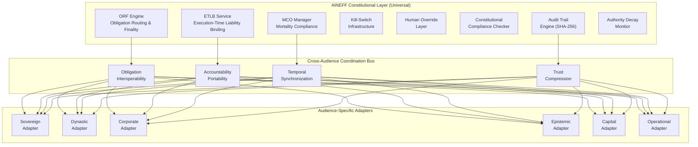

**[← Back to Sovereign Entropy Analysis](/sovereign-entropy-analysis)**

## Shared Entropy Patterns

### Entropy Dimension Universality

Of the 7 entropy dimensions, analysis across all 15 audiences reveals the following universality distribution:

| Entropy Dimension | Audiences Affected | Universality | Dominant Manifestation |
|---|---|---|---|
| **Information** | 15/15 | Universal | Truth rot, institutional memory decay, data gravity decay |
| **Governance** | 15/15 | Universal | Governance fatigue, authority diffusion, shadow processes |
| **Operations** | 14/15 | Near-universal | Complexity creep, process ossification, technical debt |
| **Culture** | 12/15 | Widespread | Value drift, cultural entropy, founder dependency |
| **Strategy** | 11/15 | Widespread | Strategic incoherence, planning horizon collapse, mission drift |
| **Capital** | 10/15 | Common | Misallocation, return degradation, subsidy dependency |
| **Incentives** | 9/15 | Selective | Principal-agent misalignment, credential inflation, regulatory arbitrage |

**Finding: Information and Governance entropy are universally present and universally underestimated.** Every audience, from a sovereign government to a solo founder, suffers from knowledge decay and governance fatigue. These two dimensions are the foundation of the AINEFF value proposition.

### Structural Causes Shared Across Audiences

**Cause 1: Temporal Disconnect Between Decision and Consequence**

Every audience makes decisions whose consequences manifest months to decades later. Governments legislate today for outcomes visible in 5-20 years. Banks underwrite risk on 30-year horizons. Dynasties make succession plans for generational transitions. The gap between decision and feedback creates a blind zone where entropy accumulates undetected.

AINEFF countermeasure: MCO enforces temporal boundaries on authority grants. ETLB creates immutable records linking decisions to outcomes across time. ORF tracks obligations from creation to finality. Together, they close the temporal gap.

**Cause 2: Accountability Diffusion at Scale**

As organizations grow, the chain from decision to consequence passes through more intermediaries. Each intermediary has partial information, partial authority, and partial accountability. At scale, no single person can trace an outcome back to the decision that caused it. This is true for a multinational with 100,000 employees and a government with 2 million civil servants alike.

AINEFF countermeasure: ETLB requires exactly one natural person bound at execution time. No anonymity, no committee shields, no "the algorithm decided."

**Cause 3: Governance Treated as Cost, Not Infrastructure**

Every audience -- without exception -- treats governance as overhead to be minimized. This structural mental model is the root cause of shadow processes (Entropy 2), regulatory arbitrage (Entropy 7), and complexity creep (Entropy 4). Organizations that minimize governance spend are optimizing for today at the cost of tomorrow.

AINEFF countermeasure: Governance-as-default architecture. Every Burger includes Fries. Ungoverned AI feels dangerous. The marketplace makes governance invisible when working, alarming when absent.

**Cause 4: Knowledge Half-Life Shorter Than Institutional Memory Cycle**

Technology knowledge decays in 2-3 years. Regulatory knowledge decays in 5-7 years. But institutional memory cycles (leadership turnover, audit cycles, strategic planning horizons) operate on 3-10 year timescales. The result: organizations act on expired knowledge because their review mechanisms are slower than their knowledge decay rate.

AINEFF countermeasure: MCO enforces knowledge expiry. Enterprise Knowledge Graph timestamps knowledge with confidence decay. Regulatory Change Tracker detects when knowledge becomes stale.

### Patterns Unique to Specific Power Classes

| Power Class | Audiences | Unique Entropy Pattern | Why It Is Unique |
|---|---|---|---|
| **Sovereign** | 1, 2, 3, 4 | Regulatory accretion without repeal | Only sovereigns create law; laws never expire without legislative action |
| **Dynastic** | 5, 6, 15 | Value drift across generations | Only multi-generational entities face the problem of transmitting values across 50+ year horizons |
| **Corporate** | 7, 8, 9 | Complexity creep + talent attrition spiral | Only scale organizations accumulate dead complexity while simultaneously losing the people who understand it |
| **Epistemic** | 10, 11, 12 | Credential inflation → signal collapse | Only knowledge-economy entities face the paradox of more credentials producing less signal |
| **Capital** | 6, 9, 13 | Capital allocation speed vs. governance friction | Only capital allocators face the structural conflict between due diligence and opportunity capture |
| **Operational** | 14 | Founder = single point of all entropy | Only single-operator entities face the condition where every entropy dimension collapses into one person |

---

## Unified AINEFF Sovereign Layer

### Shared Components (Mandatory Across All 15 Audiences)

These AINEFF components must be present in every deployment regardless of audience. They constitute the **constitutional minimum** -- the governance floor below which no deployment may operate.

| Component | Function | Why Universal |
|---|---|---|
| **ORF Obligation Engine** | Creates, tracks, and finalizes obligations | Every audience creates obligations through AI actions |
| **ETLB Binding Service** | Binds one natural person at execution time | Accountability is non-negotiable across all power classes |
| **MCO Lifecycle Manager** | Enforces AI system mortality and renewal | No audience is exempt from temporal limits on AI authority |
| **Kill-Switch Infrastructure** | Hard/soft/cascade/scheduled termination | Every deployment must have a guaranteed halt mechanism |
| **Human Override Layer** | Single-action, process, system, and emergency override | Humans must always be able to intervene |
| **Constitutional Compliance Checker** | Continuous validation against AINEFF constraints | Drift detection is required before drift becomes crisis |
| **Audit Trail Engine** | SHA-256 chained, immutable event log | Court-grade evidence generation is non-negotiable for institutional buyers |
| **Authority Decay Monitor** | Tracks and enforces declining authority over time | Prevents stale authority grants from persisting |

### Audience-Specific Components

| Audience Cluster | Specific Components | Rationale |
|---|---|---|
| **Sovereign (1, 2, 3, 4)** | National Data Sovereignty Vault, Inter-Ministry Coordination, Legislative Language Harmonizer, Procurement Intelligence | Data localization mandates, cross-ministry silos, multi-jurisdictional law |
| **Dynastic (5, 6, 15)** | Dynasty Knowledge Vault, Family Governance Facilitator, Succession Intelligence, Reputation Risk Sentinel | Multi-generational value transmission, ultra-privacy requirements, personal threat models |
| **Corporate (7, 8, 9)** | Billing Leakage Detector, Claims Processing Accelerator, Board Decision Intelligence, Process Mining Engine | ROI-driven adoption, operational pain points, board-level governance requirements |
| **Epistemic (10, 11, 12)** | Standards Compiler, Skill Valuation Engine, White-Label Governance SDK, LevelUpMax Integration | Credential systems, knowledge distribution, channel partner enablement |
| **Capital (6, 9, 13)** | Alternative Investment Analyzer, Enterprise Mortality Tables, Co-Investment Network, Liquidity Predictor | Capital allocation speed, risk pricing, portfolio-level governance |
| **Operational (14)** | AI Cost Optimization Engine, Operational Dashboard, Self-Serve Governance Wrapper | Low-touch, high-automation, price-sensitive, speed-of-deployment critical |

### Protocol Stack Cross-Audience Coherence

The ORF/ETLB/MCO protocol stack creates cross-audience coherence through three interlocking mechanisms:

**Mechanism 1: Obligation Interoperability**
When a government ministry (Aud 1) contracts with a consulting firm (Aud 12) deploying AI on behalf of a bank (Aud 9), ORF routes obligations to the correct entity under the correct jurisdiction. The obligation chain is: government creates mandate --&gt; consultant creates deployment obligation --&gt; bank creates operational obligation --&gt; AI action creates accountability obligation. Each link is ORF-tracked, ETLB-bound, and MCO-constrained. No obligation floats.

**Mechanism 2: Accountability Portability**
ETLB bindings are verifiable across audiences. A person bound as the liability bearer for a defense AI deployment (Aud 2) carries the same cryptographic accountability credential when that same AI system is adapted for critical infrastructure (Aud 3). Trust does not reset at audience boundaries.

**Mechanism 3: Temporal Synchronization**
MCO enforces the same mortality discipline across all audiences. A 12-month MCO on a government AI system (Aud 1) and a 12-month MCO on a banking AI system (Aud 9) expire with the same mechanical enforcement. No audience gets exemptions. No political override of temporal limits.

### Unified Layer Architecture

The architecture has three layers:
1. **Constitutional Layer** (8 universal components): Immutable. No audience-specific modification. This is the ORF kernel -- the floor below which no deployment may operate.
2. **Cross-Audience Coordination Bus** (4 interoperability mechanisms): Enables cross-audience obligation routing, accountability transfer, temporal enforcement, and trust compression.
3. **Audience-Specific Adapters** (6 cluster adapters): Translate universal protocols into audience-specific implementations. The Sovereign Adapter handles data localization and procurement cycles. The Corporate Adapter handles ROI-driven adoption and board governance. Each adapter extends but cannot override the Constitutional Layer.

---

## Batch Synthesis: Sovereign Power Class (Audiences 1-5)

### Common Entropy Signature

All five audiences share a structural property that distinguishes them from the remaining 10 marketplace audiences: their failures are not correctable through market mechanisms. When a government fails, citizens cannot "switch providers." When defense fails, there is no competitor offering alternative national security. When critical infrastructure fails, there is no market substitute for electricity or water. When international institutions fail, there is no alternative global governance framework. When a dynasty fails, centuries of accumulated capital, relationships, and institutional memory are destroyed irreversibly.

This irreversibility is precisely why the AINEFF protocol architecture -- with its core axiom that no irreversible action proceeds without a bound human liability bearer -- is not merely useful for these audiences. It is existentially necessary.

### Protocol Fit Summary (Audiences 1-5)

| Protocol | Sovereign Power Class Application |
|---|---|
| **ORF** | Tracks obligations across multi-decade timescales (weapon systems, infrastructure lifecycles, treaty implementations, dynastic succession). No other institutional technology enforces obligation finality across political transitions, generational changes, and organizational restructuring. |
| **ETLB** | Binds human accountability in domains where accountability diffusion is the primary failure mode: government bureaucracies, defense acquisition chains, infrastructure operational decisions, international institutional committees, and advisory-captured dynasties. The cryptographic binding at execution time is the only mechanism that creates court-grade accountability in systems designed to diffuse it. |
| **MCO** | Enforces temporal governance in domains where entropy accumulates silently: stale intelligence assessments, outdated infrastructure design parameters, unreviewed international agreements, and perpetual advisory mandates. MCO prevents the universal failure mode of all five audiences: systems that persist past their validity because no mechanism exists to challenge their continued operation. |

### Revenue Architecture (Audiences 1-5)

| Audience | Entry Product | Revenue/Customer/Year | Sales Cycle | Deployment Complexity |
|---|---|---|---|---|
| 1. Governments | AI Deployment Authorization System + Constitutional Compliance Checker | $1,000K-$5,000K | 12-36 months | 9/10 |
| 2. Defense | Supply Chain Integrity Verifier + Autonomous System Kill-Chain Auditor | $500K-$2,000K | 18-48 months | 10/10 |
| 3. Critical Infrastructure | SCADA/ICS Security Monitor + Grid Stability Predictor | $300K-$1,000K | 12-24 months | 8/10 |
| 4. International Institutions | SDG Progress Tracker + Treaty Compliance Monitor | $200K-$500K | 12-36 months | 9/10 |
| 5. Dynasties | Dynasty Knowledge Vault + Succession Intelligence Platform | $500K-$2,000K | 6-18 months | 8/10 |

**Sequencing Recommendation:** Dynasties first (shortest sales cycle, highest per-customer value, lowest procurement friction), then Critical Infrastructure (regulatory tailwind from CISA mandates), then Governments (largest revenue but longest cycle). Defense and International Institutions are Year 2-3 plays requiring clearances and institutional partnerships respectively.

**Critical Mass Requirement:** At $48K/customer/year unit economics (Sovereign Intent Fabric), these five audiences require 10-25 enterprise customers at the high end of the pricing band to sustain operations. The 40% Fries attachment rate is survival threshold: below that, Burger-layer pricing cannot sustain the business.

---

## Batch Synthesis: Structural Patterns (Audiences 6-10)

### Shared Entropy Vectors (Audiences 6-10)

| Pattern | Aud 6 | Aud 7 | Aud 8 | Aud 9 | Aud 10 |
|---------|-------|-------|-------|-------|--------|
| **Legacy system technical debt** | Fragmented reporting across 50+ entities | 47 approval layers; siloed ERPs | COBOL mainframes from 1987 | 40-year-old core banking/insurance systems | 5-10 year standards development cycles |
| **Tribal knowledge concentration** | Principal/founder as single knowledge point | 40% institutional knowledge in under 5% of employees | 40% workforce retiring in 10 years | Actuarial expertise concentrated in aging workforce | Board knowledge resets every 2-year rotation |
| **Incentive misalignment** | Advisors optimize fees, not outcomes | Executives optimize stock price, not operations | Managers optimize throughput, not TCO | Compliance officers punished for both "yes" and "no" | Body cannot advocate innovation that threatens members |
| **Information asymmetry** | Advisors control information flow to principals | Management controls information flow to board | Documented processes diverge 60% from reality | Models explain past, fail to predict future | 20% survey response rate produces unreliable data |
| **Governance fatigue** | Informal authority; no documented decision rights | Accountability diffused across matrix | ISO/FDA/EPA compliance consuming bandwidth | 2,000+ regulatory changes/year | Consensus paralysis from 25-person boards |

### AINEFF Protocol Coverage Matrix (Audiences 6-10)

| Protocol | Aud 6 Application | Aud 7 Application | Aud 8 Application | Aud 9 Application | Aud 10 Application |
|----------|-------------------|-------------------|-------------------|-------------------|-------------------|
| **ORF** | Investment Policy Statement enforcement | Corporate authority matrix encoding | Maintenance deferral obligation recording | Risk appetite framework enforcement | Standards publication evidence requirements |
| **ETLB** | Principal/CIO bound at trade execution | Named executive bound at AI action execution | Named human bound at safety/quality override | Named human bound at credit/underwriting/trading decision | Executive Director bound at advocacy/publication |
| **MCO** | 24-month advisor delegation expiry | 36-month AI system deployment expiry | 6-month temporary workaround expiry | 24-month risk model revalidation | 36-month standards expiry; 12-month policy position expiry |
| **E-AEGL** | Fee anomaly escalation; succession readiness alerts | Billing leakage escalation; regulatory change alerts | Equipment degradation escalation; safety threshold alerts | Fraud/AML escalation; capital adequacy alerts | Member engagement decline alerts; standards stall escalation |

### Deployment Priority Sequence (Audiences 6-10)

| Priority | Action | Audiences | Timeline | Revenue Impact |
|----------|--------|-----------|----------|----------------|
| 1 | **Billing Leakage Detector + Claims Processing Accelerator** | 7, 8, 9 | 0-30 days | $15K-$75K per engagement (PIAR model) |
| 2 | **Consolidated Reporting Platform + Alternative Investment Analyzer** | 6 | 30-60 days | $12K-$50K/month per family office |
| 3 | **AML/KYC Automation + Fraud Detection** | 9 | 30-90 days | $100K-$500K per institution annually |
| 4 | **Predictive Maintenance + Tribal Knowledge Extractor** | 8 | 60-90 days | $50K-$200K per plant annually |
| 5 | **Industry Benchmarking Engine + Regulatory Impact Modeler** | 10 | 60-120 days | $25K-$100K per industry body annually |
| 6 | **Enhancement Layer (full 10 superclasses)** | All | 90-180 days | Platform fee per orchestrated call |
| 7 | **ORF/ETLB/MCO protocol implementation** | All | 180-365 days | Governance-as-a-Service subscription |

### Terminal Assessment (Audiences 6-10)

The five audiences analyzed here represent the core of the Burger/Fries/Kitchen economic model's target market. Family Offices (Aud 6) and Banks/Insurers (Aud 9) provide the highest ARPA ($144K-$600K/year). Multinational Corporate Empires (Aud 7) and Legacy Enterprises (Aud 8) provide volume scale. National Industry Bodies (Aud 10) provide network effects that amplify adoption across entire sectors.

The critical structural insight: **every audience's entropy vectors converge on the same three protocol gaps that AINEFF fills**:

1. **No mechanism to bind a human to an AI action at execution time (ETLB)** -- every audience suffers from accountability diffusion that ETLB structurally eliminates.
2. **No enforced expiry for AI systems or delegated authority (MCO)** -- every audience accumulates zombie systems, stale models, and outdated standards that MCO structurally kills.
3. **No finality mechanism for obligations and decision rights (ORF)** -- every audience operates with informal, undocumented authority structures that ORF structurally encodes.

The marketplace is not selling AI tools. It is selling the right to deploy AI without losing control, trust, or legal survivability. The "fries" (governance at 70-95% margin) are the business. The "burger" (cheap AI access) is the hook. The "kitchen" (telemetry, failure library, industry ontology) is the moat that compounds daily and cannot be replicated without equivalent production deployment.

Below 40% attachment rate, the marketplace dies. Above 60%, it becomes infrastructure.

---

## Batch Synthesis: Structural Patterns (Audiences 11-15)

### Shared Entropy Vectors (Audiences 11-15)

| Pattern | Audiences Affected | AINEFF Response |
|---|---|---|
| **Information asymmetry is the primary attack vector** | All 5 | ETLB eliminates anonymous decisions. ORF creates auditable obligation chains. E-AEGL enforces access controls with sub-10ms policy enforcement. |
| **Advisor/consultant/expert fragmentation** | 11, 12, 13, 15 | ORF-tracked obligations across advisory relationships. No advisor operates without defined scope, accountability, and expiry. |
| **Incentive misalignment between principal and agent** | 11 (grant), 12 (billable hour), 13 (2/20), 14 (sunk cost), 15 (advisor conflicts) | ORF redefines success as obligation fulfillment, not activity volume. ETLB binds individuals to outcomes, not processes. |
| **Single-point-of-failure concentration** | 14 (founder), 15 (individual), 11 (grant source), 13 (GP) | MCO enforces review/expiry cycles. No authority persists unchecked. No system runs without re-authorization. |
| **Knowledge decay without enforced refresh** | 11 (curriculum), 12 (deliverable), 13 (due diligence), 14 (strategy), 15 (security posture) | MCO applies temporal limits to all knowledge artifacts. Expired knowledge loses authority automatically. |

### Protocol Deployment Priority (Audiences 11-15)

| Audience | First Protocol | Rationale |
|---|---|---|
| 11 (Education) | MCO | Curriculum and research tool expiry is the highest-leverage intervention. Kills zombie courses, expired methods, and unmaintained AI systems. |
| 12 (Consulting) | ORF | Engagement obligation tracking is the core problem. Scope creep, deliverable ambiguity, and responsibility allocation all resolve through ORF. |
| 13 (Investors) | ETLB | Investment decision accountability is the highest-leverage intervention. Binding GPs to decisions creates the feedback loop that improves selection quality. |
| 14 (Founders) | ORF | Self-imposed obligation tracking is the only mechanism that converts architectural vision into revenue-generating execution. The founder needs ORF applied to themselves before applying it to customers. |
| 15 (High-Risk) | ETLB | Advisor accountability is the highest-leverage intervention. Every advisor recommendation bound to a name, a timestamp, and a scope creates the trust verification layer that currently does not exist. |

### Revenue Extraction Sequence (Audiences 11-15)

| Priority | Audience | Product | Price Range | Timeline |
|---|---|---|---|---|
| 1 | 15 (High-Risk) | Personal Risk Architecture Assessment (PIAR variant) | $25K-$75K per engagement | 0-30 days |
| 2 | 12 (Consulting) | Engagement Obligation Tracking (ORF-powered) | $5K-$15K/month SaaS | 30-60 days |
| 3 | 14 (Founders) | Founder Operating System (AINEFF-lite) | $500-$2K/month SaaS | 30-60 days |
| 4 | 13 (Investors) | Portfolio Health Monitor (automated DD feeds) | $10K-$30K/quarter per fund | 60-90 days |
| 5 | 11 (Education) | Accreditation Compliance Automator | $20K-$80K/year per institution | 90-180 days |

### Existential Constraint

AINEFF must survive its own creator being a single point of failure (Audience 14 analysis). Until this constraint is resolved -- through revenue generation enabling hiring, or through external advisors creating governance, or through AI-agent delegation of non-judgment tasks -- every other deployment analysis in this document describes a system that could be killed by one person's health, motivation, or judgment failure.

The sequence is:
1. Revenue (PIAR within 30 days)
2. Advisor (1-2 unpaid circuit breakers within 60 days)
3. Delegation (first hire or contractor within 90 days of revenue)
4. Governance (formal board/advisory structure within 12 months)

Without this sequence, the ecosystem remains a documentation set describing infrastructure that does not exist in operational form.
