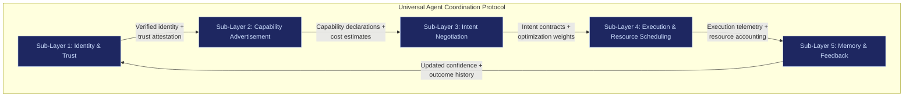
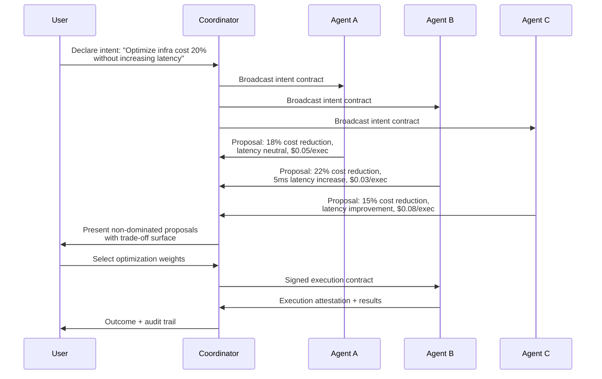

# Agent Coordination Protocol

Right now, AI agents are framework-bound, vendor-locked, cloud-coupled, API-fragmented, and identity-ambiguous. There is no universal way for agents to announce capabilities, request resources, negotiate execution, prove identity, transfer memory, delegate tasks, or audit outcomes. Everything is custom glue. That is the silo problem repeating itself at the agent layer.

The **Universal Agent Coordination Protocol** defines the grammar of agent civilization. Get the grammar right, and engines, runtimes, clouds, and devices can compete freely underneath. Get it wrong, and you create another silo wearing a revolutionary costume.

---

## Why a Protocol, Not a Product

Protocols outlive products. Apps die. Companies pivot. Cloud vendors merge. Protocols persist.

- HTTP survived browser wars.
- TCP/IP survived operating system wars.
- SMTP survived email client wars.

A product captures a market. A protocol captures an ecosystem. SIF needs the latter because the goal is interoperability across edge devices, cloud overflow, enterprise runtimes, and third-party vendors — not a proprietary platform.

---

## The 5 Sub-Layers



---

### Sub-Layer 1: Identity & Trust

**Purpose**: Every agent must have verifiable identity with cryptographic proof. Not just API keys.

| Component | Detail |
|---|---|
| **Verifiable identity** | Machine identity with hardware-rooted cryptographic attestation |
| **Capability declaration** | Structured metadata of what the agent can perform |
| **Trust attestation** | Chain of trust from device hardware through runtime to agent instance |
| **Permission scope** | Cryptographically bound constraints on what the agent is authorized to access |

**Design rules**:
- Identity is hardware-rooted (TPM 2.0 or equivalent secure enclave).
- No centralized identity authority. Decentralized attestation via device-bound keys.
- Trust is verifiable by any counterparty without requiring a central server.
- Identity keys are never uploaded, never backed up in plaintext, never stored on third-party infrastructure.

---

### Sub-Layer 2: Capability Advertisement

**Purpose**: Agents must expose what they can do, what resources they need, what they cost, and how fast they perform. This creates a protocol-native capability marketplace.

| Component | Detail |
|---|---|
| **Capability schema** | Standardized metadata format: "I can perform X, Y, Z" |
| **Resource requirements** | CPU/GPU/NPU cores, RAM, storage, network, estimated duration |
| **Cost estimates** | Per-execution pricing or resource-based billing |
| **Latency expectations** | Expected time-to-completion under normal and degraded conditions |
| **Performance history** | Historical success rate, average execution time, failure modes |

**Example capability advertisement**:

```
Agent: legal-doc-summarizer-v3
Capabilities: [document_summarization, clause_extraction, risk_flagging]
Resources: {RAM: 6GB, NPU: 2 cores, Duration: 30s per document}
Cost: $0.02 per document
Latency: p50=12s, p95=28s
Trust: {TPM_attestation: verified, Runtime: ESR_v2.1, Audit_trail: enabled}
```

---

### Sub-Layer 3: Intent Negotiation

**Purpose**: Replace static API calls with intent contracts. Instead of "call this endpoint with these parameters," the protocol negotiates: "here is what I want to achieve — who can do it, under what constraints, at what cost?"

| Component | Detail |
|---|---|
| **Intent contract** | Structured negotiation format: goal + constraints + optimization weights |
| **Proposal exchange** | Agents respond to intent broadcast with proposals (cost, time, trade-offs) |
| **Trade-off evaluation** | System evaluates proposals against user optimization weights |
| **Contract signing** | Cryptographic commitment to execution terms |

**Protocol flow**:



**Key principle**: The system never decides for the user. It presents trade-offs. The user selects optimization weights. Agency is preserved.

---

### Sub-Layer 4: Execution & Resource Scheduling

**Purpose**: Separate intent logic from compute location. The protocol defines what needs to happen; the runtime decides where and how.

| Component | Detail |
|---|---|
| **Execution descriptor** | Resource requirements + environment abstraction (edge, hybrid, cloud) |
| **Location abstraction** | Agent says "I need 6GB RAM, 2 NPU cores, 30 seconds" — runtime decides local vs. cloud |
| **Scoped contracts** | Agents operate under cryptographic capability boundaries (SACS) |
| **Isolation** | Container-level or enclave-level execution isolation |
| **Rollback capability** | Every execution is reversible by default |

**Agent execution constraints (from SACS)**:
- Cannot expand its own scope
- Cannot persist beyond defined execution window
- Cannot access adjacent datasets unless explicitly granted
- Cannot call other agents outside declared dependency graph
- No recursive authority expansion — prevents "silent leverage escalation"

**Edge-first scheduling**:

| Priority | Compute location | When used |
|---|---|---|
| 1 | Local device (edge) | Sufficient resources available, latency-sensitive, privacy-critical |
| 2 | Hybrid (edge + cloud) | Partial local execution, cloud for overflow compute |
| 3 | Cloud | Resource requirements exceed edge capacity, non-sensitive workload |

---

### Sub-Layer 5: Memory & Feedback

**Purpose**: Agents log decisions, share outcome telemetry, update capability confidence, and learn longitudinally — without centralizing everything.

| Component | Detail |
|---|---|
| **Decision logs** | Cryptographically signed execution records |
| **Outcome telemetry** | Cost delta, performance delta, error rate, compliance friction |
| **Capability confidence update** | Agent success rate adjusted based on real execution outcomes |
| **Longitudinal learning** | Cross-execution pattern recognition (not session-based) |
| **Feedback envelope** | Verifiable outcome reporting format — the fifth protocol primitive |

**What gets reported**:

| Signal | Purpose |
|---|---|
| Execution success/failure | Binary outcome + failure classification |
| Resource consumption | Actual vs. estimated (RAM, compute, time) |
| Cost accuracy | Actual cost vs. quoted cost |
| Latency accuracy | Actual latency vs. p50/p95 estimates |
| Constraint compliance | Were all SACS constraints honored? |
| Side effects | Any unexpected state changes or dependency triggers |

---

## Protocol Primitives Summary

The entire protocol reduces to 5 primitives. Not 200 pages of complexity. The simpler the protocol, the faster ecosystems adopt it.

| # | Primitive | Format |
|---|---|---|
| 1 | Identity & Trust | Cryptographic identity + attestation chain |
| 2 | Capability Schema | Standardized capability metadata |
| 3 | Intent Contract | Structured negotiation format |
| 4 | Execution Descriptor | Resource + environment abstraction |
| 5 | Feedback Envelope | Verifiable outcome reporting |

---

## Integration with FrankMax Protocols

The Universal Agent Coordination Protocol does not replace the existing FrankMax protocols. It extends them into the agent coordination layer.

### ORF (Obligation & Responsibility Finality)

| Integration point | How it works |
|---|---|
| **Sub-Layer 3: Intent Negotiation** | Intent contracts carry ORF obligation stamps — each party's obligations are finalized at contract signing |
| **Sub-Layer 4: Execution** | Execution attestations reference the ORF obligation that authorized them |
| **Sub-Layer 5: Feedback** | Outcome reports include obligation fulfillment status |

### ETLB (Execution-Time Liability Binding)

| Integration point | How it works |
|---|---|
| **Sub-Layer 4: Execution** | Liability is bound at execution time, not at contract negotiation — actual resource consumption and execution context determine liability scope |
| **Sub-Layer 5: Feedback** | Liability assessment uses actual telemetry, not estimates |

### MCO (Mortality Compliance Object)

| Integration point | How it works |
|---|---|
| **Sub-Layer 1: Identity** | Agent identities carry mortality compliance metadata — what happens to this agent's state, permissions, and data when the authorizing identity ceases |
| **Sub-Layer 5: Feedback** | Every execution outcome carries a mortality-aware compliance envelope — audit trail persists beyond agent lifecycle |

---

## Protocol Adoption Path

The protocol does not launch as ideology. It emerges from installed base.

| Phase | What happens | Timeframe |
|---|---|---|
| **Internal standard** | Protocol primitives extracted from repeated deployment patterns | Year 1-2 |
| **SDK release** | Execution contract format published as integration point | Year 2-3 |
| **Third-party integration** | Vendors build against the standard for interoperability | Year 2-3 |
| **Formal specification** | Published protocol spec with versioning | Year 3-4 |
| **Certification program** | Third-party runtime implementations certified | Year 3-4 |
| **Network effect** | Protocol becomes de facto standard through installed base gravity | Year 4+ |

**Critical principle**: Protocols without installed base are noise. Infrastructure companies can become protocols. Protocols rarely bootstrap themselves. TCP/IP succeeded because machines needed to talk — not because someone declared it philosophical.
