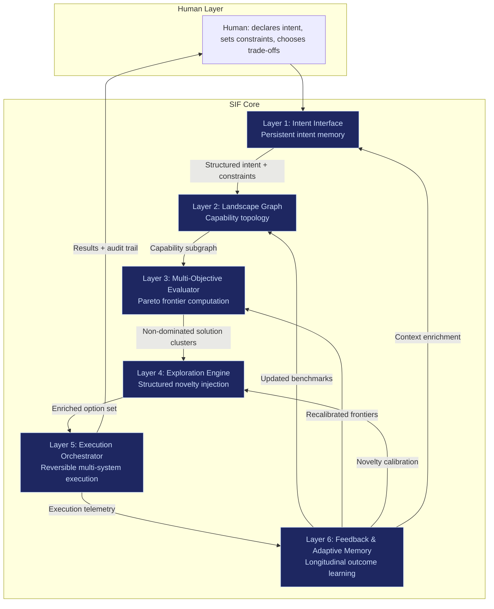

# 6-Layer Architecture

The Sovereign Intent Fabric is structured as a closed-loop system with six distinct layers. Each layer has a defined purpose, specific inputs and outputs, and operates under constraint by design. The loop runs continuously: feedback from execution updates the landscape graph, recalibrates evaluation frontiers, adjusts exploration budgets, and refines intent understanding over time.

This is not a request-response pipeline. It is a **cybernetic feedback system** — measure, compare, correct, learn.

---

## Architecture Overview

---

## Layer 1: Intent Interface

**Purpose**: Capture human intent as structured outcomes, not keywords. Maintain persistent context memory across sessions and time.

| Attribute | Detail |
|---|---|
| **Input** | Natural language intent declarations, constraints, value preferences, time horizons |
| **Output** | Structured intent object: goal + constraints + optimization weights + risk tolerance |
| **Key components** | Intent parser, context memory store, longitudinal goal tracker, constraint clarifier |
| **What it replaces** | Search queries, keyword input, manual tool selection |

**Design principles**:
- Humans declare outcomes: "Reduce infra cost 22% without increasing latency."
- System stores context across time — not session-based, but longitudinal.
- Intent discovery layer helps clarify latent goals through reflective prompts and behavioral pattern surfacing.
- The interface must accept vague impulses and progressively sharpen them without manipulation.

**Constraint**: The system reveals latent intent; it never decides intent for the user. That boundary separates reflection from manipulation.

---

## Layer 2: Landscape Graph

**Purpose**: Maintain a continuously updating capability topology of the solution space. Replace ranked lists with multidimensional maps.

| Attribute | Detail |
|---|---|
| **Input** | Structured intent object from Layer 1, real-time crawl data, benchmark results, user feedback |
| **Output** | Filtered capability subgraph relevant to the current intent |
| **Key components** | Node registry (tools, vendors, APIs, models, jurisdictions, policies), edge computation (compatibility, cost, performance, compliance), continuous benchmarking engine |
| **What it replaces** | Search engine indexes, static comparison sites, marketplace listings |

**Graph structure**:
- **Nodes**: Tools, vendors, APIs, AI models, jurisdictions, policies, research, workflows
- **Edges**: Compatibility relationships, cost relationships, performance benchmarks, compliance constraints, dependency chains

**Update mechanisms**:
- Automated crawling of provider ecosystems
- Sandbox benchmarking of candidate tools
- User feedback and outcome telemetry from Layer 6
- Performance regression detection

**Constraint**: The graph is not ranked. No single authority scores globally. Nodes advertise capabilities; coordinators filter. Users set optimization weights.

---

## Layer 3: Multi-Objective Evaluator

**Purpose**: Compute Pareto frontiers across multiple optimization dimensions. Present non-dominated solution clusters, not a single "best."

| Attribute | Detail |
|---|---|
| **Input** | Capability subgraph from Layer 2, user optimization weights from Layer 1 |
| **Output** | Set of non-dominated strategy clusters with explicit trade-off surfaces |
| **Key components** | Multi-objective optimizer, Pareto frontier calculator, trade-off visualizer, dominated strategy eliminator |
| **What it replaces** | "Top 10" ranked lists, single-score comparisons |

**Evaluation dimensions**:

| Dimension | What it measures |
|---|---|
| Cost frontier | Total cost of ownership including hidden fees, egress, support |
| Speed frontier | Latency, provisioning time, time-to-value |
| Compliance frontier | Regulatory readiness, audit trail completeness, jurisdictional coverage |
| Risk frontier | Vendor lock-in risk, single-point-of-failure exposure, breach probability |
| Innovation frontier | Experimental capability, rate of improvement, community momentum |

**How it works**:
- Predict likely optimal zones using constrained search + intelligent pruning.
- Simulate alternative configurations.
- Discard dominated strategies (those objectively worse across all dimensions).
- Present remaining non-dominated clusters with transparent trade-off visualization.

**Constraint**: The evaluator never claims "this is best." It says: "These are the best trade-offs given your intent, risk profile, and constraints." Authority concentration triggers distrust; guided optimization builds loyalty.

---

## Layer 4: Exploration Engine

**Purpose**: Prevent algorithmic tunnel vision. Inject structured novelty to surface hidden gems — emerging tools, underexposed performers, contrarian approaches.

| Attribute | Detail |
|---|---|
| **Input** | Non-dominated clusters from Layer 3, exploration budget parameters |
| **Output** | Enriched option set including emerging, underrepresented, and contrarian candidates |
| **Key components** | Diversity sampler, performance sandbox, contextual relevance filter, novelty calibrator |
| **What it replaces** | Engagement-optimized feeds (reels, ad-driven discovery), popularity-biased ranking |

**Three core capabilities**:

1. **Diversity sampling** — Actively pull from underrepresented providers, new entrants, niche domains. No ad-driven amplification. No pay-to-rank.
2. **Performance sandboxing** — Test emerging tools in controlled environments before recommending. Measure real-world performance, not marketing claims.
3. **Contextual relevance filtering** — Not random novelty. Relevant novelty. Adjacent domains, not unrelated noise.

**Exploration budget**: A structural allocation (not optional) that ensures a percentage of every result set includes candidates outside the dominant cluster. This breaks the positive reinforcement loop where popular tools become more visible, become more popular.

**Constraint**: Exploration is expensive (continuous crawling, benchmarking, simulation, anomaly detection). The engine must resist capture — randomized sampling, periodic re-evaluation, cross-signal validation, no ad-based ranking.

---

## Layer 5: Execution Orchestrator

**Purpose**: Convert intent into multi-system action. Provision infrastructure, deploy models, route APIs, configure workflows, trigger compliance checks — reversible by default.

| Attribute | Detail |
|---|---|
| **Input** | Enriched option set from Layer 4 with user-selected trade-off preferences |
| **Output** | Executed actions, deployed resources, compliance attestations, audit trails |
| **Key components** | Infra provisioner, model deployer, API router, workflow configurator, compliance checker, sandbox spinner, rollback engine |
| **What it replaces** | Manual multi-app coordination, dashboard hopping, vendor management |

**Execution principles**:
- **Reversible by default**: Every action can be rolled back. No irreversible commits without explicit multi-factor confirmation.
- **Modular by design**: Components are interchangeable. No vendor lock-in.
- **Vendor-agnostic routing**: Can provision across AWS, Azure, GCP, or edge nodes.
- **Edge-first**: Local execution preferred. Cloud as overflow compute.

**Agent execution model**:
- Agents operate under **Scoped Agent Contracts (SACS)** — cryptographic capability boundaries.
- An agent cannot expand its own scope, persist beyond its defined window, access adjacent datasets without explicit grant, or call other agents outside its declared dependency graph.
- Execution descriptors specify resource requirements: "6GB RAM, 2 NPU cores, 30 seconds."
- Edge runtime decides: local, hybrid, or cloud overflow.

**Constraint**: High-impact irreversible operations (large capital movement, mass data access, identity transfer, governance parameter changes) trigger enforced reflection — multi-factor intent confirmation, cooling-off period, explicit trade-off visualization, optional peer validation.

---

## Layer 6: Feedback & Adaptive Memory

**Purpose**: Learn longitudinally from every execution. Track outcome deltas, update the landscape graph, recalibrate evaluation frontiers, and adjust exploration budgets.

| Attribute | Detail |
|---|---|
| **Input** | Execution telemetry from Layer 5 — cost delta, performance delta, error rate, compliance friction, user satisfaction |
| **Output** | Updated benchmarks for Layer 2, recalibrated frontiers for Layer 3, novelty calibration for Layer 4, enriched context for Layer 1 |
| **Key components** | Outcome telemetry collector, longitudinal performance tracker, dependency visibility engine, hidden dependency surfacer, benchmark updater |
| **What it replaces** | Session-based analytics, click-based optimization, isolated A/B tests |

**What it tracks**:

| Signal | Purpose |
|---|---|
| Cost delta | Was the execution cheaper than projected? Than the cloud alternative? |
| Performance delta | Did latency, throughput, or accuracy meet the intent contract? |
| Error rate | Failure frequency, blast radius, recovery time |
| Compliance friction | Audit gaps, regulatory mismatches, attestation failures |
| User satisfaction | Did the outcome match the declared intent? |
| Hidden dependencies | What external factors (timing, platform, people) contributed to success or failure? |

**Constraint**: The feedback layer surfaces hidden dependencies after every major outcome — dependency graph, external leverage sources, timing factors, platform reliance. This prevents false abstraction, myth-building, and the assumption that outcomes validate understanding. Outcomes validate effects, not mastery.

---

## Cross-Cutting Constraints

Every layer operates under constraints that prevent the system from becoming the thing it replaces:

| Constraint | Where it applies | Why it exists |
|---|---|---|
| No global ranking hierarchy | Layers 2, 3, 4 | Prevent visibility scarcity and ranking tyranny |
| Reversible execution by default | Layer 5 | Prevent lock-in and irreversible damage |
| Transparent scoring logic | Layers 2, 3 | Prevent capture and pay-to-rank gaming |
| Exploration budget is structural | Layer 4 | Prevent algorithmic tunnel vision |
| Authority decays by default | All layers | Prevent power concentration |
| Human override always available | All layers | Preserve agency |
| No ad-based monetization | All layers | Prevent incentive corruption |
| Outcome-based learning | Layer 6 | Prevent click-based optimization drift |

---

## Integration with FrankMax Protocols

The 6-layer architecture integrates with the three existing FrankMax protocols:

| Protocol | Integration point |
|---|---|
| **ORF** (Obligation & Responsibility Finality) | Layer 5 — execution contracts carry obligation finality stamps |
| **ETLB** (Execution-Time Liability Binding) | Layer 5 — liability is bound at execution time, not at contract signing |
| **MCO** (Mortality Compliance Object) | Layer 6 — every execution outcome carries a mortality-aware compliance envelope |
